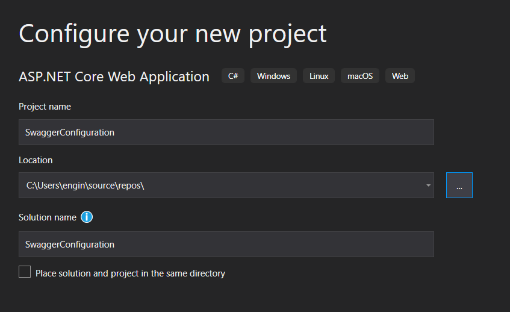
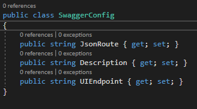
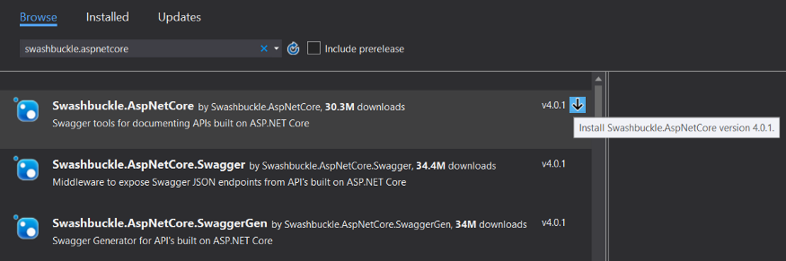
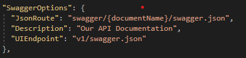
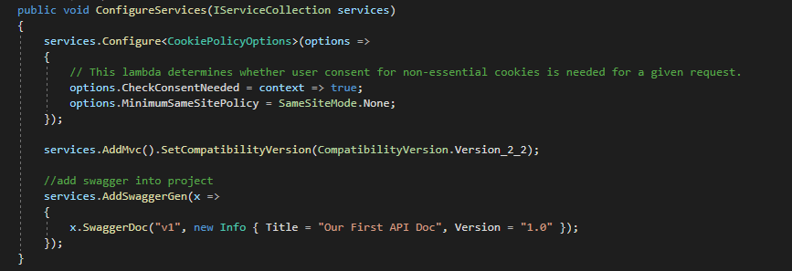
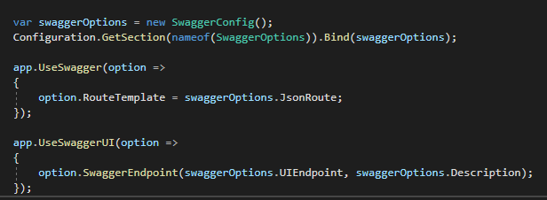
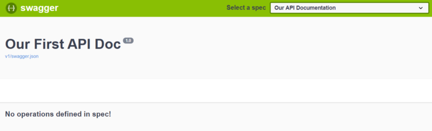
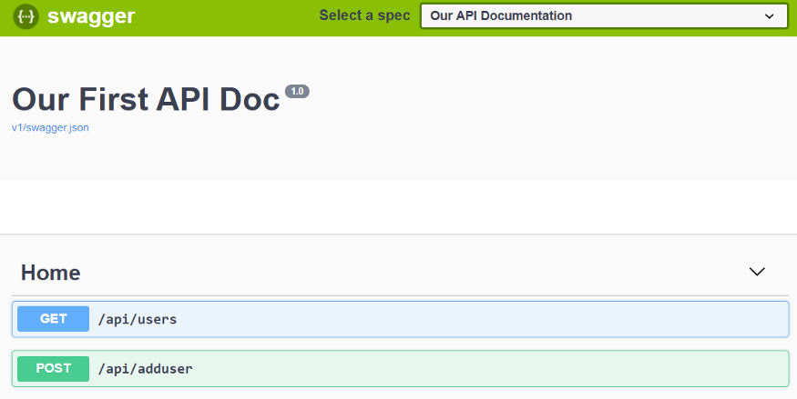

### ASP.NET Core Projesine Swagger’ı Dahil Etmek

#### İçindekiler

- [Swagger'ın Projeye Dahil Edilmesi](#swagger'ın-projeye-dahil-edilmesi)

Herkese merhaba… Bir süredir medium a yazı yazmayı planlıyordum fakat bir türlü fırsat bulamıyordum. Sınavlar ve projeler ile yoğun bir dönem geçirdim ve sonunda aradığım boşluğu buldum ve ilk yazımı yazmaya karar verdim. Lafı daha fazla uzatmadan yazıma başlıyorum.

Bu yazımda Swagger’ın Asp.net Core projesine nasıl dahil edilip kullanılabileceğinden bahsedeceğim. Ondan önce Swagger’ın tanımını yapmakta fayda var sanırım.

Swagger kısaca yazmış olduğumuz API’ların dökümanını bizim yerimize yapıp, standartlaştıran bir araçtır. Swagger sayesinde oluşturmuş olduğumuz API’ların bilgileri otomatik olarak dökümente edilir ve güncel bir şekilde tutulmuş olur.

---

### Swagger’ın Projeye Dahil Edilmesi

Ilk olarak Asp.net Core Web Application’ı seçerek yeni bir proje oluşturuyoruz.

Proje adımızı belirtip projemizi oluşturduktan sonra bize hangi proje template ini kullanmak istediğimiz soruluyor. Buradan Web Application (MVC) seçeneğini seçip ilerleyelim. Bu işlemleri yaptıktan sonra projemiz oluşmuş olacaktır. Artık Swagger’ı projemize dahil edebiliriz.

Ilk olarak Swagger’ın özelliklerini belirtmek için Options klasörü oluşturalım ve bu klasörün içine SwaggerConfig adında bir sınıf tanımlayalım. Ve içerisini şu şekilde dolduralım.

Daha sonra projemize Swagger’ı dahil etmemiz gerekiyor, bu sebeple projemizin üstüne gelip sağ tıklayalım ve “Manage NuGet Packages…” seçeneğine tıklayalım. Buradan arama kısmına gelip “swashbuckle.aspnetcore” yazıp aratalım ve ilk çıkan paketi yükleyelim.

Bu işlemi yaptıktan sonra, appsettings.json dosyamıza gelelim ve aşağıdaki Swagger ayarlarını bu dosyamıza ekleyelim.

Bu işlemi de yaptıktan sonra artık tek yapmamız gereken Startup.cs sınıfımızda Swagger için gerekli olan yapılandırma bilgilerini tanımlamak. İlk olarak bu sınıftaki “ConfigureServices” metoduna aşağıdaki kod bloğunu ekleyelim.

Daha sonra “Configure” metodumuzda yukarıda tanımlamış olduğumuz Swagger’ı kullanacağımızı bildirmemiz gerekiyor.

Ve sonunda projemize Swagger’ı eklemiş olduk, bunu test etmek için uygulamamızı çalıştıralım ve “/swagger/index.html” route una gidelim. Eğer yapılandırmayı doğru yaptıysanız aşağıdakine benzer bir çıktı almanız gerekmekte.

Artık herhangi bir API yazdığımızda, otomatik olarak burada görebileceğiz. (Biz herhangi bir API yazmadığımız için bu ekran boş gözükmekte.) Örnek olması açısından iki basit API oluşturdum ve Swagger dökümanımıza otomatik olarak API ile ilgili bilgiler eklenmiş oldu. Istersek oluşturmuş olduğumuz bu API’ların dönüş değerleri dahil bir çok bilgiyi buradan görebiliriz.

Bu yazıda anlatmak istediklerim bu kadardı. Bu yazının herhangi bir yerinde bir hata olduğunu düşünüyorsanız benimle iletişime geçebilirsiniz, geri dönüşleriniz benim için önemli. Okuduğunuz için teşekkürler umarım faydalı olmuştur, bir sonraki anlatımda görüşmek üzere…