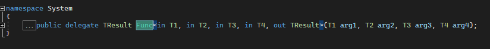

### Invariant, Covariant ve Contravariant Tipler

#### İçindekiler

- [Variance, Değişim Özelliği](#variance-değişim-özelliği)
- [Invariance, Covariance ve Contravariance Özelliği](#invariance-covariance-ve-contravariance-özelliği)
- [Atanabilme Uyumluluğu](#atanabilme-uyumluluğu)
- [Diziler ve Koleksiyonlar için Değişim](#diziler-ve-koleksiyonlar-için-değişim)
- [Generic Interfaceler için Değişim](#generic-interfaceler-için-değişim)
- [Generic Koleksiyonlar için Değişim](#generic-koleksiyonlar-için-değişim)
- [In ve Out Modifier](#in-ve-out-modifier)
  - [Invariance Kullanımı, no in no out modifiers](#invariance-kullanımı-no-in-no-out-modifiers)
  - [Covariance(Out) Kullanımı](#covarianceout-kullanımı)
  - [Contravariance(In) Kullanımı](#contravariancein-kullanımı)
- [Kullanılan Kaynaklar](#kullanılan-kaynaklar)

### Variance, Değişim Özelliği

C#, Java gibi nesneye yönelik dillerde kalıtım yoluyla birbiriyle ilişkili tipler arasında referans geçişleri yapabiliyoruz. Örneğin C# için bütün tipler doğrudan ya da dolaylı olarak Object base clasından türetilir. Bu yüzden de bir _string_ ya da bir _int_ i rahatlıkla _object_ tipine çevirebiliriz. Aynı şekilde _object_ tipine çevrilen bir _string_ nesnesini tekrar _string_ hale getirebiliriz.


```csharp
//Definition
struct S { }
class C { }
//Usage
Console.WriteLine("S is a struct? {0}", typeof(ValueType).IsAssignableFrom(typeof(S))); // True
Console.WriteLine("S is a object? {0}", typeof(object).IsAssignableFrom(typeof(S)));    // True

Console.WriteLine("C is a struct? {0}", typeof(ValueType).IsAssignableFrom(typeof(C))); // False
Console.WriteLine("C is a object? {0}", typeof(object).IsAssignableFrom(typeof(C)));    // True
```

Kalıtım yoluyla birbiriyle ilişkili tipler arasında referans geçişi yapmaya `variance` diyoruz. Kısaca tipler arasında _değişim_ de diyebiliriz.

### Invariance, Covariance ve Contravariance Özelliği

`Variance` özelliğini kullanarak tipler arasında geçiş sağlayabiliriz.

- **Invariance Özelliği:** Atama yapılacak olan tip ile atanan tip aynı olmak zorundadır. Yani Child (`More Derived`) bir tip ile Parent (`Less Derived`) tip arasında herhangi bir geçiş yapılamaz.
- **Covariance Özelliği:** Child bir tipten Parent bir tipe geçiş yapılabilir. More Derived ==> Less Derived geçişi
- **Contravariance Özelliği:** Parent bir tipten Child bir tipe geçiş yapabilir. Less Derived ==> More Derived geçişi

Konu içerisinde `More Derived`(daha fazla türetilmiş) ve `Less Derived`(daha az türetilmiş) tanımlarını sıklıkla kullanacağımız için bunlara açıklık getirelim.

```csharp
class Base{}
class Derived : Base{}
class Derived2 : Derived{}
```

İlgili tanımlama baktığımız yöne göre değişebileceği için adım adım gidelim.

- `object` bütün tiplerin atası olduğu için diğer tiplere göre her zaman `Less Derived` tip olur.
- _Base_ tipi _object_ tipine göre `More Derived`, _Derived_ ve _Derived2_ tiplerine göre `Less Derived` tip olur.
- _Derived_ tipi _object_ ve _Base_ tiplerine göre `More Derived`, _Derived2_ tipine göre `Less Derived` tip olur.
- _Derived2_ tipi _object_, _Base_ ve _Derived_ tiplerine göre `More Derived`, _object_, _Base_ ve _Derived_ tipleri _Derived2_ tipine göre `Less Derived` tip olur.

### Atanabilme Uyumluluğu

Kodlama yaparken sıklıkla atama yapıyoruz. Örneğin;

```csharp
string value1 = "value1"; //Normal atama
object value2 = "value2"; //More Derived ==> Less Derived atama
Console.WriteLine($"{value1}");
Console.WriteLine($"{value2}");
Console.WriteLine($"value2 is a {value2.GetType().Name}.");
```

```
value1
value2
value2 is a String.
```

String tipini rahatlıkla _object_ tipindeki bir değişkene atadık. Çünkü her `String` tipinin aslında `object` tipinde olduğunu biliyoruz. Peki ya tam tersi bir atama yapabilir miydik?

```csharp
string value1 = "value1"; //Normal atama
object value2 = "value2"; //More Derived ==> Less Derived atama
//ERROR !!
string value3 = value2; // Less Derived ==> More Derived atama
```

Hayır bu şekilde bir atama yapamayız. Objenin dolaylı yoldan (_implicit way_) _string_ tipine dönüştürülmesi yapılamaz.


Eğer ilgili nesnenin (_value2_) gerçekten de _string_ tipine dönüştürülebilen bir nesne olduğunu biliyorsak doğrudan (_explicit way_) cast işlemi yaparak ilgili hatayı giderip atama gerçekleştirebiliriz.

```csharp
string value3 = (string) value2; // string => string atama
```

Fakat cast işlemi yaptığımızda ilgili nesnenin gerçekten de bir string olduğunu sisteme söyledik. Eğer _string_ tipinde bir nesne değilse çalışma sırasında hata alırız.

Örn;

```csharp
object value1 = new object();
string value2 = (string)value1; // object => string atama, runtime error
```


Farkettiyseniz _more derived_ türleri _less derived_ türlere sorunsuz bir şekilde atayabiliyoruz. Fakat tam tersini yapmak istediğimizde (örneğin object => string ataması) sorunla karşılaşıyoruz. Eğer gerçekten de atanacak olan tipin (`atanan.GetType()`) atanan nesne ile _aynı tip_ ya da _more derived_ olduğunu söyleyebiliyorsak `cast` işlemi ile bunu sorunsuz gerçekleştirebiliriz. Kısacası C# içerisinde yapılan atamalar `Covariant` uyumlu çalışırlar.

---

Method ile kullandığımız bütün parametreler de `Covariant` uyumlu çalışırlar. Örn;

_object_ tipinde parametre kabul eden bir metoda farklı tiplerde değerler gönderelim ve sonucu ekrana yazdıralım.

```csharp
//Class Definition
class AClass { }

//Method Definition
void CallMe(object obj)
{
    Console.WriteLine($"Type is {obj.GetType().Name}. Value is {obj}");
}

//Usage
CallMe(100);
CallMe(100f);
CallMe("Hello");
CallMe(new AClass());
```

Ekran Çıktısı

```csharp
Type is Int32. Value is 100
Type is Single. Value is 100
Type is String. Value is Hello
Type is AClass. Value is CovarianceContravarianceExample.AClass
```

`Covariance` özelliğini kullanarak bütün tipleri _object_ tipine çevirdik ve kullandık.

### Diziler ve Koleksiyonlar için Değişim

Diziler ve koleksiyonlar referans tiplerinde `covarience`, değer tiplerinde ise `invariance` özelliğini gösterirler. Fakat `type-safe` yani tip güvenli çalışmazlar.

Referans tipinde olan _string_ için örnek yapalım.

```csharp
object[] array1 = new string[3]; // 1. Adım
array1[0] = ""; // 2. Adım
array1[1] = 5;  // 3. Adım
array1[2] = new object(); // 4. Adım
```

Adım adım inceleyelim.

- **1.Adım:** _string_ tipinde diziyi _object_ tipine atadık. (Covariance özelliği)
- **2.Adım:** Dizinin ilk elemanına _string_ tipinde bir değer atadık.
  - Covariance özelliği string => object ataması (OK)
  - _array1_ dizisi gerçekte _string_ tipinde bir dizi olduğu için sorun bulunmuyor. (OK)
- **3.Adım:** Dizinin ikinci elemanına _int_ tipinde bir değer atadık.
  - Covariance özelliği int => object ataması (OK)
  - _array1_ dizisi gerçekte _string_ tipinde bir dizi olduğu için _int_ tipinde bir eleman alamaz. (`not-type-safe`, ERROR)
- **3.Adım:** Dizinin üçüncü elemanına _object_ tipinde bir değer atadık.
  - Covariance özelliği object => object ataması (OK)
  - _array1_ dizisi gerçekte _string_ tipinde bir dizi olduğu için _object_ tipinde bir eleman alamaz. (`not-type-safe`, ERROR)

Çalıştırdığımızda ise `ArrayTypeMismatchException` hatası alırız.


Değer tipleri için `invariant` olduğunu söylemiştim. Örn;

```csharp
//Derleme hatası
object[] array1 = new int[3];
```

Derleme hatası alırız. _Değer tipinde_ olan bir dizi _object_ tipine atanamaz.


`ArrayList` gibi koleksiyonlar da `object[]` ile çalıştığı için aynı sorun onlarda da bulunmaktadır. Yani `type-safe` değildirler.

### Generic Interfaceler için Değişim

Generic Interfaceler default olarak olarak `invariance` özelliği gösterirler. Yani generic geçilen tip ile atama yapılacak olan generic tip aynı olmalıdır.

Örn;

```csharp
interface IExample<T> { }

//Invariance Yaklaşım
IExample<int> example = (IExample<int>)null; // 1. Durum
IExample<string> example2 = (IExample<string>)null; // 2. Durum
//Covariance Yaklaşım
IExample<object> example3 = (IExample<string>)null; // 3. Durum, Compiler Error
//Contravariance Yaklaşım
IExample<string> example4 = (IExample<object>)null; // 4. Durum, Compiler Error
```

`Invariant` tipte davrandıkları için aynı tip geçişi olmak zorundadır. Kısaca _1.Durum_ ve _2.Durum_ için atama uygunken, _3.Durum_ ve _4.Durum_ için atama yapılamadı.

`(Not: Bu durum değiştirilebilir. İlerleyen kısımlarda detaylı bir şekilde inceleyeceğiz.)`

### Generic Koleksiyonlar için Değişim

Generic Koleksiyonlar da _altyapı_ olarak generic interfaceleri kullandığı için `invariant` tipteydiler. Fakat C# 4.0 ile birlikte _covariant_ ve _contravariant_ tipte çalışmaları sağlanmıştır.

Örneğin aşağıdaki kod C# 4.0 öncesi derleme hatası verirken şu anda hata vermemektedir ve `type-safe` çalışır.

```csharp
IEnumerable<object> enumerable = new List<string>(); //Before C# 4.0 Compiler Error

IEnumerable<object> enumerable = new List<string>(); //After C# 4.0 OK, type-safe
```

### In ve Out Modifier

Generic koleksiyon ya da bir delegate kullanırken bir şeye dikkat ettiniz mi? Kabul edilen tiplerin başında `in` ve `out` modifierlar mevcut.

Örneğin `IEnumerable<T>` için kaynak kodunda `out` modifier bulunur.


Ya da sıklıkla kullandığımız, delegate olan `Func<>` kaynak kodunda `in` ve `out` bulunur. Örneğin 5 tip kabul eden bir _Func_ için kaynak kodu şu şekildedir.



_Generic Interface_ ve _Delegate_ için C# 4.0 dan sonra `in` ve `out` modifier hayatımıza girdi. İlgili tip üzerinde `out` kullandığımızda `covariance` özellik, `in` kullandığımızda da `contravariance` özellik kazandırdığımızı söylesem? Ortalık iyice karıştı değil mi? `Invariance`, `covariance` ve `contravariance` özelliklerini anlamaya çalışırken bir de karşımıza `in` ve `out` çıktı. Rahatlayın ve arkanıza yaslanın. Bu bölüm bittiğinde her şey yerli yerine oturacak :)

`In` ve `Out` kullandığımızda ilgili interface içerisinde tanımlanan metotlar için kısıtlama getirmiş oluruz. Bu kısıtlamalar ile de rahatlıkla tipler arasında geçiş yapabiliyoruz. Yani `type-safe` çalışabiliyoruz.

```csharp
class Animal { }
class Mammal : Animal { } // Her memeli bir hayvandır.
class Dog : Mammal { } // Her köpek bir memelidir.

interface IInvariant<T>
{
    T Get(); // Invariant tip geri dönüş tipi olarak kullanılabilir.
    void Set(T t); // Invariant tip parametre olarak kullanılabilir.
}

interface ICovariant<out T>
{
    T Get(); // Covariant tip geri dönüş tipi olarak kullanılabilir.
    //void Set(T t); // Covariant tip parametre olarak kullanılamaz! ,compilation error
}

interface IContravariant<in T>
{
    //T Get(); // Contravariant tip geri dönüş tipi olarak kullanılamaz., compilation error
    void Set(T t); // Contravariant tip parametre olarak kullanılabilir.
}
```

#### Invariance Kullanımı, no in no out modifiers

Tip olarak herhangi bir modifier almayan generic interface neden sadece `invariant` özelliğinde olur? Örneğin aşağıdaki gibi bir kodu çalıştırdığımızda neden hata alıyoruz?

```csharp
IInvariant<object> invariantMammal = (IInvariant<string>)null; // compilation error
IInvariant<string> invariantMammal = (IInvariant<ok>)null; // compilation error
```

`Covariance` ya da `Contravariance` özelliğini uygulamak istediğimizde derleme hatası alıyoruz. Adım adım neden bu şekilde olduğunu inceleyelim.

Covariant yaklaşım uygularsak;

```csharp
// Mammal less derived Dog more derived. less derived <== more derived
IInvariant<Mammal> invariantMammal = (IInvariant<Dog>)null; // compilation error
```

Derleme hatası alırız. Fakat neden?

- `IInvariant<Mammal>.Get()` geri dönüş tipi Mammal olan bir nesne bekler. `IInvariant<Dog>.Get()` geriye döniş tipi olarak Dog döndürür. Bütün köpekler(Dog) birer memeli hayvan(Mammal) olduğu için bu şekilde kullanıma uygun.
- `IInvariant<Mammal>.Set(Mammal)` parametre olarak Mammal bekler. `IInvariant<Dog>.Set(Dog)` olarak atama yaptığımızdan beri Dog türünde bütün nesneleri kabul eder. Memeli hayvanların(Mammal) hepsi köpek(Dog) olmadığı için bu şekilde bir kullanıma uygun değil.

Contravariant yaklaşım uygularsak;

```csharp
// Mammal more derived Animal less derived. more derived <== less derived
IInvariant<Mammal> invariantMammal = (IInvariant<Animal>)null; // compilation error
```

Derleme hatası alırız. Fakat neden?

- `IInvariant<Mammal>.Get()` geri dönüş tipi Mammal olan bir nesne bekler. Ama `IInvariant<Animal>.Get()` geriye dönüş tipi olarak Animal döndürür. Bütün hayvanlar(Animal) memeli(Mammal) olmadığı için bu şekilde bir kullanıma uygun değil.

- `IInvariant<Mammal>.Set(Mammal)` parametre olarak Mammal bekler. `IInvariant<Animal>.Set(Animal)` olarak atama yaptığımızdan beri Animal türünde bütün nesneleri kabul eder. Memeli hayvanlar(Mammal) aynı zamanda hayvan(Animal) türünde oldukları için bu şekilde kullanıma uygun.

```csharp
IInvariant<Animal> invariantAnimal1 = (IInvariant<Animal>)null;
//IInvariant<Animal> invariantAnimal2 = (IInvariant<Mammal>)null; // compilation error
//IInvariant<Animal> invariantAnimal3 = (IInvariant<Dog>)null; // compilation error

//IInvariant<Mammal> invariantMammal1 = (IInvariant<Animal>)null; // compilation error
IInvariant<Mammal> invariantMammal2 = (IInvariant<Mammal>)null;
//IInvariant<Mammal> invariantMammal3 = (IInvariant<Dog>)null; // compilation error

//IInvariant<Dog> invariantDog1 = (IInvariant<Animal>)null; // compilation error
//IInvariant<Dog> invariantDog2 = (IInvariant<Mammal>)null; // compilation error
IInvariant<Dog> invariantDog3 = (IInvariant<Dog>)null;
```

Kısaca parametre olarak invariant alan bir interface için tipler aynı olmak zorundadır. Yani more derived ve less derived türlerine izin verilmez.

#### Covariance(Out) Kullanımı

Eğer `ICovariant<out T>` şeklinde bir kullanım gerçekleştirirsek ne olur?

- Interface içerisinde tanımlanan metotların geri dönüş tipi T olabilir.
- Interface içerisinde tanımlanan metotlarda parametre olarak T tipi verilemez. (Out kullanım kısıtlaması) Restriction

```csharp
// Mammal more derived Animal less derived. more derived <== less derived
ICovariant<Mammal> covariantMammal = (ICovariant<Animal>)null; //compilation error
```

Derleme hatası alırız. Fakat neden?

- `ICovariant<Mammal>.Get()` geri dönüş tipi Mammal olan bir nesne bekler. Ama `ICovariant<Animal>.Get()` geriye dönüş tipi olarak Animal döndürür. Bütün hayvanlar(Animal) memeli(Mammal) olmadığı için bu şekilde bir kullanıma uygun değil.
- `ICovariant.Set(Mammal)` ı zaten kullanamıyoruz. Out modifier ile bu kısıtlamayı gerçekleştirdik.

```csharp
// Mammal less derived Dog more derived. less derived <== more derived
ICovariant<Mammal> covariantMammal = (ICovariant<Dog>)null; //OK
```

Bu şekilde bir tanımlama yapabildik.Fakat neden?

- `ICovariant<Mammal>.Get()` geri dönüş tipi Mammal olan bir nesne bekler. `ICovariant<Dog>.Get()` geriye döniş tipi olarak Dog döndürür. Bütün köpekler(Dog) birer memeli hayvan(Mammal) olduğu için bu şekilde kullanıma uygun.
- `ICovariant.Set(Mammal)` ı zaten kullanamıyoruz. Out modifier ile bu kısıtlamayı gerçekleştirdik.

```csharp
ICovariant<Animal> covariantAnimal1 = (ICovariant<Animal>)null;
ICovariant<Animal> covariantAnimal2 = (ICovariant<Mammal>)null;
ICovariant<Animal> covariantAnimal3 = (ICovariant<Dog>)null;

//ICovariant<Mammal> covariantMammal1 = (ICovariant<Animal>)null; // compilation error
ICovariant<Mammal> covariantMammal2 = (ICovariant<Mammal>)null;
ICovariant<Mammal> covariantMammal3 = (ICovariant<Dog>)null;

//ICovariant<Dog> covariantDog1 = (ICovariant<Animal>)null; // compilation error
//ICovariant<Dog> covariantDog2 = (ICovariant<Mammal>)null; // compilation error
ICovariant<Dog> covariantDog3 = (ICovariant<Dog>)null;
```

Kısaca parametre olarak covariant(out) bir tip için less derived <== more derived ataması yapılabilir. more derived <== less derived ataması yapılamaz. Başka bir deyişle `out` kullandığımızda _covariance_ özelliğini kazandırırken _contravariance_ özelliğini dışlamış oluyoruz. Bu sayede `type-safe` bir şekilde çalışırız.

#### Contravariance(In) Kullanımı

Eğer `IContravariant<in T>` şeklinde bir kullanım gerçekleştirirsek ne olur?

- Interface içerisinde tanımlanan metotların geri dönüş tipi T olamaz.(In kullanım kısıtlaması) Restriction
- Interface içerisinde tanımlanan metotlarda parametre olarak T tipi verilebilir.

```csharp
// Mammal more derived Animal less derived. more derived <== less derived
IContravariant<Mammal> contravariantMammal = (IContravariant<Animal>)null;
```

Bu şekilde bir tanımlama yapabildik fakat neden?

- `IContravariant<Mammal>.Set(Mammal)` parametre olarak Mammal bekler. `IContravariant<Animal>.Set(Animal)` olarak atama yaptığımızdan beri Animal türünde bütün nesneleri kabul eder. Memeli hayvanlar(Mammal) aynı zamanda hayvan(Animal) türünde oldukları için bu şekilde kullanıma uygun.
- `IContravariant<Mammal>.Get()` ı zaten kullanamıyoruz. In modifier ile bu kısıtlamayı gerçekleştirdik.

```csharp
// Mammal less derived Dog more derived. less derived <== more derived
IContravariant<Mammal> contravariantMammal = (IContravariant<Dog>)null; // compilation error
```

Derleme hatası aldık.Fakat neden?

- `IContravariant<Mammal>.Get()` ı zaten kullanamıyoruz. In modifier ile bu kısıtlamayı gerçekleştirdik.
- `IContravariant<Mammal>.Set(Mammal)` parametre olarak Mammal bekler. `IContravariant<Dog>.Set(Dog)` olarak atama yaptığımızdan beri Dog türünde bütün nesneleri kabul eder. Memeli hayvanların(Mammal) hepsi köpek(Dog) olmadığı için bu şekilde bir kullanıma uygun değil.

```csharp
IContravariant<Animal> contravariantAnimal1 = (IContravariant<Animal>)null;
//IContravariant<Animal> contravariantAnimal2 = (IContravariant<Mammal>)null; // compilation error
//IContravariant<Animal> contravariantAnimal3 = (IContravariant<Dog>)null; // compilation error

IContravariant<Mammal> contravariantMammal1 = (IContravariant<Animal>)null;
IContravariant<Mammal> contravariantMammal2 = (IContravariant<Mammal>)null;
//IContravariant<Mammal> contravariantMammal3 = (IContravariant<Dog>)null; // compilation error

IContravariant<Dog> contravariantDog1 = (IContravariant<Animal>)null;
IContravariant<Dog> contravariantDog2 = (IContravariant<Mammal>)null;
IContravariant<Dog> contravariantDog3 = (IContravariant<Dog>)null;
```

Kısaca parametre olarak contravariant(in) bir tip için more derived <== less derived ataması yapılabilir. less derived <== more derived ataması yapılamaz. Başka bir deyişle `in` kullandığımızda _contravariance_ özelliğini kazandırırken _covariance_ özelliğini dışlamış oluyoruz. Bu sayede `type-safe` bir şekilde çalışırız.

---

Generic interface için örneklerin kolayca anlaşılması için tek tip yaptım. Fakat birden fazla generic tip için ayrı ayrı özellik kazandırabileceğimizi unutmayın. Örneğin şu şekilde bir kullanım da gerçekleştirebilirdik.

```csharp
interface IExample<out T1, in T2, out T3, T4, in T5>
{
    //...
}
```

Umarım faydalı bir içerik olmuştur.

### Kullanılan Kaynaklar

- Burak Selim Hocamızın 2009 yılında yazmış olduğu çok faydalı içerik [C# 4.0 - Invariance, Covariance, Contravariance ???](https://www.buraksenyurt.com/post/C-40-Invariance-Covariance-Contravariance)
- Güzel bir şekilde açıklamasının yapıldığı [stackoverflow sayfası](https://stackoverflow.com/a/53134957/8069766)
- [The theory behind covariance and contravariance in C# 4](http://tomasp.net/blog/variance-explained.aspx/)
- [C# | Object Class](https://www.geeksforgeeks.org/c-sharp-object-class/)
- [Covariance and Contravariance (C#)](https://docs.microsoft.com/tr-tr/dotnet/csharp/programming-guide/concepts/covariance-contravariance/)
- [Covariance and Contravariance in Generics](https://docs.microsoft.com/tr-tr/dotnet/standard/generics/covariance-and-contravariance)
