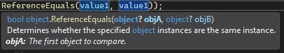
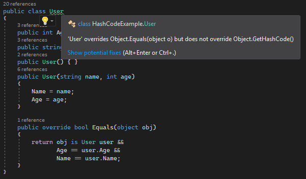
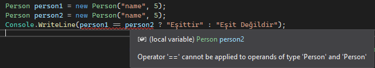

### Nesneler Arasında Eşitlik

#### İçindekiler

- [==, Equals, ReferenceEquals, GetHashCode ...](#-equals-referenceequals-gethashcode-)
- [ReferenceEquals Metodu](#referenceequals-metodu)
  - [Değer Tiplerinde ReferenceEquals](#değer-tiplerinde-referenceequals)
    - [Boxing, Unboxing](#boxing-unboxing)
  - [Referans Tiplerinde ReferenceEquals](#referans-tiplerinde-referenceequals)
  - [String Tipi ile ReferenceEquals](#string-tipi-ile-referenceequals)
- [Equals Metodu](#equals-metodu)
- [ == (eşitlik) operatörü](#-eşitlik-operatörü)
  - [Değer Tiplerinde Eşitlik Operatörü](#değer-tiplerinde-eşitlik-operatörü)
  - [Referans Tiplerinde Eşitlik Operatörü](#referans-tiplerinde-eşitlik-operatörü)
  - [String Tipinde Eşitlik Operatörü](#string-tipinde-eşitlik-operatörü)
  - [== operatörünü overload etmek](#-operatörünü-overload-etmek)
- [GetHashCode](#gethashcode)
  - [Değer Tiplerinde GetHashCode](#değer-tiplerinde-gethashcode)
  - [Referans Tiplerinde GetHashCode](#referans-tiplerinde-gethashcode)
- [Kullanılan Kaynaklar](#kullanılan-kaynaklar)

### ==, Equals, ReferenceEquals, GetHashCode ...

Zaman zaman nesnelerin birbirleriyle eşitliğini kontrol ediyoruz. Matematiksel olarak bir değerin diğerine eşit olup olmadığını gözlemlemek kolayken işin içerisine nesneler girince gözlemlemek biraz zorlaşıyor.

Örn; `3 = 3` için 3 ün 3 e eşit olduğunu matematiksek olarak rahatlıkla görebiliyoruz. Detaylı düşünmemizi gerektiren bir şey yok. Sayıları bilen herkes 3 değerinin 3 e eşit olduğunu hemen söyler. Peki programlama dillerinde kullanılan nesnelerin birbirine eşit olup olmadığını `eşittir(=)` ifadesi ile doğrudan söylemek mümkün mü?

```csharp
int a = 3;
int b = 3;
Console.WriteLine("a b ye eşit mi? {0}", a == b ? "eşittir" : "eşit değildir");

//ya da
object c = 3;
object d = 3;
Console.WriteLine("c d ye eşit mi? {0}", c == d ? "eşittir" : "eşit değildir");
```

`==` operatörünü kullanarak _eşitler mi?_ sorusunu sorduk aslında. Ekran çıktısına bakalım.

```
a b ye eşit mi? eşittir
c d ye eşit mi? eşit değildir
```

Aynı sayılar için eşitlik kontrolü yaparken farklı cevaplar aldık. Peki `==` tam olarak nasıl davrandı? Değer eşitliğine mi baktı? Yoksa referans eşitliğine mi? `==` operatörü haricinde `Equals` ve `ReferenceEquals` metodu da eşitlik kontrolü yapıyor. Bu metotlar nasıl davranıyor? Niçin bu metotlara ihtiyaç var? `GetHashCode` ile de o nesneye özel üretilen hash koduna erişiyoruz. Eşitlik ile birlikte bu hash kodu da kullanılabilir mi? Bu yazımızda bu sorulara cevap arayacağız :)

_**NOT:**_ Referans ve değer tipleri ile ilgili temel bir bilgiye sahip değilseniz anlatılanlar karışık gelebilir. Referans ve değer tipleri ile ilgili yazıya gitmek için [tıklayınız.](../value-type-and-reference-type/value-type-and-reference-type.md)

### ReferenceEquals Metodu

`ReferenceEquals` metodu paremetre olarak geçilen 2 nesnenin referanslarının eşit olup olmadığını kontrol eder. Kısaca 2 nesne memory üzerinde ayrı adresi referans almış ise eşitlikten söz edebiliriz. `ReferenceEquals` metodu _override_ <u>edilemez.</u> Yani bütün nesneler için bu şekilde çalıştığına güvenebiliriz.

#### Değer Tiplerinde ReferenceEquals

Değer tipleri için referans eşitliği kontrolü yapmak uygun bir işlem değildir. Yine de nasıl davrandığını inceleyelim.

```csharp
double value1 = 5;
Console.WriteLine("value1 - {0}", ReferenceEquals(value1, value1));
Console.WriteLine(value1.GetType().IsValueType);
```

Ekran Çıktısı

```
value1 - False
True
```

Aynı nesne örneğini vermemize rağmen neden `False` çıktısını aldık? double tipinin değer tipinde olduğunu biliyoruz. Zaten referans değeri olarak eşitliğinden söz etmemiz mümkün değil. Daha iyi anlamak adına detaylandıralım. ReferenceEquals metodunu incelediğimizde parametre olarak `object` tipinde değer kabul ettiğini görürüz.



Paremetre olarak verdiğimiz value1 değişkeni üzerinde `boxing` işlemi gerçekleştirilerek dolaylı yoldan object türüne çevrildi. `Object` türüne çevrildiğinde yeni bir nesne üretilip heap üzerinde adreslendi. Aynı şekilde 2. parametre için de yeni bir nesne üretilip heap üzerinde adreslendi. 2 nesne örneğinin doğrudan birbiriyle bir ilişkisi bulunmamakta. Yani heap üzerinde tutulan adresleri birbirinden farklı. Bu yüzden de `ReferenceEquals` metodu _False_ değerini döndürdü.

---

```csharp
double value1 = 5;
double value2 = 5;
Console.WriteLine("value1 - value2, {0}", ReferenceEquals(value1, value2));
```

Ekran Çıktısı

```
value1 - value2, False
```

`value1` ve `value2` yi paremetre olarak verdiğimizde dolaylı yoldan object türüne çevirmiş olduk. 2 nesne birbirinden farklı referanslara sahip olduğu için _False_ sonucunu aldık.

---

##### Boxing, Unboxing

Hazır `boxing` işleminden söz etmişken `boxing` ve `unboxing` işlemlerini de aradan çıkartalım.
Değer tipli bir nesneyi referans tipine dönüştürme (cast) işlemine `boxing` diyoruz.
`Boxing` gerçekleştirilmiş nesneyi yeniden eski haline, değer tipine çevirme işlemine `unboxing` diyoruz.

```csharp
int a = 5;
object b = a; //implicit boxing, dolaylı olarak paketleme
object c = (object)a; //explicit boxing, açık bir şekilde paketleme

int d = b; //implicit unboxing, dolaylı olarak açma
ind e = (int) b; //explicit unboxing, açık bir şekilde açma
```

---

#### Referans Tiplerinde ReferenceEquals

Referans tipindeki `object` sınıfını kullanalım ve sonuçlarını gözlemleyelim.

```csharp
object o = null;
object p = null;
object q = new object();
object r = new object();
Console.WriteLine("o - p {0}", ReferenceEquals(o, p)); // 1
p = q;
Console.WriteLine("p - q {0}", ReferenceEquals(p, q)); // 2
Console.WriteLine("o - p {0}", ReferenceEquals(o, p)); // 3
Console.WriteLine("q - r {0}", ReferenceEquals(q, r)); // 4
```

Ekran Çıktısı

```csharp
o - p True // 1
p - q True // 2
o - p False // 3
q - r False // 4
```

Adım adım sonuçların neden bu şekilde olduğuna bakalım.

- 1.Durum: True olmasının sebebi 2 değerin de null olması. Yani parametre olarak geçilen nesneler null ise referans eşitliğine bakmaya gerek yoktur. Değer _True_ döner.
- 2.Durum: _p_ değerine `p = q` ile _q_ nun atamasını yaptıktan sonra referanslarını karşılaştırdık. Referans tiplerinde atama yapıldığında değer yerine referansları atandığı için _True_ değerini aldık.
- 3.Durum: _o_ null bir nesne. _p_ ise şu anda _q_ nun referansına sahip. Sonuç olarak null ile referansı olan bir nesneyi karşılaştırdığımızda sonuç _False_ olur.
- 4.Durum: _q_ ve _r_ birbirinden farklı referans değerine sahiptir. Çünkü `new` anahtar kelimesi ile newlendikleri için referans değerleri birbirinden farklıdır. Bu yüzden de sonuç _False_ olur.

Bu kısma kadar `ReferenceEquals` metodunun çalışma mantığını anladık gibi. Peki biraz kafa karışıklığına ne dersiniz? :) _string_ tipinin referans tipinde olup değer tipi gibi çalıştığını biliyoruz. `ReferenceEquals` metodunu string tipi için inceleyelim.

#### String Tipi ile ReferenceEquals

String tipinin adreslenmesi tanımladığımız referans tiplerine(_class_) göre farklı olduğu için ayrıca incelememiz gerekiyor.

Örn;

```csharp
string s1 = "String1";
string s2 = "String1";
Console.WriteLine("s1 = s2: {0}", ReferenceEquals(s1, s2));
```

Ekran Çıktısı

```
s1 = s2: True
```

Hmm. s1 ve s2 farklı nesne örnekleri değil mi? Aslında değiller. Referans değerleri de aynı. Bunu biraz inceleyelim.

```csharp
string s1 = "String1";
string s2 = "String1";
```

s1 ve s2 değerlerine baktığımızda aynılar. Derleme anında bu değerlerin `String1` olduğu biliniyor. Bu yüzden de s1 için heap üzerinde adresleme yapıldıktan sonra sıra s2 ye geldiğinde önceden bu değer bilindiği için aynı adres kullanılıyor.

String tipi diğer referans tiplerinin aksine değer tipi gibi davrandığı için değeri değiştiği anda yeni bir yerde adresleme yapılır. Bu yüzden referans ve değer olarak birbirine eşit olan `s1` ve `s2` den brisi değiştirildiği anda diğeri etkilenmez.

```csharp
string prefix = "String";
string s1 = prefix + "1";
string s2 = prefix + "1";
```

Yukarıdaki örnekten farklı olarak burada s1 ve s2 değerleri çalışma anında yani ihtiyaç duyulduğu anda hesaplanır. Bu yüzden de her ikisinin değeri aynı olmasına rağmen ilgili değerler hesaplandıktan hemen sonra adresleme yapılacağı için farklı adres değerlerine sahip olurlar.

String değeri önceden belli ise yani herhangi bir yerden veri gelip değeri şekillenmiyorsa ya da değerinin belli olması için işlem yapmaya gerek yoksa bu string sistem tarafından `Intern` kabul edilir. Oluşturulduklarında sistem tarafından belirlenmiş olan string havuzuna eklenirler. Bir stringin `Intern` olup olmadığını `string.IsNullOrEmpty(string.IsInterned(s1)) ? "No" : "Yes"` ile kontrol edebiliriz.

- Değeri aynı olan ve `Intern` olan string nesneleri için kullanılan adresler de aynı olduğundan dolayı `ReferenceEquals` metodu _True_ değerini döndürür.
- Değeri aynı olan ve `Intern` olmayan string nesneleri için kullanılan adresler farklı olacağından dolayı `ReferenceEquals` metodu _False_ değeri döndürür.
- Değeri farklı olan string nesneleri için `ReferenceEquals` metodu _False_ değeri döndürür.

Örnek ile pekiştirelim.

```csharp
string s1 = "String1";
string s2 = "String1";
Console.WriteLine("s1 - s2 ReferenceEquals: {0}", ReferenceEquals(s1, s2));
Console.WriteLine("{0} interned: {1}", s1, string.IsNullOrEmpty(string.IsInterned(s1)) ? "No" : "Yes");

string suffix = "A";
string s3 = "String" + suffix;
string s4 = "String" + suffix;
Console.WriteLine("s3 - s4 ReferenceEquals: {0}", ReferenceEquals(s3, s4));
Console.WriteLine("{0} interned: {1}", s3, string.IsNullOrEmpty(string.IsInterned(s3)) ? "No" : "Yes");

string suffixB = "B";
string s5 = "StringB";
string s6 = "String" + suffixB;
string s7 = string.Intern("String" + suffixB);
Console.WriteLine("s5 - s7 ReferenceEquals: {0}", ReferenceEquals(s5, s7)); // 3.1
Console.WriteLine("s6 - s7 ReferenceEquals: {0}", ReferenceEquals(s6, s7)); // 3.2
Console.WriteLine("{0} interned: {1}", s6, string.IsNullOrEmpty(string.IsInterned(s6)) ? "No" : "Yes");

s7 = "String value changed!";
Console.WriteLine("s5 - s7 ReferenceEquals: {0}", ReferenceEquals(s5, s7)); // 3.3

```

Ekran Çıktısı

```
s1 - s2 ReferenceEquals: True // 1
String1 interned: Yes // 1

s3 - s4 ReferenceEquals: False // 2
StringA interned: No // 2

s5 - s7 ReferenceEquals: True // 3.1
s6 - s7 ReferenceEquals: False // 3.2
StringB interned: Yes
s5 - s7 ReferenceEquals: False // 3.3
```

İnceleyelim.

- 1.Durum: Değerleri aynı ve `intern` olduğu için aynı adres referansını kullanırlar. True.
- 2.Durum: Değerleri aynı ama `intern` olmadığı için farklı adres referansına sahipler. False.
- 3.Durum: Daha iyi anlamak için adım adım gidelim.
  - `string s5 = "StringB";` s5 için adresleme yapıldı ve referans değerinin `0x123456` olduğunu varsayalım.`string s6 = "String" + suffixB;` s6 için adresleme yapıldı._Interned_ olmadığı için s5 ile aynı değere sahip olmasına rağmen adresleme yapıldığında farklı bir yere yazıldı. Referans değerinin `0x234567` olduğunu varsayalım.`string s7 = string.Intern("String" + suffixB);` s6 da olduğu gibi farklı bir yere adresleme yapılacakken `Intern()` ile interned hale getirdik. Bu aşamada `Intern()` metodu önceden aynı değere sahip _interned_ bir string olup olmadığını kontrol eder. Eğer yoksa ilgili değeri _interned_ hale getirip adreslemesini yapar. Bu örneğimizde aynı değere sahip _interned_ halde bir referans değeri bulunduğundan yeni bir adresleme yerine bu değer kullanıldı. _s5_ in referans değeri _s7_ için de aynı oldu. Yani _0x123456_.
  - 3.1.Durum: _s5_ ve _s6_ referans değeri `0x123456` yani True.
  - 3.2.Durum: _s6_ referans değeri `0x234567` iken _s7_ referans değeri `0x123456` yani False.
  - 3.3.Durum: _s7_ nin referans değeri `0x123456` iken değerini `s7 = "String value changed!";` ile değiştirdiğimiz anda s7 nin referans adresi değişti. Örn; `0x3571341` olsun. Bu adımdan sonra ReferansEquals ile referanslarının eşit olup olmadığı söz konusu olamaz. Değerleri bile farklı. Yani False.

### Equals Metodu

`Equals` metodu paremetre olarak geçilen 2 nesnenin değerinin eşit olup olmadığını kontrol eder. Kısaca 2 nesne aynı değere sahip ise eşitlikten söz edebiliriz. `Equals` metodu _override_ edilebilir. Yani `Equals` metodunu ile değer eşitliğinden söz ediyorsak _override_ edilip edilmediğini de gözden geçirmemiz gerekiyor.

Basit bir örnek ile `Equals` metodunun değer eşitliğini kontrol ettiğini görelim.

```csharp
double value1 = 5;
double value2 = 5;
Console.WriteLine("value1 - value2, Equals: {0}", Equals(value1, value2));
```

Ekran Çıktısı

```
value1 - value2, Equals: True
```

Değer tipinde olan _value1_ ve _value2_ için değer eşitliği sonucu `True` değerini aldık. Peki referans tipindeki nesneler için değer eşitliği sonucu ne olur?

```csharp
object value1 = 5;
object value2 = 5;
Console.WriteLine("value1 - value2, Equals: {0}", Equals(value1, value2));
```

Ekran Çıktısı

```csharp
value1 - value2, Equals: True
```

Referans tipinde olan _value1_ ve _value2_ için de sonuç değişmedi. Kısaca `Equals` metodunun referans eşitliğine bakmadığını, daha çok değer tipi eşitliği ile ilgilendiğini söyleyebiliriz. Peki oluşturduğumuz değer türleri(_struct_) ya da referans türleri (_inherit from object_, class) için _Equals_ metodu nasıl davranır? `Equals` metodunu _override_ etmemiz gerekiyor mu? Bunlara bakalım.

```csharp
// Değer tipinde
public struct Person
{
    public int Age { get; set; }
    public string Name { get; set; }
    public Person(string name, int age)
    {
        Name = name;
        Age = age;
    }
}

// Referans tipinde
public class User
{
    public int Age { get; set; }
    public string Name { get; set; }
    public User() { }
    public User(string name, int age)
    {
        Name = name;
        Age = age;
    }
}
```

Değer tipinde olan `Person` için test edelim.

```csharp
Person p1 = new Person("Cihan", 25);
Person p2 = new Person("Cihan", 25);
Console.WriteLine("p1 - p2, Equals: {0}", Equals(p1, p2));

Person p3 = new Person("Test Value", 25);
Console.WriteLine("p1 - p3, Equals: {0}", Equals(p1, p3));
Person p4 = new Person("Cihan", 24);
Console.WriteLine("p1 - p4, Equals: {0}", Equals(p1, p4));
```

Ekran Çıktısı

```
p1 - p2, Equals: True
p1 - p3, Equals: False
p1 - p4, Equals: False
```

Değer tipinde olan `Person` için `Equals` metodu beklediğimiz gibi çalıştı. Aynı örneği referans tipinde olan `User` için gerçekleştirelim.

```csharp
User user1 = new User("Cihan", 25);
User user2 = new User("Cihan", 25);
Console.WriteLine("user1 - user2, Equals: {0}", Equals(user1, user2));

User user3 = new User("Test Value", 25);
Console.WriteLine("user1 - user3, Equals: {0}", Equals(user1, user3));

User user4 = new User("Cihan", 24);
Console.WriteLine("user1 - user4, Equals: {0}", Equals(user1, user4));
```

Ekran Çıktısı

```
user1 - user2, Equals: False
user1 - user3, Equals: False
user1 - user4, Equals: False
```

`user1` ve `user2` nesneleri aynı değerlere sahip olmasına rağmen beklediğimiz gibi _True_ değeri almadık. Bunun sebebi yazdığımız `User` sınıfı içerisinde object sınıfında bulunan `Equals` metodunun ezilmemiş olması. `Equals` metodunu oluşturduğumuz sınıf içerisinde _override_ etmediğimiz sürece _default_ olarak çalışan `Equals` _değer eşitliğine_ bakmak yerine _referans eşitliğine_ bakar. Test edersek referans eşitlipi aynı olan nesneler için değer eşitliğinin de aynı sonucu verdiğini gözlemleriz.

```csharp
User user1 = new User("Cihan", 25);
User user2 = user1;
Console.WriteLine("user1 - user2, ReferenceEquals: {0}", ReferenceEquals(user1, user2));
Console.WriteLine("user1 - user2, Equals: {0}", Equals(user1, user2));
```

Ekran Çıktısı

```
user1 - user2, ReferenceEquals: True
user1 - user2, Equals: True
```

---

Referans tipinde oluşturduğumuz bir sınıf için `Equals` metodunu override etmediğimiz zaman ilgili sınıfın _değer eşitliğini_ kullanmak yerine _referans eşitliğini_ kullandığını biliyoruz. İhtiyaca göre ilgili sınıfın değer türünden eşit olduklarını kontrol etmek isteyebiliriz. Bu gibi durumlarda `Equals` metodunu _override_ etmemiz yani ezmemiz gerekir. _Equals_ metodunu ilgili sınıf için _override_ edelim.

```csharp
public class User
{
    public int Age { get; set; }
    public string Name { get; set; }
    public User() { }
    public User(string name, int age)
    {
        Name = name;
        Age = age;
    }

    // Otomatik üretilen Equals metodu. Visual studio kullanıyorsanız ctrl + . > Generate Equals(object) demeniz ve
    // değer eşitliği için kullanmak istediğiniz alanları belirtmeniz yeterli.
    public override bool Equals(object obj)
    {
        return obj is User user &&
                Age == user.Age &&
                Name == user.Name;
    }
}
```

Visual studio tarafından otomatik üretilen olan `Equals` metoduna bakalım. İlk olarak parametre olarak gelen nesnenin türünün `User` olup olmadığını kontrol ediyoruz. Eğer ilgili tür `User` değilse eşitlikten söz etmemiz mümkün değil. Daha sonrasında ise `==` operatörünü kullanarak _Age_ ve _Name_ alanlarının eşitliğini kontrol ettik. Bu kısımda daha özel eşitlik metodu yazabilirdik. Örneğin ilgili nesne örnekleri arasında eşitliği sadece _Name_ alanına göre kontrol etmek isteseydik aşağıdaki kod parçasına benzer bir `Equals` metodu da oluşturabilirdik.

Örn;

```csharp
return obj is User user &&
        Name == user.Name;
```

Örneğimizi yeniden test edelim ve sonuçları gözlemleyelim.

```csharp
User user1 = new User("Cihan", 25);
User user2 = new User("Cihan", 25);
Console.WriteLine("user1 - user2, Equals: {0}", Equals(user1, user2));

User user3 = new User("Test Value", 25);
Console.WriteLine("user1 - user3, Equals: {0}", Equals(user1, user3));

User user4 = new User("Cihan", 24);
Console.WriteLine("user1 - user4, Equals: {0}", Equals(user1, user4));
```

Ekran Çıktısı

```
user1 - user2, Equals: True
user1 - user3, Equals: False
user1 - user4, Equals: False
```

Beklediğimiz gibi değer olarak birbirine eşit olan _Name_ ve _Age_ alanları için `Equals` metodu _True_ değerini verdi.

`Equals` metodunu _override_ ettiğimizde derleyici tarafından _uyarı_ mesajı aldık.



`Equals` metodunun doğruluğundan söz ediyorsak `GetHashCode` metodunun da doğruluğundan emin olmamız gerekiyor. Bu yüzden de derleyici bu şekilde bir _uyarı_ mesajı verdi. `GetHashCode` metodu da inceledikten sonra bu konuya açıklık getireceğiz.

`Equals` metodunu biraz daha iyi anlamak adına `string` için de bir kaç örnek yapalım.

```csharp
string str1 = "Hello World!";
string str2 = "Hello World!";
Console.WriteLine("str1 - str2, ReferenceEquals: {0}", ReferenceEquals(str1, str2));
Console.WriteLine("str1 - str2, Equals: {0}", Equals(str1, str2));
```

Ekran Çıktısı

```
str1 - str2, ReferenceEquals: True
str1 - str2, Equals: True
```

Değerleri ile referans değerleri aynı. Tam olarak beklediğimiz sonucu aldık. Peki referans değerleri farklı ama değerleri aynı olsaydı ne olurdu?

```csharp
string prefix = "Hello";
string str1 = "Hello World!";
string str2 = prefix + " World!";
Console.WriteLine("str1 - str2, ReferenceEquals: {0}", ReferenceEquals(str1, str2));
Console.WriteLine("str1 - str2, Equals: {0}", Equals(str1, str2));
```

Ekran Çıktısı

```
str1 - str2, ReferenceEquals: False
str1 - str2, Equals: True
```

Referans eşitliği _False_ dönmesine rağmen değer eşitliği _True_ döndü. Oluşturduğumuz referans tiplerinde böyle bir sonuç almak için `Equals` metodunu _override_ etmemiz gerekiyordu. String tipi de kendi içerisinde `Equals` metodunu _override_ ettiği için bu şekilde sonuç alabildik.


### == (eşitlik) operatörü

`ReferenceEquals` ve `Equals` metotlarının en azından neler olduklarını anladığımıza göre `==` operatörünün nasıl çalıştığına bakabiliriz. Sonunda 3 == 3 diyebileceğiz. :)

`==` operatörü değer tiplerinde _değer eşitliğini_ kontrol ederken referans tiplerinde _referans eşitliğini_ kontrol eder. _override_ edilebileceği için bu tanım da değişebilir.

#### Değer Tiplerinde Eşitlik Operatörü

Karşılaştırılan değerler eşitse `True` döner. Değer tiplerindeki `Equals` metodu gibi davranır diyebiliriz.

```csharp
int a = 1 + 2 + 3;
int b = 6;
Console.WriteLine("a - b, {0}",a == b ? "Eşittir" : "Eşit Değildir");

int c = 7;
Console.WriteLine("a - c, {0}",a == c ? "Eşittir" : "Eşit Değildir");

double d = 6;
Console.WriteLine("a - d, {0}",a == d ? "Eşittir" : "Eşit Değildir");
```

Ekran Çıktısı

```
a - b, Eşittir

a - c, Eşit Değildir

a - d, Eşittir
```

---

```csharp
char c1 = 'a';
char c2 = 'A';
Console.WriteLine(c1 == c2);
Console.WriteLine(c1 == char.ToLower(c2));
```

Ekran Çıktısı

```
False
True
```

---

`struct` tipi değer tipi olmasına rağmen özel yapıda oldu için default bir `==` operatörü bulunmaz. Örn;

```csharp
public struct Person
{
    public int Age { get; set; }
    public string Name { get; set; }
    public Person(string name, int age)
    {
        Name = name;
        Age = age;
    }
}
```

```csharp
Person person1 = new Person("name", 5);
Person person2 = new Person("name", 5);
// Compiler Error
// Console.WriteLine(person1 == person2 ? "Eşittir" : "Eşit Değildir");
```

Yukarıdaki şekilde kullanmak istediğimizde derleyici hatası alırız.



`Not:` == operatörünü overload etmeye konunun ilerleyen kısımlarında bakacağız.

#### Referans Tiplerinde Eşitlik Operatörü

Karşılaştırılan nesne örneklerinin ikisi de aynı objeyi referans ediyorsa `True` döner. Referans tiplerindeki `ReferenceEquals` metodu gibi davranır diyebiliriz. Default olarak `==` operatörünü destekler.

Eğer `==` operatörü overload edilmişse referans eşitliğini kontrol etmek için `ReferenceEquals` metoduna güvenebiliriz.(_override_ edilemediği için)

```csharp
public class User
{
    public int Age { get; set; }
    public string Name { get; set; }
    public User(string name, int age)
    {
        Name = name;
        Age = age;
    }
}
```

```csharp
User user1 = new User("name", 5);
User user2 = new User("name", 5);
User user3 = user1;
Console.WriteLine("user1 - user2, {0}", user1 == user2 ? "Eşittir" : "Eşit Değildir");
Console.WriteLine("user1 - user3, {0}", user1 == user3 ? "Eşittir" : "Eşit Değildir");
```

Ekran Çıktısı

```
user1 - user2, Eşit Değildir
user1 - user3, Eşittir
```

#### String Tipinde Eşitlik Operatörü

_string_ tipinin referans tipinde olduğunu söylemiştik. `==` operatörü `Equals` metodunda olduğu gibi değer karşılaştırması yapar. _Referans eşitliğine_ bakmaz. Bunun sebebi string içerisinde `==` operatörünün _overload_ edilmiş olmasıdır.


```csharp
string s1 = "hello!";
string s2 = "HeLLo!";
Console.WriteLine(s1 == s2.ToLower());  // output: True

string s3 = "Hello!";
Console.WriteLine(s1 == s3);  // output: False
```

`==` operatörünün `Equals` ve `ReferenceEquals` metodları ile farkını anlamak adına örnek yapalım.

```csharp
string s1 = "test";
string s2 = "test";
string s3 = "test1".Substring(0, 4);
object s4 = s3;
Console.WriteLine("s1 - s2, ReferenceEquals: {0}, == operator: {1}, Equals: {2}", ReferenceEquals(s1, s2), s1 == s2, s1.Equals(s2)); // 1
Console.WriteLine("s1 - s3, ReferenceEquals: {0}, == operator: {1}, Equals: {2}", ReferenceEquals(s1, s3), s1 == s3, s1.Equals(s3)); // 2
Console.WriteLine("s1 - s4, ReferenceEquals: {0}, == operator: {1}, Equals: {2}", ReferenceEquals(s1, s4), s1 == s4, s1.Equals(s4)); // 3
```

Ekran Çıktısı

```
s1 - s2, ReferenceEquals: True, == operator: True, Equals: True // 1
s1 - s3, ReferenceEquals: False, == operator: True, Equals: True // 2
s1 - s4, ReferenceEquals: False, == operator: False, Equals: True // 3
```

- 1.Durum:
  - ReferenceEquals: iki string değeri de aynı referans adresine sahip olduğu için `True`
  - == operator: iki string değeri de aynı değere sahip olduğu için `True`
  - Equals: iki string değeri de aynı değere sahip olduğu için `True`
- 2.Durum:
  - ReferenceEquals: `s3` _Substring_ olduktan sonra geriye dönen nesne örneği heap üzerinde farklı bir adreste tutuldu. `s1` ile referans adresleri aynı değil. `False`
  - == operator: iki string değeri de aynı değere sahip olduğu için `True`
  - Equals: iki string değeri de aynı değere sahip olduğu için `True`
- 3.Durum:
  - ReferenceEquals: `s3` üzerine _boxing_ işlemi uygulanarak farklı bir nesne örneği oluşturuldu. `s1` ile referans adresleri aynı değil. `False`
  - == operator: `s1` string tipinde iken `s4` object tipinde olduğu için değerleri eşit olsa bile `==` eşitliği olamaz. `False`
  - Equals: Değerleri aynı olduğu için `True`

#### == operatörünü overload etmek

Sıklıkla olmasa da bazen `==` operatörünü overload etmek isteyebiliriz.

```csharp
public static bool operator ==(YourType leftSide, YourType rightSide)
{
    // == eşitliğin neye göre yapılacağı örneğin struct için Equals metodunun kullanılması uygundur.
    //return leftSide.Equals(rightSide);
}

public static bool operator !=(YourType leftSide, YourType rightSide)
{
    return !(leftSide == rightSide);
}
```

Struct tipinde olan nesneler için _==_ operatörünü kullanmak istiyorsak _overload_ etmemiz gerekir. `==` operatörün overload olması için `!=` operatörünün de overload olması gerekir. Aksi takdirde derleyici hata verir. `==` ve `!=` operatörlerini _overload_ ettiğimizde de derleyici `Equals` metodunun _override_ edilmesi gerektiğini söyler. `Equals` metodunu _override_ etmemize gerek yoktur. Fakat `==` operatöründen söz ediyorsak `Equals` metodunu _override_ etmemiz daha uygun olur.

Şu şekilde özetleyelim.

- `==` operatörün overload edilmesi için `!=` operatörünün de overload edilmesi gerekir. (Zorunlu)
- `==` ve `!=` operatörünü düzgün kullanabilmek adına `Equals` metodunun override edilmesi önerilir. (Zorunlu Değil)
- `Equals` metodunu düzgün kullanabilmek adına `GetHashCode` metodunun override edilmesi önerilir. (Zorunlu Değil)

Örnek ile pekiştirelim.

```csharp
public struct Person
{
    public int Age { get; set; }
    public string Name { get; set; }
    public Person(string name, int age)
    {
        Name = name;
        Age = age;
    }
}
```

```csharp
Person person1 = new Person("name", 5);
Person person2 = new Person("name", 5);
// Compiler Error
// Console.WriteLine("person1 - person2, {0}",person1 == person2 ? "Eşittir" : "Eşit Değildir");
```

Person değer tipinin yapısı ile oynayalım.

```csharp
public struct Person
{
    public int Age { get; set; }
    public string Name { get; set; }
    public Person(string name, int age)
    {
        Name = name;
        Age = age;
    }

    public static bool operator ==(Person leftSide, Person rightSide)
    {
        return leftSide.Equals(rightSide);
    }

    public static bool operator !=(Person leftSide, Person rightSide)
    {
        return !(leftSide == rightSide);
    }

    public override bool Equals(object obj)
    {
        return obj is Person person &&
                Age == person.Age &&
                Name == person.Name;
    }

    public override int GetHashCode()
    {
        return HashCode.Combine(Age, Name);
    }
}
```

Aynı kodu yeniden çalıştırmaya çalışırsak;

```csharp
public struct Person
{
    public int Age { get; set; }
    public string Name { get; set; }
    public Person(string name, int age)
    {
        Name = name;
        Age = age;
    }
}
```

```csharp
Person person1 = new Person("name", 5);
Person person2 = new Person("name", 5);
Console.WriteLine("person1 - person2, {0}",person1 == person2 ? "Eşittir" : "Eşit Değildir");
```

Ekran Çıktısı

```
person1 - person2, Eşittir
```

Toparlamak gerekirse şu şekilde bir tanım yapabiliriz.

Özel veri türleri(struct) için;

- `Equals` metodu default olarak değer eşitliğini kontrol eder.
- `==` operatörü default olarak tanımlı değildir. Kullanılabilmesi için _overload_ edilmesi gerekir.

Özel referans türleri(class) için;

- `Equals` metodu default olarak referans eşitliğini kontrol eder.
- `==` operatörü default olarak referans eşitliğini kontrol eder. _overload_ edilerek bu değiştirilebilir.

`ReferenceEquals metodu _override_ edilemediği için her ikisi için de aynı şekilde davranır. Yani referans eşitliğini kontrol eder.`

---

### GetHashCode

`GetHashCode` metoduna geçmeden önce hash kodunun bir nesne için ne anlama geldiğini anlamaya çalışalım.

Örneğin İstanbul'da bir suç işlendi ve katil ile ilgili bir kaç bilgiye sahibiz. Orta yaşlarda mavi göz rengine sahip bir erkek olduğunu biliyoruz. Ayrıca suç aleti üzerinde parmak izi de bulunuyor. Türkiye'de yaklaşık 81 milyon kişi yaşıyor. Ortalama yarısının erkek olduğunu bildiğimize göre bu katili yakalamak için nasıl bir yol izleriz?

Bilinen özellikler

- Orta yaşlı
- Erkek
- Mavi göz rengi
- Parmak izi

Katili tanımlamak için `orta yaşlı, mavi gözlü bir erkek` bilgisi yeterli mi? Hayır yeterli değil. Çünkü bu özelliklere sahip çok sayıda kişi var.

Katili tanımlamak için `Parmak izi` bilgisi yeterli mi? Kısmen yeterli olabilir.

- Parmak izinin eşsize yakın olduğunu biliyoruz. Aynı parmak izine sahip farklı kişiler olabilir ama bu sıklıkla rastlanan bir durum değil.
- Katilin parmak izinin değişmeyeceğini biliyoruz. Çünkü parmak izi değişen bir özellik değil.
- Dış görünüşleri neredeyse aynı olan kişileri bile parmak izinden ayırt edebiliriz. (Parmak izinin aynı olmaması şartıyla)

20 milyon kişinin parmak izi ve kişisel bilgilerinin bulunduğu bir sistem içerisinde elimizde bulunan parmak izini kullanarak ilgili kişiyi bulmaya çalışalım.(Katilin parmak izinin sistemde kayıtlı olduğunu varsayalım.) Herkesin kişisel özelliklerine bakarak arama yapmak arama hızını yavaşlatacaktır. Bu yüzden her kişiye özel bulunan _parmak izine_ göre arama yapmak daha hızlı sonuç verecektir. Eğer aynı parmak izine sahip 2 kişi bulunmuşsa bu sefer diğer ayrıntılar dikkate alınarak daha detaylı bir şekilde kontrol sağlanabilir. Bu yapı ile hızlı bir şekilde katili bulmuş oluruz.

Örneğimizi programlama diline uyarlamaya çalışırsak;

- Katil: Nesne
- Katilin özellikleri: Nesne içerisindeki alanlar (yaşı, cinsiyeti, boyu...)
- Katilin parmak izi: Nesneye özel üretilen Hash Kodu
- 20 milyonluk kayıt: Hash Table

Örnekte bulunan kuralları uyarlarsak;

- Üretilen hash kodu nesneye özel olarak üretilir. (parmak izi)
- Üretilen hash kodu nesnenin ömrü boyunca değiştirilmemelidir. Bu nedenle hash kodu hesaplamak için kullanılan alanların değişmez(_immutable_) olması gerekmektedir.(parmak izi değiştirilemez)
- 2 nesne değer olarak (`Equals`) birbirine eşit ise üretilen hash kodu aynı olmaklıdır. Yani 2 nesne `Equals`ile _True_ ise `GetHashCode` ile dönen hash kodu aynı olmalıdır. (Parmak izi ve bütün özellikleri aynı olan 2 insan yoktur. Parmak izi aynı olsa bile iki kişi arasında en az 1 farklılık bulunur. )
- 2 nesne için üretilen hash kodu farklı ise 2 nesne birbirinden farklı olmalıdır. Yani 2 nesne için `GetHashCode` farklı sonuç döndürüyorsa `Equals` ile de _False_ dönmelidir.(İki farklı parmak izi 1 kişiye ait olamaz.)
- 2 farklı nesnenin üretilen hash kodu aynı olabilir. Yani 2 nesne `Equals` ile _False_ olsalar bile `GetHashCode` ile dönen hash kodu aynı olabilir. (İki farklı kişinin aynı parmak izi olabilir)
- Üretilen hash kodu nesnenin DNA sıdır. Bu kodu kullanarak ilgili nesnenin izini takip edebiliriz. (Parmak izini kullanarak aradığımız kişiyi rahatlıkla bulabiliriz. Birden fazla kişi bulduksak kişisel özelliklerine bakarız.)

#### Değer Tiplerinde GetHashCode

`GetHashCode` metodu geriye hash algoritmasına göre üretilen `int` tipinde bir değer döndürür. Bu sayede ilgili nesnenin izini takip ederek hızlıca ilgili nesneyi bulabiliriz. Genellikle hash tablolarında `key - value` ikilisinde `key` görevi görürler.

Örnek üzerinden üretilen hash kodunu anlamaya çalışalım.

```csharp
int value1 = 1;
int value2 = int.MaxValue; // max value is 2147483647
Console.WriteLine("value1, {0}", value1.GetHashCode());
Console.WriteLine("value2, {0}", value2.GetHashCode());
```

Ekran Çıktısı

```
value1, 1
value2, 2147483647
```

`int` değer tipi için üretilen hash kodu değerin kendisidir.

---

```csharp
double value3 = 1;
Console.WriteLine("value3, {0}", value3.GetHashCode());
```

Ekran Çıktısı

```
value3, 1072693248
```

`double` değer tipi için üretilen hash kodu değişen bir yapıda değildir. Her defasında aynı değeri döndürür.

---

Özel değer tiplerinde(_struct_) hash kodunun nasıl davranacağını inceleyelim.

```csharp
public struct Person
{
    public int Age { get; set; }
    public string Name { get; set; }
    public Person(int age, string name)
    {
        Age = age;
        Name = name;
    }
}
```

```csharp
Person p1 = new Person(10, "name");
Person p2 = new Person(10, "name");
Console.WriteLine("p1 - p2, Equals: {0}", Equals(p1, p2));
Console.WriteLine("p1, {0}", p1.GetHashCode());
Console.WriteLine("p2, {0}", p2.GetHashCode());
```

Ekran Çıktısı

```
p1 - p2, Equals: True
p1, -1101417518
p2, -1101417518
```

Her ikisi de değer olarak birbirine eşit. Değer olarak birbirine eşit olduğu için üretilen hash kodu da eşit olmak zorundadır. Sorun gözükmüyor. Özelliklerini değiştirip tekrar gözlemleyelim.

```csharp
Person p1 = new Person(10, "name");
Person p2 = new Person(20, "name"); //Age Changed
Console.WriteLine("p1 - p2, Equals: {0}", Equals(p1, p2));
Console.WriteLine("p1, {0}", p1.GetHashCode());
Console.WriteLine("p2, {0}", p2.GetHashCode());

Person p3 = new Person(10, "name");
Person p4 = new Person(10, "name changed"); //Name Changed
Console.WriteLine("p3 - p4, Equals: {0}", Equals(p3, p4));
Console.WriteLine("p3, {0}", p3.GetHashCode());
Console.WriteLine("p4, {0}", p4.GetHashCode());
```

Ekran Çıktısı

```
p1 - p2, Equals: False
p1, -1101417518
p2, -1101417524

p3 - p4, Equals: False
p3, -1101417518
p4, -1101417518
```

`p1` ve `p2` değer olarak birbirinden farklı. _default_ olarak çalışan `GetHashCode` metodu buna göre farklı hash kodu üretti.Aynı şekilde `p3` ve `p4` de değer olarak birbirinden farklı. _default_ olarak çalışan `GetHashCode` metodunun da buna göre farklı hash kodu üretmesi gerekiyordu. Niçin _Age_ alanını değiştirince üretilen hash kodu kodunda değişiklik meydana gelirken _Name_ alanı değiştirilince hash kodunda değişiklik meydana gelmedi? Bu sorunun cevabı _default_ olarak kullanılan `GetHashCode` metodunda gizli. Özel değer tipleri için _default_ bulunan `GetHashCode` metodu sadece yapı içerisindeki ilk alanı kullanır. Örneğimizde de _Age_ daha önce tanımlanmış olduğu için hash kodu üretilirken sadece bu alan kullanıldı. _Name_ alanının değiştirilmesinden etkilenmedi. `Not:` Kendi lokalinizde test edebilirsiniz. _Name_ alanını en başa getirirseniz `p1`, `p2` ve `p3` için üretilen hash kodunun aynı olduğunu `p4` için ise farklı olduğunu göreceksiniz.

Kısacası struct tipi için eğer `GetHashCode` metoduna ihtiyaç duyuyorsak _override_ etmemiz gerekiyor.

```csharp
public struct Person
{
    public int Age { get; set; }
    public string Name { get; set; }

    public Person(int age, string name)
    {
        Age = age;
        Name = name;
    }

    public override int GetHashCode()
    {
        return HashCode.Combine(Age, Name);
    }
}
```

Aynı örneği tekrar çalıştıralım.

```csharp
Person p1 = new Person(10, "name");
Person p2 = new Person(20, "name"); //Age Changed
Console.WriteLine("p1 - p2, Equals: {0}", Equals(p1, p2));
Console.WriteLine("p1, {0}", p1.GetHashCode());
Console.WriteLine("p2, {0}", p2.GetHashCode());

Person p3 = new Person(10, "name");
Person p4 = new Person(10, "name changed"); //Name Changed
Console.WriteLine("p3 - p4, Equals: {0}", Equals(p3, p4));
Console.WriteLine("p3, {0}", p3.GetHashCode());
Console.WriteLine("p4, {0}", p4.GetHashCode());
```

Ekran Çıktısı

```
p1 - p2, Equals: False
p1, 541287661
p2, -683842282

p3 - p4, Equals: False
p3, 541287661
p4, 340022448
```

Tam olarak istediğimiz gibi alanları değiştirince farklı hash kodu üretildi.

---

`Equals` metodu _False_ olsa bile `GetHashCode` metodu aynı hash kodunu üretebilir. Bununla ilgili de bir örnek yapalım.

```csharp
public struct Point
{
    public double X { get; set; }
    public double Y { get; set; }

    public Point(double x, double y)
    {
        X = x;
        Y = y;
    }

    public override int GetHashCode()
    {
        return X.GetHashCode() ^ Y.GetHashCode();
    }
}
```

```csharp
Point point1 = new Point(1, 2);
Point point2 = new Point(2, 1);
Console.WriteLine("point1 - point2, Equals: {0}", Equals(point1, point2));
Console.WriteLine("point1, GetHashCode: {0}", point1.GetHashCode());
Console.WriteLine("point2, GetHashCode: {0}", point2.GetHashCode());
```

Ekran Çıktısı

```
point1 - point2, Equals: False
point1, GetHashCode: 2146435072
point2, GetHashCode: 2146435072
```

#### Referans Tiplerinde GetHashCode

String tipi ile örnek yapıp incelelim.

```csharp
string prefix = "Hello";
string a = "Hello World!";
string b = prefix + " World!";
Console.WriteLine("a - b, ReferenceEquals = {0}, Equals = {1}", ReferenceEquals(a, b), Equals(a, b));
Console.WriteLine("a, {0}", a.GetHashCode());
Console.WriteLine("b, {0}", b.GetHashCode());
```

Ekran Çıktısı

```
a - b, ReferenceEquals = False, Equals = True
a, 1503894113
b, 1503894113
```

Referans eşitliği olmayan fakat değerleri aynı olan 2 string nesnesi için üretilen hash kodu aynıdır. Program her çalıştırıldığında hash kodu yeniden hesaplanır ve farklı bir int değeri döndürür. Örneğin console uygulamasını yeniden çalıştırırsak şu şekilde bir çıktı elde ederiz.

```
a - b, ReferenceEquals = False, Equals = True
a, 1121359642
b, 1121359642
```

---

Kendi oluşturduğumuz referans tipleri için de örnek yapalım.

```csharp
public class User
{
    public int Age { get; set; }
    public string Name { get; set; }

    public User(int age, string name)
    {
        Age = age;
        Name = name;
    }
}
```

```csharp
User u1 = new User(24, "Name");
User u2 = new User(24, "Name");
User u3 = u1;
Console.WriteLine("u1 - u2, ReferenceEquals: {0}, Equals: {1}", ReferenceEquals(u1, u2), Equals(u1, u2));
Console.WriteLine("u1 - u3, ReferenceEquals: {0}, Equals: {1}", ReferenceEquals(u1, u3), Equals(u1, u3));
Console.WriteLine("u1 GetHashCode : {0}", u1.GetHashCode());
Console.WriteLine("u2 GetHashCode : {0}", u2.GetHashCode());
Console.WriteLine("u3 GetHashCode : {0}", u3.GetHashCode());

```

Ekran Çıktısı

```
u1 - u2, ReferenceEquals: False, Equals: False
u1 - u3, ReferenceEquals: True, Equals: True
u1 GetHashCode : 58225482
u2 GetHashCode : 54267293
u3 GetHashCode : 58225482
```

`u1` ve `u2` birbirinden farklı nesneler. `u1` ile `u3` ise aynı. Referans tiplerinde `Equals` metodunun default olarak `ReferenceEquals` gibi davrandığını biliyoruz. Kısaca referans eşitliği aynı olan nesneler için default olarak kullanılan `GetHashCode` metodu aynı hash kodunu üretir. Referans eşitliği olmayan nesneler için ise farklı hash kodu üretilir. Yukarıdaki örneğimizde _Age_ ve _Name_ alanının her iki nesne örneği için de aynı olduğunu biliyoruz. `Equals` metodunu override ederek _true_ değer dönmesini sağlayalım ve üretilen hash kodunu yeniden gözlemleyelim.

```csharp
public class User
{
    public int Age { get; set; }
    public string Name { get; set; }

    public User(int age, string name)
    {
        Age = age;
        Name = name;
    }

    public override bool Equals(object obj)
    {
        return obj is User user &&
                Age == user.Age &&
                Name == user.Name;
    }
}
```

Aynı kodu tekrar çalıştıralım. Ekran çıktısı;

```csharp
u1 - u2, ReferenceEquals: False, Equals: True
u1 - u3, ReferenceEquals: True, Equals: True
u1 GetHashCode : 58225482 //Farklı
u2 GetHashCode : 54267293 //Aynı
u3 GetHashCode : 58225482 //Aynı
```

`Equals` metodu bu sefer istediğimiz gibi çalıştı. Hatırlarsanız iki nesne için `Equals` metodundan dönen sonuç _True_ ise `GetHashCode` ile dönen hash kodunun aynı olması gerektiğini söylemiştik. Bu yanlışlığı düzeltmek adına `GetHashCode` metodunu da override edelim.

```csharp
public class User
{
    public int Age { get; set; }
    public string Name { get; set; }

    public User(int age, string name)
    {
        Age = age;
        Name = name;
    }

    public override bool Equals(object obj)
    {
        return obj is User user &&
                Age == user.Age &&
                Name == user.Name;
    }

    public override int GetHashCode()
    {
        return HashCode.Combine(Age, Name);
    }
}
```

Aynı kodu tekrar çalıştıralım. Ekran çıktısı;

```csharp
u1 - u2, ReferenceEquals: False, Equals: True
u1 - u3, ReferenceEquals: True, Equals: True
u1 GetHashCode : -558482602 //Aynı
u2 GetHashCode : -558482602 //Aynı
u3 GetHashCode : -558482602 //Aynı
```

Tam olarak istediğimiz gibi 3 nesne örneği için de aynı sonucu aldık.

---

`Equals` metodunu override edince aldığımız uyarıya açıklık getirip sonlandıralım.

- `GetHashCode` metodunu _override_ ettiğimizde herhangi bir sorun bulunmamakta. Derleyici de bununla ilgili bir uyarı vermez. Bunun sebebi `GetHashCode` metodu ile üretilen hash kodu için değer eşitliğinin aynı olması beklenmez. Başka bir deyişle `Equals` metodundan dönen değer _False_ olsa bile üretilen _hash kodu_ aynı olabilir.
- `Equals` metodunu _override_ ettiğimizde derleyici `GetHashCode` metodunu _override_ etmemiz gerektiği konusunda uyarır. İki nesne için `Equals` ile dönen değer _True_ ise `GetHashCode` ile üretilen hash kodunun da aynı olması gerektiğini biliyoruz. `Equals` metodunu _override_ ettiğimizde bu kuralı çiğneme ihtimali yüksek olduğu için derleyici bu uyarıyı verir. `GetHashCode` metodunu da _override_ ederek kullanılan yapıyı/sınıfı daha sağlıklı bir hale getirebiliriz.

Uzun bir yazı oldu. Umarım faydalı bir içerik olmuştur. Herkese iyi çalışmalar.

### Kullanılan Kaynaklar

- [Why is it important to override GetHashCode when Equals method is overridden?](https://stackoverflow.com/a/371348/8069766)
- [What is hashCode used for? Is it unique?](https://stackoverflow.com/a/35217051/8069766)
- [C# .Equals(), .ReferenceEquals() and == operator](https://stackoverflow.com/a/3869626/8069766)
- [Object.GetHashCode Method](https://docs.microsoft.com/en-us/dotnet/api/system.object.gethashcode?view=netframework-4.8)
- [Object.ReferenceEquals(Object, Object) Method](https://docs.microsoft.com/en-us/dotnet/api/system.object.referenceequals?view=netframework-4.8)
- [C# Temelleri: 1!=1 Eşitsizliğinden GetHashCode' a Uzun İnce Bir Yol](https://www.buraksenyurt.com/post/C-Temelleri-1!=1-Esitsizliginden-GetHashCode-a-Uzun-Ince-Bir-Yol-bsenyurt-com-dan)
