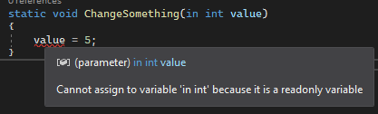
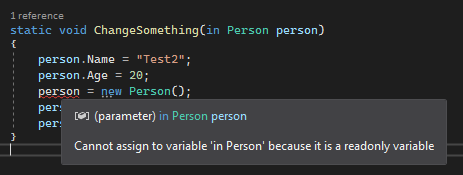
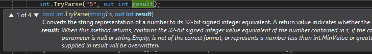
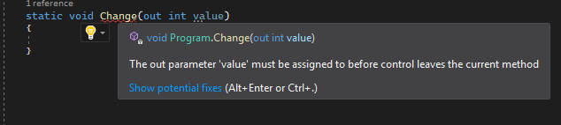

### Ref, In ve Out Anahtar Sözcüklerinin Kullanımı

#### İçindekiler

- [Ref, in, out ihtiyacı](#ref-in-out-ihtiyacı)
- [Metot davranışlarını anlamak](#metot-davranışlarını-anlamak)
  - [Parametre olarak değer tipinin gönderilmesi](#parametre-olarak-değer-tipinin-gönderilmesi)
  - [Parametre olarak referans tipinin gönderilmesi](#parametre-olarak-referans-tipinin-gönderilmesi)
- [Ref anahtar sözcüğü kullanımı](#ref-anahtar-sözcüğü-kullanımı)
  - [Değer tiplerinde ref anahtar sözcüğü](#değer-tiplerinde-ref-anahtar-sözcüğü)
  - [Referans tiplerinde ref anahtar sözcüğü](#referans-tiplerinde-ref-anahtar-sözcüğü)
- [In anahtar sözcüğü kullanımı](#in-anahtar-sözcüğü-kullanımı)
  - [Değer tiplerinde in anahtar sözcüğü](#değer-tiplerinde-in-anahtar-sözcüğü)
  - [Struct değer tipinde in anahtar sözcüğü](#struct-değer-tipinde-in-anahtar-sözcüğü)
  - [Referans tiplerinde in anahtar sözcüğü](#referans-tiplerinde-in-anahtar-sözcüğü)
- [Out anahtar sözcüğü kullanımı](#out-anahtar-sözcüğü-kullanımı)
  - [Değer tiplerinde out anahtar sözcüğü](#değer-tiplerinde-out-anahtar-sözcüğü)
  - [Referans tiplerinde out anahtar sözcüğü](#referans-tiplerinde-out-anahtar-sözcüğü)
- [Kullanılan kaynaklar](#kullanılan-kaynaklar)

### Ref, in, out ihtiyacı

Kodlama yaparken sıklıkla metot kullanıyoruz. Çoğunlukla da parametreli metotlar ile işlem yapıyoruz. Peki parametre alan gönderilen nesnelerin metot içerisinde değişmeyeceğinin garantisi var mı?

Örneğin çok sayıda kayıt bulunan bir liste ile çalıştığımızı hayal edelim. `MethodExample()` adında nasıl çalıştığını bilmediğimiz bir metot olsun.

```csharp
//  `Cihan` ismine sahip kişileri liste içerisinden silen bir metot örneği
public static void MethodExample(List<User> userList)
{
    list.RemoveAll(user => user.Name == "Cihan");
}
```

User listesini bu metoda verdikten sonra işlem yapmaya devam edelim.

```csharp
List<User> list = _userService.GetAllUsers();
// MethodExample metodunun nasıl bir işlem yaptığını bilmiyoruz.
MethodExample(list);

// list ile işlem 1
// list ile işlem 2
//...
```

`MethodExample` metodunu çalıştırdıktan sonra `list` ismindeki liste içerisinde bazı değişiklikler oldu. Fakat ilgili metodu kullanırken metodun neler yaptığını bilmediğimiz için ilgli listeyi kullanırken istenmeyen durumlar oluşabilir. İstenmeyen durumların oluşmaması için parametre olarak gönderdiğimiz nesne üzerinde nelerin olacağını önceden bilmeliyiz.

Şu durumlarda değişikliği bilebiliriz.

- `MethodExample` metodunu başkası yazmadıysa
- `MethodExample` metoduna erişip inceleyebiliyorsak
- `MethodExample` metodunun nasıl davrandığını _kesin_ olarak biliyorsak
- `MethodExample` iyi bir şekilde dokümante edilmişse ve ilgili metoda güveniyorsak
- ...

Yukarıdaki maddelere göre bir metodun nasıl davrandığına karar vereceksek vay halimize! Parametre olarak gönderdiğimiz nesnenin _değişeceği_, _değişmeyeceği_ ya da _değişebileceği_ bilgisini önceden bilmemiz gerekiyor.

Yukarıdaki ihtiyaç haricinde parametre olarak geçilen nesnenin davranışını da değiştirme ihtiyacımız olabilir. Örneğin değer tipindeki bir nesneye metot içerisinde referans tipi gibi davranmasını isteyebiliriz. Ya da ilgili nesneyi `readonly` durumuna getirip metot içerisine güvenli bir şekilde gönderebiliriz.

Bu gibi ihtiyaçlar için `in`, `out` ve `ref` anahtar sözcükleri imdadımıza yetişiyor.

### Metot Davranışlarını Anlamak

Konuya geçmeden önce metoda gönderilen parametrelerin _değer tipleri_ ve _referans tipleri_ için nasıl davrandığına bakalım.(Referans ve değer tipleri ile ilgili daha detaylı içeriğe erişmek için [tıklayınız.](../value-type-and-reference-type/value-type-and-reference-type.md))

#### Parametre olarak değer tipinin gönderilmesi

Değer tiplerinde ilgili `değerin kopyalandığını` biliyoruz. Bir metoda parametre olarak ilgili değeri gönderdiğimizde farklı bir nesne elde etmiş oluruz. Atanan değer ile hiç bir bağ bulunmaz. Örneğin;

```csharp
//Method
public static void ChangeNumber(int x)
{
    x = 10;
}

//Usage
int number = 5;
ChangeNumber(number);
Console.WriteLine(number);
```

Ekran Çıktısı

```
5
```

Değeri `10` yapmamıza rağmen orjinal değer etkilenmedi ve `5` olarak kaldı.

Neden bu şekilde davrandığını anlamak adına adım adım inceleyelim.

- `number = 5` olarak stack içerisine eklendi.
- `ChangeNumber` metoduna geçiş yapılırken stack üzerinde ayrı bir kısım ayrıldı.
- `ChangeNumber` içerisine gönderilen parametre olan `number=5` => `x = 5` olarak `kopyalandı` ve ayrılan stack üzerine eklendi.
- Method içerisindeki x `x = 10` olarak değiştirildi.
- `ChangeNumber` metodu sonlandırılırken `x = 10` stack üzerinden kaldırıldı. (Artık x=10 adında bir nesne bulunmuyor.)
- Stack üzerinde ayrılan kısım kaldırıldı.
- Hala `number = 5` değerine sahip olduğu için ekran çıktısı `5`

#### Parametre olarak referans tipinin gönderilmesi

Referans tiplerinde nesnenin kendisi kopyalanmaz. Bunun yerine `referans değerleri` kopyalanır. Bir metoda parametre olarak ilgili nesneyi gönderdiğimizde referans değerleri ile çalıştığımız için değişikliklerden ilgili referans değerine sahip bütün nesneler etkilenir. Örneğin;

```csharp
public class Person
{
    public string Name;
    public int Age;
}
```

```csharp
public static void ChangePersonAge(Person person)
{
    person.Age = 20;
}

static void Main(string[] args)
{
    Person p1 = new Person() { Name = "Cihan", Age = 25 };
    ChangePersonAge(p1);
    Console.WriteLine("Person age is {0}", p1.Age);
}
```

Ekran Çıktısı

```
Person age is 20
```

Beklediğimiz gibi method içerisindeki bir değişiklikten ilgili nesnenin kendisi etkilendi.

---

Parametre olarak referans ve değer tipi verildiğinde standart olarak nasıl davrandığını özetlediğimize göre `ref`, `in` ve `out` anahtar sözcükleri ile bu davranışın nasıl değiştiğini gözlemleyelim.

### Ref anahtar sözcüğü kullanımı

Parametre olarak gönderilen nesne üzerinde `ref` anahtar sözcüğünü kullanırsak ilgili değerin `değişebileceği` bilgisini vermiş oluruz. Referans ve değer tiplerinde nasıl davrandığına bakalım.

#### Değer tiplerinde ref anahtar sözcüğü

Parametre olarak değer tipi gönderirken `ref` anahar sözcüğünü kullandığımızda ilgili değer tipi kopyalanmaz. Bunun yerine referans tipi gibi davranır.

Daha iyi anlamak adına örnek yapalım.

```csharp
public static void ChangeNumber(ref int number)
{
    number = 10;
}

static void Main(string[] args)
{
    int number = 5;
    // Method parametresi ref kabul ettiği için nesneyi gönderirken ref ile belirtmek zorundayız.
    // Bu şekilde zorunlu tutulması kod okunabilirliği açısından da oldukça faydalı.
    // Parametre olarak geçilen nesnenin değişebileceği bilgisini ilgili metodu kullanırken de biliyoruz.
    ChangeNumber(ref number);
    Console.WriteLine("Number is {0}", number);
}
```

Ekran çıktısı

```csharp
Number is 10
```

Kısaca parametre olarak değer tipinde `ref` bulunuyorsa bu değerin metot içerisinden `değişebileceğini` sağlamış oluruz.

#### Referans tiplerinde ref anahtar sözcüğü

"Referans tiplerinde ilgili değerin referans değeri kopyalanıyor. `ref` kullanınca ne değişecek?" sorusunu duyar gibiyim. Örnek üzerinden gidersek daha iyi anlaşılacağını düşünüyorum.

Öncelikle hiç bir anahtar sözcüğü vermeden referans tipinde nasıl davrandığını gözlemleyelim. Daha sonrasında ise aynı metodu `ref` ile kullanıp farklarını inceleyeceğiz.

```csharp
public class Person
{
    public string Name;
    public int Age;
    public override string ToString()
    {
        return $"{Name} age is {Age}";
    }
}
```

```csharp
static void ChangeSomething(Person person)
{
    person.Name = "Test2"; // 2. Adım
    person.Age = 20; // 3. Adım
    person = new Person(); // 4. Adım
    person.Name = "Test3"; // 5. Adım
    person.Age = 30; // 6. Adım
}//7.Adım

static void Main(string[] args)
{
    Person person = new Person() { Name = "Test1", Age = 10 };
    ChangeSomething(person); // 1. Adım
    Console.WriteLine(person); //8. Adım
}
```

Ekran Çıktısı

```csharp
Test2 age is 20
```

Neden bu şekilde davrandığına adım adım bakalım.

- **1.Adım:** Oluşturduğumuz _person_ nesnesini parametre olarak gönderdik. (Referans değerinin 0x1234567 olduğunu varsayalım.)
  - Person nesnesinin referans değeri kopyalandı.
  - `in`, `out` ve `ref` kullanılmadığı için de sadece o referans değerine bağlı olan alanlar(field, property vb.) üzerinde değişiklik yapılabilir.
  - Name = "Test1", Age = 10. `(0x1234567)`
- **2.Adım:** _person.Name_ üzerinde değişiklik yapılabilir.
  - Name = "Test2", Age = 10. `(0x1234567)`
- **3.Adım:** _person.Age_ üzerinde değişiklik yapılabilir.
  - Name = "Test2", Age = 20. `(0x1234567)`
- **4.Adım:** _new_ anahatar sözcüğü kullanıldığı zaman yeni bir nesne üretildiğini, bu nesneye ait bir referans adresinin oluşturulduğunu biliyoruz. Bu referans adresini _person_ nesnesine atama yapmaya çalıştığımız andan itibaren paremetre olarak geçilen orjinal nesneyi kaybetmiş oluruz. Çünkü parametre olarak geçilen nesnenin `referans adresi` <u>değiştirilemez</u>. Kısaca bu adım ve bu adımdan sonraki bütün işlemler metot içerisinde üretilen nesneyi etkiler. (Yeni üretilen nesnenin referans değerinin 0x2345678 olduğunu varsayalım.)
- **5.Adım:** _person.Name_ üzerinde değişiklik yapılabilir.
  - Name = "Test3", Age = 0 `(0x2345678)`
- **6.Adım:** _person.Age_ üzerinde değişiklik yapılabilir.
  - Name = "Test3", Age = 30 `(0x2345678)`
- **7.Adım:** Method içerisinden çıkarken ilgili nesnenin referans adresini tutan stack kaldırılır. GC kendi algoritmasına göre kullanılmayan nesneyi bir süre sonra siler.
- **8.Adım:** İlgili nesnemizin referans adresi `0x1234567`. Ekran çıktısı `Test2 age is 20` olur. (Son güncelleme _3.Adımda_ yapıldı.)

Standart olarak nasıl davrandığını anladığımıza göre aynı metodu `ref` ile birlikte kullanalım ve sonuçları gözlemleyelim.

```csharp
static void ChangeSomething(ref Person person)
{
    person.Name = "Test2";
    person.Age = 20;
    person = new Person();
    person.Name = "Test3";
    person.Age = 30;
}

static void Main(string[] args)
{
    Person person = new Person() { Name = "Test1", Age = 10 };
    ChangeSomething(ref person);
    Console.WriteLine(person);
}
```

Ekran Çıktısı

```csharp
Test3 age is 30
```

Hatırlarsanız parametre olarak gönderilen nesne üzerinde `ref` anahtar sözcüğünü kullanırsak ilgili değerin `değişebileceğini` söylemiştim. Aslında tam da beklediğimiz gibi davrandı. Yaptığımız bütün değişikliklerden etkilendi.

Yukarıda olduğu gibi adım adım anlatarak uzatmak istemedim. Arkaplanda nelerin olduğunu hayal edebilirsiniz. Örneğin ilk oluşturduğumuz nesnenin referans değeri metot içerisinde değiştiği için _memory_ üzerinde saklanan ilk nesne belirli bir süre sonra GC tarafından silinir.

Özetlemek gerekirse referans tipindeki bir nesneye ön ek olarak `ref` anahtar sözcüğü tanımlanmışsa ilgili nesnenin `referans değerinin de değişebileceğini` söyleriz.

### In anahtar sözcüğü kullanımı

Parametre olarak gönderilen nesne üzerinde `in` anahtar sözcüğünü kullanırsak ilgili değerin `değiştirilemeyeceği` bilgisini vermiş oluruz. Başka bir deyişle gönderilen nesne `readonly` (okunabilir ama değiştirilemez) özelliğine sahip olur. Referans ve değer tiplerinde nasıl davrandığına bakalım.

#### Değer tiplerinde in anahtar sözcüğü

Parametre olarak değer tipi gönderirken `in` anahtar sözcüğünü kullandığımızda ilgili değer tipi kopyalanmaz. Bunun yerine referans tipi gibi davranır. Fakat bu değer metot içerisinde `değiştirilemez`. Bunu kısıtlamış oluruz.

Örneğin aşağıdaki gibi bir metot tanımlamaya çalışırsak hata alırız.

```csharp
static void ChangeSomething(in int value)
{
    value = 5;
}
```



#### Struct değer tipinde in anahtar sözcüğü

Struct tipi de değer tipi olduğu için `in` kullanımında aynı özelliği gösterirler. İçerisinde tanımladığımız <u>bütün alanlar</u> `readonly` olurlar. Örneğin;

```csharp
public struct MyStruct
{
    public string Name;
    public string SurName;
    public override string ToString()
    {
        return $"{Name} {SurName}";
    }
}
```

```csharp
static void Change(in MyStruct value)
{
    value.Name = ""; //Compiler error
    value.SurName = ""; //Compiler error
}
```

Yukarıdaki gibi metot tanımlamaya çalıştığımızda derleme hatası alırız. `MyStruct` tipi içerisindeki alanlar ile birlikte tamamen `readonly` durumundadır. Metot içerisinde `değiştirilemezler`.

Derleyiciyi kandırıp çalışma anında da `readonly` özelliğini koruduğunu gözlemleyelim. Bunun için ilgili tip içerisine ilgili alanları değiştirebilen metot ekliyorum.

```csharp
public struct MyStruct
{
    public string Name;
    public string SurName;
    public override string ToString()
    {
        return $"{Name} {SurName}";
    }
    public void ChangeName(string name) => Name = name;
	public void ChangeSurname(string surname) => SurName = surname;
}
```

Metodumuzu şu şekilde güncelleyelim.

```csharp
static void Change(in MyStruct value)
{
    value.ChangeName("Name changed!");
    value.ChangeSurname("Surname changed!");
}
```

Çalıştırıp sonucu gözlemleyelim.

```csharp
static void Main(string[] args)
{
    MyStruct value = new MyStruct() { Name = "Name", SurName = "Surname" };
    Console.WriteLine("Before Change Method: {0}", value);
    Change(in value);
    Console.WriteLine("After Change Method: {0}", value);
}
```

Ekran Çıktısı

```csharp
Before Change Method: Name Surname
After Change Method: Name Surname
```

Görüldüğü gibi değerler değişmedi. Kısaca `readonly` özelliği korundu.

#### Referans tiplerinde in anahtar sözcüğü

Parametre olarak referans tipi gönderirken `in` anahtar sözcüğünü kullandığımızda ilgili referans tipinin <u>referans adresini</u> `değiştirilemez` hale getiririz. Örneğin;

```csharp
public class Person
{
    public string Name;
    public int Age;
    public override string ToString()
    {
        return $"{Name} age is {Age}";
    }
}
```

```csharp
static void Main(string[] args)
{
    Person person = new Person() { Name = "Test1", Age = 10 };
    ChangeSomething(in person);
    Console.WriteLine(person);
}

static void ChangeSomething(in Person person)
{
    person.Name = "Test2";
    person.Age = 20;
    person = new Person(); // Compiler error!
    person.Name = "Test3";
    person.Age = 30;
}
```

İlgili nesnenin referans değerini değiştiremeyeceğimiz için _derleme hatası_ alırız.



Derleme hatası aldığımız yeri kaldırıp şu şekilde çalıştırırsak;

```csharp
static void ChangeSomething(in Person person)
{
    person.Name = "Test2";
    person.Age = 20;
    person.Name = "Test3";
    person.Age = 30;
}
```

Ekran Çıktısı

```
Test3 is 30.
```

Farkettiyseniz _Person_ nesnesi içerisinde bulunan diğer alanlar bu değişiklikten etkilendi. `in` ile sadece referans değerinin değişmesini engelleriz. Nesne üzerinde bulunan alanlar değişikliklerden etkilenmeye devam ederler.

### Out anahtar sözcüğü kullanımı

`ref` ve `in` aksine `out` sıklıkla karşılaştığımız bir anahtar sözcüğü aslında. En basitinden convert işlemlerinde bile bunu görürüz. Örneğin string tipte bir değeri _int_ tipine dönüştürmeye çalışırken 2. parametre olarak `out` aldığına dikkat edin.



Peki tam olarak `out` anahtar sözcüğü ne yapar?

Parametre olarak gönderilen nesne üzerinde `out` anahtar sözcüğünü kullanırsak ilgili değerin metot içerisinde `kesinlikle değiştirileceğini` sağlamış oluruz. Başka bir deyişle gönderilen nesne metot içerisinde değiştirilmek zorundadır.

Referans ve değer tiplerinde örnek yapıp nasıl davrandığına bakalım.

#### Değer tiplerinde out anahtar sözcüğü

Aşağıdaki gibi bir metot tanımı yaparsak derleme hatası alırız.

```csharp
static void Change(out value)
{
}
```



`Must be assigned` tanımı dikkatinizi çekti mi? :) `out` kullandığımız için içeride atama yapmamız gerekiyor.

```csharp
static void Change(out int value)
{
    value = 10;
}

static void Main(string[] args)
{

    int value;
    Change(out value);
    Console.WriteLine(value);
}
```

Ekran Çıktısı

```
10
```

`out` anahtar sözcüğüne sahip parametreler için şu şekilde kısaltma yapabiliriz.

```csharp
static void Main(string[] args)
{
    Change(out int value);
    Console.WriteLine(value);
}
```

Yukarıdaki kullanım ile arasında hiç bir fark bulunmamakta.

#### Referans tiplerinde out anahtar sözcüğü

Değer tiplerinde olduğu gibi referans tiplerinde aynı şekilde davranır. Yani metot içerisinde ilgili nesneye `atama` yapmak zorundayız. Örnek yapalım.

```csharp
public class Person
{
    public string Name;
    public int Age;
    public override string ToString()
    {
        return $"{Name} age is {Age}";
    }
}
```

```csharp
static void ChangePerson(out Person person)
{
    person = new Person() { Name = "Cihan", Age = 25 };
    person.Name = "Changed!";
}

static void Main(string[] args)
{
    Person person;
    ChangePerson(out person);
    Console.WriteLine(person);
}
```

Ekran Çıktısı

```
Changed! age is 25
```

Aynı şekilde burada da kısaltmaya gidebiliriz.

```csharp
ChangePerson(out Person person);
Console.WriteLine(person);
```

---

Özetle `in`, `out` ve `ref` anahtar sözcükleri aşağıdaki şekilde yorumlanabilir.

- `in` anahtar sözcüğüne sahip parametreye nesne gönderen kişi ilgili nesnenin metot içerisinde `kesinlikle değişmeyeceğini` bilir.
- `ref` anahtar sözcüğüne sahip parametreye nesne gönderen kişi ilgili nesnenin metot içerisinde `değişebileceğini` bilir.
- `out` anahtar sözcüğüne sahip parametreye nesne gönderen kişi ilgili nesnenin metot içerisinde `kesinlikle değişeceğini` bilir.

* `in` anahtar sözcüğüne sahip parametreyi metot içerisinde kullanan kişi ilgili nesneyi `değiştiremeyeceğini` bilir.
* `ref` anahtar sözcüğüne sahip parametreyi metot içerisinde kullanan kişi ilgili nesneyi ihtiyaca göre `değiştirebileceğini` bilir.
* `out` anahtar sözcüğüne sahip parametreyi metot içerisinde kullanan kişi ilgili nesneye `atama yapması gerektiğini` bilir.

---

Uzun bir yazı oldu. Umarım faydalı bir içerik olmuştur.Hatalı gördüğünüz, yanlış olduğunu düşündüğünüz ve eklemek istediğiniz kısımlar için pull request yapabilirsiniz. Bu sayede daha güzel bir içerik oluşmuş olur.

Herkes iyi çalışmalar.

### Kullanılan kaynaklar

- [C# - Using in, out, and Ref with Parameters](https://www.pluralsight.com/guides/csharp-in-out-ref-parameters)
- [Reference Types ve Value Types arasındaki farklar nelerdir?](https://youtu.be/07Tqdn_h4bU)
