#### İçindekiler

- [AspNetCore Uygulamasında Loglama, Serilog, Seq, Docker ve Github Action Kullanımı](#aspnetcore-uygulamasında-loglama-serilog-seq-docker-ve-github-action-kullanımı)
  - [Default Tanımlı Loglama](#default-tanımlı-loglama)
    - [Projeyi Oluşturma](#projeyi-oluşturma)
    - [Microsoft.Extensions.Logging.ILogger](#microsoftextensionsloggingilogger)
    - [Yapılandırma Dosyasındaki Log Seviyesi](#yapılandırma-dosyasındaki-log-seviyesi)
    - [Yapılandırma Dosyaları Arasındaki İlişki](#yapılandırma-dosyaları-arasındaki-i̇lişki)
  - [Serilog](#serilog)
    - [AspNetCore Projesine Serilog Dahil Edilmesi](#aspnetcore-projesine-serilog-dahil-edilmesi)
    - [Serilog AspNetCore Request Loglama](#serilog-aspnetcore-request-loglama)
    - [Serilog ile Dosyaya Loglama](#serilog-ile-dosyaya-loglama)
    - [Serilog ile Logları Zenginleştirmek](#serilog-ile-logları-zenginleştirmek)
  - [Serilog ile Seq Kullanımı](#serilog-ile-seq-kullanımı)
    - [Seq Sink Yapılandırması](#seq-sink-yapılandırması)
    - [Docker Seq Server Kurulumu](#docker-seq-server-kurulumu)
    - [Docker Seq Volume Oluşturma](#docker-seq-volume-oluşturma)
  - [Demo Uygulamasını Dockerize Etme](#demo-uygulamasını-dockerize-etme)
  - [Docker Compose Kullanımı](#docker-compose-kullanımı)
    - [SerilogSeqServerUrl Değerini Ekleme](#serilogseqserverurl-değerini-ekleme)
    - [Docker Compose ile Uygulamayı Çalıştırma](#docker-compose-ile-uygulamayı-çalıştırma)
  - [Github Action ile Uygulama Imajını Docker Hub'a Göndermek](#github-action-ile-uygulama-imajını-docker-huba-göndermek)
    - [Projenin Github'a Gönderilmesi](#projenin-githuba-gönderilmesi)
    - [Github Action Yapılandırma Dosyası](#github-action-yapılandırma-dosyası)
  - [Kullanılan Kaynaklar](#kullanılan-kaynaklar)

## AspNetCore Uygulamasında Loglama, Serilog, Seq, Docker ve Github Action Kullanımı

Herkese merhaba. Geçen günlerde projemi .net core 3.1 versiyonuna güncellerken loglama kısımları ile ilgili konfigürasyonların biraz karışık ve yönetilemez bir halde olduğunu farkettim. Projeyi daha basite indirgemek adına loglama ile ilgili küçük bir demo projesi oluşturup test ettim. Demo projesinde hazır kullanılabilecek yapılar bulunduğu için bununla ilgili de içerik yazmaya karar verdim. Bugün aynı demo projesini sıfırdan oluşturup adım adım ilerleyeceğiz.

### Default Tanımlı Loglama

#### Projeyi Oluşturma

Öncelikle proje için gerekli `solutionı` oluşturalım.

```
mkdir DemoApplication
cd .\DemoApplication\
dotnet new sln --name DemoApplication
```

Böylelikle `DemoApplication` adında _solution_ elde ettik. Demo projesi `Web` projesi olacağı için solution içerisinde web projesi oluşturalım. Proje için `razor` template'i kullanacağız.

```
dotnet new razor --name DemoApplication.Web
```

Böylelikle `DemoApplication.Web` adında _project_ elde ettik. İlgili solution'a bu projeyi bağlayalım.

```
dotnet sln add .\DemoApplication.Web\DemoApplication.Web.csproj
```

Projenin ihtiyaç duyduğu kütüphaneleri projeye dahil edelim.

```
dotnet restore
```

Son olarak projeyi `build` edelim.

```
dotnet build .\DemoApplication.sln
```

Projemiz hazır. Çalıştıralım.

```
dotnet run --project .\DemoApplication.Web\DemoApplication.Web.csproj
```

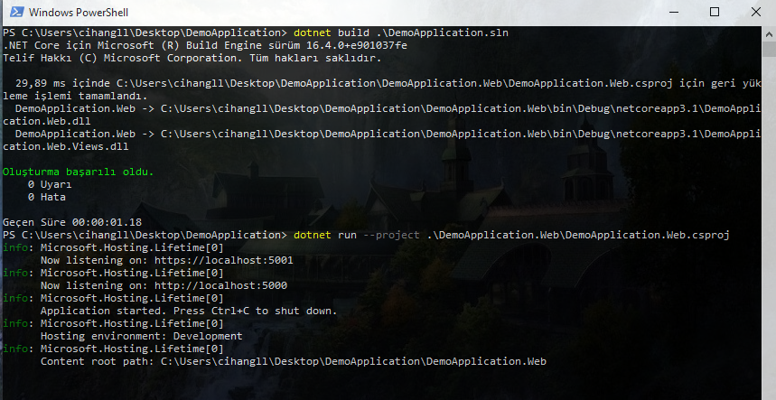

Herhangi bir sorun olmadıysa yukarıdaki gibi bir ekran göreceksiniz. Artık ilgili web uygulamasına http - _5000_, https - _5001_ portunu kullanarak erişebiliriz.

_Not: Aynı proje ortamında çalışmak için bilgisayarınızda kurulu .net core sdk versiyonunun 3.1 olması gerekmektedir. Aksi takdirde proje dosyaları ve konfigürasyonların bazıları farklılık gösterebilir. .net core sdk versiyonunu öğrenmek için `dotnet --version` komutunu kullanabilirsiniz._

_Not2: `dotnet run` komutu projeyi çalıştırmadan önce build işleminin gerekli olup olmadığına bakar. Gerekiyorsa build işlemi de yapar. İhtiyacınıza göre build etmeden çalıştırmak için `dotnet run --no-build` komutunu kullanabilirsiniz._

#### Microsoft.Extensions.Logging.ILogger

Daha önceden dotnet core projesinde kodlama yaptıysanız loglama için kullanılan `ILogger` sınıfı ile tanışmışsınızdır. `ILogger` loglama yapabileceğimiz bir yapı sunar. Örneğin `Microsoft.Extensions.Logging.LoggerExtensions` sınıfını incelerseniz içerisinde `ILogger` için yazılmış, halihazırda kullanabileceğiniz _extension_ metotlar bulunur. _Log_, _LogCritical_, _LogDebug_, _LogError_, _LogInformation_, _LogTrace_ ve _LogWarning_. Projenin herhangi bir yerinde ihtiyacınıza göre bu metotları kullanarak rahat bir şekilde loglama yapabilirsiniz.

Örneğin oluşturduğumuz projede index page modelini incelersek halihazırda kullanmamız için _ILogger_ sınıfının `constructor injection` yöntemiyle page modele dahil edildiğini gözlemleriz. _ILogger_ generic interface yapısına sahip olduğu için `ILogger<T>` olarak interface sunar. Loglama yapacağımız sınıfı argüman olarak verebiliriz.

```csharp
public class IndexModel : PageModel
{
    private readonly ILogger<IndexModel> _logger;

    public IndexModel(ILogger<IndexModel> logger)
    {
        _logger = logger;
    }

    public void OnGet()
    {

    }
}
```

_Not :Farkettiyseniz `_logger` nesnesi için herhangi bir tanımlama, oluşturma vb. yapmadık. Bunun yönetimini uygulamanın kendisi sağlıyor. Bu konu ile ilgili detaylı bilgiye şu anahtar kelimeleri aratarak ulaşabilirsiniz. `Inversion of control (IoC)`, `Dependency Injection`, `Dotnet core default IoC container`, `constructor injection`_

Bu aşamada `Index` sayfasına `GET` isteği yapıldığında _Hello World!_ yazan bir log oluşturalım.

```csharp
//...
public void OnGet() {
    _logger.LogInformation("Hello World!");
}
```

`dotnet run` ile çalıştırıp index sayfasına istek atalım.

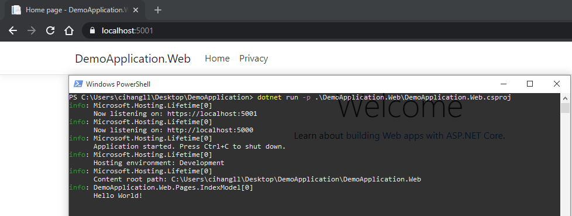

Biraz önce belirttiğimiz `Hello World!` loglaması yapıldı. Farklı log tiplerini de işin içerisine dahil edip daha fazla log elde edelim. Örneğin 1 den 10 a kadar olan sayılar için çift ise information, tek ise warning loglaması yapalım.

```csharp
//...
public void OnGet() {

    //...

    for (int i = 0; i <= 10; i++)
    {
        if (i % 2 == 0)
            _logger.LogInformation("{value} is even.", i);
        else
        {
            _logger.LogWarning("{value} is odd.", i);
        }
    }
}
```

Index sayfasına her istekte bu metot çalışacağı için loglama yapılacaktır. Konsol üzerinde görüntüleyelim.

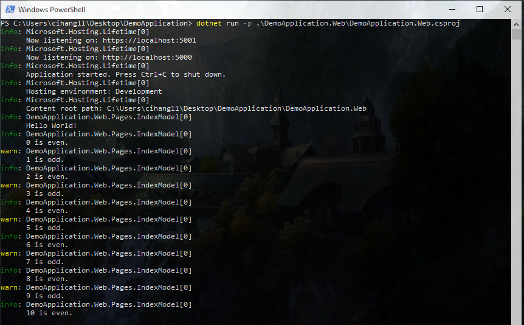

Artık `warn` ve `info` olarak 2 farklı log seviyesini de görüntüleyebiliyoruz. Hata aldığımız durumlarda ilgili hatayı loglayan bir örnek de yapalım. Bunun için herkesin çok sevdiği ve bildiği bir hatayı kullanabiliriz :)

```csharp
//...
public void OnGet() {

    //...

    try
    {
        string value = "test value";
        value = null;

        value.Split(";");
    }
    catch (Exception e)
    {
        _logger.LogError(e, "Error occured!");
    }
}
```

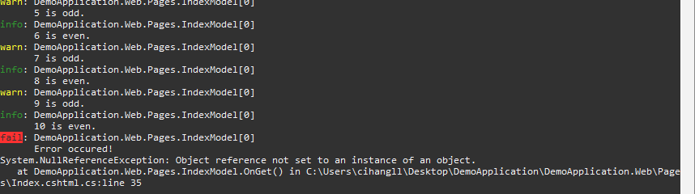

#### Yapılandırma Dosyasındaki Log Seviyesi

.net core projesi oluşturduğunuzda standart olarak 2 yapılandırma dosyası gelir. `appsettings.json` ve `appsetttings.Development.json`. İçerisinde loglama seviyeleri ile ilgili hazır olarak gelen yapı bulunur. Ne olduklarını, nasıl çalıştıklarını inceleyelim. (Daha fazla bilgi için [adresini](https://docs.microsoft.com/en-us/aspnet/core/fundamentals/logging/?view=aspnetcore-3.1#configuration) inceleyebilirsiniz.)

appsetttings.Development.json dosyası

```json
{
  "Logging": {
    "LogLevel": {
      "Default": "Information",
      "Microsoft": "Warning",
      "Microsoft.Hosting.Lifetime": "Information"
    }
  }
}
```

`Logging` adı ile başlayan kısım ile loglama yapılandırması olduğunu belirttik. `LogLevel` ile de hangi _namespacelerin_ hangi loglama seviyesine göre loglanması gerektiğini söyledik.

İçerisindeki namespace değerlerine bakalım.

- **"Default": "Information"** Bu yapılandırmaya göre bütün _namespace_ ler default olarak `Information` seviyesinde loglama yaparlar.
- **"Microsoft": "Warning"** Bu yapılandırmaya göre Microsoft _namespace_ ine ait her şey `Warning` seviyesinde loglama yapar.
- **"Microsoft.Hosting.Lifetime": "Information"** Bu yapılandırmaya göre Microsoft.Hosting.Lifetime _namespace_ ine ait her şey `Information` seviyesinde loglama yapar.

Development ortamında yapılandırmamız bu şekilde. Hatırlarsanız `information`, `warning`, `error` seviyelerini rahatlıkla console üzerinde görüntülemiştik. İsterseniz _Default_ olarak _Information_ tanımlı kısmı test etmek adına `Error` haline getirelim.

```json
{
  "Logging": {
    "LogLevel": {
      "Default": "Error",
      "Microsoft": "Warning",
      "Microsoft.Hosting.Lifetime": "Information"
    }
  }
}
```

Uygulamayı çalıştırıp _Index_ sayfasına istek atarsak console üzerindeki loglar şu şekilde olacaktır.

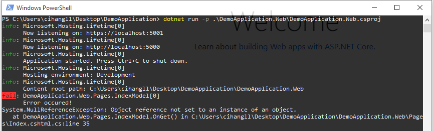

Farkettiyseniz oluşturmuş olduğumuz `information` ve `warning` seviyesindeki loglar artık getirilmiyor. Fakat `Microsoft.Hosting.Lifetime` altındaki her şey `information` seviyesinde loglanmaya devam ediyor.

Development ortamında log yapılandırması bu şekilde. `Default` ortamda bu yapılandırmanın nasıl olduğuna bakalım.

appsetttings.json dosyası

```json
{
  "Logging": {
    "LogLevel": {
      "Default": "Information",
      "Microsoft": "Warning",
      "Microsoft.Hosting.Lifetime": "Information"
    }
  },
  "AllowedHosts": "*"
}
```

`appsettings.Development.json` dosyasındaki loglama yapısı ile herhangi bir farkı yok. Peki neden iki yere de tanımlı? Farkları neler? İnceleyelim.

_Not: Loglama ile ilgili detaylı bilgiye [adresinden](https://docs.microsoft.com/en-us/aspnet/core/fundamentals/logging/?view=aspnetcore-3.1) erişebilirsiniz._

#### Yapılandırma Dosyaları Arasındaki İlişki

`appsettings.json` ve `appsettings.Development.json` dosyalarının birbiri ile nasıl haberleştiğine biraz değinelim. `appsettings.json` default yapılandırma dosyamız. `appsettings.{ENVIRONMENT}.json` dosyaları ise ortam değiştirdiğimizde kullanılacak ve _appsettings.json_ dosyasını _ezen_ yapılandırma dosyalarıdır. Nasıl çalıştığını anlamak adına örnek yapalım. Konumuz loglama olduğu için de loglama üzerinden göstermek çok daha uygun.

`appsettings.json` dosyasında `Microsoft.Hosting.Lifetime` tarafından sağlanan bütün bilgilendirme loglarını görmek istiyorum. Fakat geliştirme ortamında buna ihtiyacım olmadığını varsayıp `Error` seviyesinde loglama yapmak istiyorum.

`appsettings.Development.json` dosyası

```json
{
  "Logging": {
    "LogLevel": {
      "Default": "Information",
      "Microsoft": "Warning",
      "Microsoft.Hosting.Lifetime": "Information"
    }
  }
}
```

`appsettings.json` dosyası

```json
{
  "Logging": {
    "LogLevel": {
      "Default": "Information",
      "Microsoft": "Warning",
      //Test etmek için Error seviyesine getirdik.
      "Microsoft.Hosting.Lifetime": "Error"
    }
  }
}
```

Komut satırını açıp ilgili komutları yazarak çalıştıralım ve `Development` ve `Default` ortamda nasıl davrandığına bakalım.

İlk önce `Default` ortamda çalıştırıp `appsettings.Development.json` kullanılmadan loglamamızın sorunsuz çalıştığını görelim.

```
dotnet run -p .\DemoApplication.Web\DemoApplication.Web.csproj --environment=Production --no-launch-profile
```

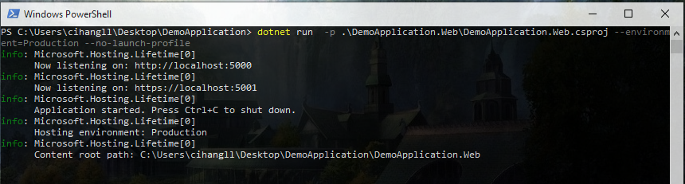

Beklediğimiz gibi `Microsoft.Hosting.Lifetime` loglaması _information_ seviyesinde loglama yapıyor. Şimdi de `Development` ortamında çalıştırıp değişikliği gözlemleyelim.

```
dotnet run -p .\DemoApplication.Web\DemoApplication.Web.csproj --environment=Development --no-launch-profile
```

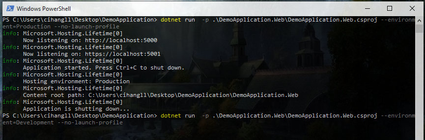

Görüldüğü gibi uygulama çalışmasına rağmen `Microsoft.Hosting.Lifetime` ile ilgili `Information` seviyesinde hiç bir loglama yapılmadı. Çünkü _development_ ortamındaki yapılandırmalar _production_ ortamındaki yapılandırmaları ezdi.

_Not: `--environment=` ile kullandığımız ortamı setliyoruz. `--environment` ile `ASPNETCORE_ENVIRONMENT` değeri setlenir. Daha fazla bilgi için [şu adreste](https://stackoverflow.com/a/50821669/8069766) bulunan ilgili kısmı okuyabilirsiniz._

_Not2: Projenizde `launchSettings.json` dosyası yoksa `--no-launch-profile` komutuna gerek yok. `--environment` ile verdiğimiz ortam değerinin ezilmemesi için launch profile olmadan çalıştırmamız gerekli._

_Not3: Yapılandırma dosyalarını birbiriyle ezerken dikkatli olmakta yarar var. Örneğin `appsettings.json` dosyasında bulunan ve array olan bir kısmı (`["...", "...",...]`) `appsettings.{environment}.json` ile ezdiğinizde değerler sırasıyla ezilir. `"Name" : ["1","2"]` olan yapılandırmayı `"Name" : ["2"]` şeklinde verirseniz son hali şu olur. `"Name": ["2","2"]`_

### Serilog

NetCore projelerinde öntanımlı olarak gelen loglama kütüphanesi ihtiyacınıza göre yetersiz kalabilir. (Örneğin logları dosyaya yazma, veritabanına yazma, daha anlamlı loglar elde etme, format değiştirme vb.) Bunun için genellikle `nlog`, `serilog` gibi ekstra loglama kütüphaneleri kullanıyoruz. Bu demo projesinde kendini bile loglayabilen `Serilog` kütüphanesini kullanacağız.

_Not: Serilog başlı başına anlatılması gereken bir konu. Bu yazıda .net core projesine nasıl ekleneceğine değineceğiz. Daha detaylı bilgi için kendi dokümantasyonunun bulunduğu [şu adrese](https://github.com/serilog/serilog/wiki/Getting-Started) gidebilirsiniz._

#### AspNetCore Projesine Serilog Dahil Edilmesi

Serilog kütüphanesini projemize ekleyelim.

```
cd .\DemoApplication.Web\
dotnet add package Serilog.AspNetCore
```

Standart bir aspNetCore projesinde olması gereken serilog kütüphaneleri (console log, file log ...) tek çatı altında toplanmış şekilde. Bu yüzden doğrudan `Serilog` paketini eklemek yerine `Serilog.AspNetCore` paketini ekledik.

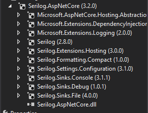

Serilog yapılandırması farklı şekillerde yapılabiliyor. Örneğin doğrudan kod içerisinde, json dosyasıyla ya da xml dosyasıyla yapılandırma eklenebilir. Bu örnekte json dosyası üzerinden yapılandırma ayarlarını yöneteceğiz. Json yapılandırması için gerekli olan kütüphaneyi projeye dahil edelim.

```
dotnet add package Serilog.Settings.Configuration
```

DemoApplication.Web.csproj dosyası aşağıdakine benzer yapıda olacaktır.

```xml
<Project Sdk="Microsoft.NET.Sdk.Web">

  <PropertyGroup>
    <TargetFramework>netcoreapp3.1</TargetFramework>
  </PropertyGroup>

  <ItemGroup>
    <PackageReference Include="Serilog.AspNetCore" Version="3.2.0" />
    <PackageReference Include="Serilog.Settings.Configuration" Version="3.1.0" />
  </ItemGroup>

</Project>
```

`Program.cs` sınıfında serilog ayarlarına geçmeden önce Program.cs sınıfının çalışma mekanizmasını temel seviyede de olsa anlamamız gerekli. Serilog yapılandırmasını anlamak adına çok üstten giriş yapacağım. Daha detaylı bilgiyi [adresinden](https://docs.microsoft.com/en-us/aspnet/core/fundamentals/host/generic-host?view=aspnetcore-3.1) bulabilirsiniz.

```csharp
public class Program
{
  public static void Main(string[] args) // 1
  {
    CreateHostBuilder(args).Build().Run(); //2
  }

  public static IHostBuilder CreateHostBuilder(string[] args)
  {
    return Host
      .CreateDefaultBuilder(args) //3
      .ConfigureWebHostDefaults(webBuilder => //4
      {
        webBuilder.UseStartup<Startup>();
      });
  }
}
```

- **1** Uygulamamızın başlayıp sonlandırıldığı kısım olan `main` metot. Her şeyin başlangıcı ve her şeyin sonu :)
- **2** Uygulamayı ayağa kaldırdığımız kısım. Dönen `IHostBuilder` nesnesini `Build` ettikten sonra `Run` diyerek başlatıyoruz.
- **3** `CreateDefaultBuilder` metodu standart bir netcore uygulamasında olması gereken temel yapılandırmaları yapıp geriye `IHostBuilder` nesnesi döndürür.
  - Dependency injection (DI)
  - Logging
  - Configuration
  - IHostedService implementations ...
- **4** `ConfigureWebHostDefaults` metodu stanadrt bir netcore web uygulamasında olması gereken temel yapılandırmaları yapıp geriye `IHostBuilder` nesnesi döndürür.

Bu aşamada loglamayı uygulamanın başlatılıp sonlandırıldığı `main` metodu içerisinde yapılandırmamız gerekli.

```csharp
public static void Main(string[] args)
{
  try
  {
    Log.Information("Application Starting Up...");
    CreateHostBuilder(args).Build().Run();
  }
  catch (Exception e)
  {
    Log.Fatal(e, "The application failed to start correctly.");
  }
  finally
  {
    // Uygulama sonlandırıldığında log ile ilgili her şeyi kapat ve sifonu çek!
    Log.CloseAndFlush();
  }
}
```

Uygulamayı çalıştıralım. Console üzerinde `Application Starting Up...` şeklinde bir yazı gördünüz mü? Bir şeyler ters gibi. Main metodu içerisinde yazmış olduğumuz hiç bir şey loglanmadı.

Böyle olması gayet normal bir olay. Her ne kadar `Serilog` kütüphanesini projeye ekleyip `Main` metodu içerisinde bir kaç loglama yapsak da ana uygulama (`IHostBuilder` nesnesi) bunu bilmiyor. Bunu da uygulamaya dahil edelim.

```csharp
public static IHostBuilder CreateHostBuilder(string[] args)
{
  return Host
    .CreateDefaultBuilder(args)
    .UseSerilog()
    .ConfigureWebHostDefaults(webBuilder =>
    {
      webBuilder.UseStartup<Startup>();
    });
}
```

Uygulamayı çalıştıralım.

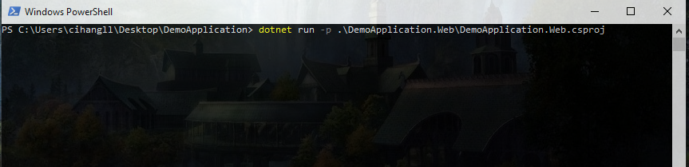

Bu sefer de hiç bir şey loglanmıyor. Bir şeyler yanlış oldu gibi. Serilog loglarını da diğer logları da göremiyoruz.

Aslında her şey olduğu işledi.

Şu ana kadar görüntülediğimiz logları görüntüleyememizin sebebi `.UseSeriLog` metodu. Bu metodu `IHostBuilder` nesnesine uyguladığımızda uygulamaya şunu söyledik. "Default loglamayı kullanmak yerine `Serilog` kullan." Bu yüzden loglama yapılmıyor.

Herhangi bir serilog seviyesi belirtmediğimiz için yukarıda yazmış olduğumuz (Log. ile başlayan) logları görüntüleyemiyoruz. Serilog içerisinde bulunan `ILogger` nesnesi için yapılandırmayı yapmamız gerekli. Serilog yapılandırma ayarları için json kullanacağız.

```csharp
public static void Main(string[] args)
{
  //1
  var configurationBuilder = new ConfigurationBuilder();
  configurationBuilder.AddJsonFile("appsettings.json", optional: false, reloadOnChange: true);

  //2
  var aspNetCoreEnvironment = Environment.GetEnvironmentVariable("ASPNETCORE_ENVIRONMENT");
  if (string.IsNullOrEmpty(aspNetCoreEnvironment))
  {
    configurationBuilder.AddJsonFile($"appsettings.{aspNetCoreEnvironment}.json", optional: true, reloadOnChange: true);
  }

  //3
  var configuration = configurationBuilder.Build();
  var loggerConfiguration = new LoggerConfiguration()
    .ReadFrom.Configuration(configuration);

  //4
  Log.Logger = loggerConfiguration.CreateLogger();

  ///...
}
```

Yukarıdaki işlemleri adım adım inceleyelim.

- **1** Yeni bir yapılandırıcı oluşturup `appsettings.json` dosyasını ekledik. Çalışma sırasında değişikliklerin izlenebilmesi için `reloadOnChange` değerini `true` yaptık. `appsettings.json` dosyası haricinde herhangi bir yerden serilog yapılandırması çekmediğimiz için de `optional` değerini false yaptık. Bu sayede sistem bu dosyayı bulamayınca hata verecektir.
- **2** `ASPNETCORE_ENVIRONMENT` ile çalışma ortamını alıp ilgili yapılandırma dosyası varsa `appsettings.json` dosyasını ezip kullanılacağını söyledik.
- **3** Yapılandırıcıyı kullanarak yeni bir yapılandırma nesnesi oluşturduk. Yeni bir `LoggerConfiguration` nesnesi oluşturup ilgili yapılandırmayı atadık.
- **4** Serilog içerisinde bulunan `ILogger` nesnesinin default olarak değil de `LoggerConfiguration` nesnesi üzerinden `CreateLogger` metodu aracılığıyla yaratılacağını söyledik.

Bu aşamada uygulamayı çalıştırırsak yine hiç bir çıktı göremeyiz. `appsetting.json` dosyası içerisinde `Serilog` ile ilgili herhangi bir yapılandırma ayarı bulunmadığından dolayı loglama yine yapılmaz. Bunu da ekleyince bütün taşlar yerine oturacak.

_Not: Artık `appsetting.Development.json` ve `appsetting.json` içerisindeki default loglama yapılandırmasının herhangi bir anlamı bulunmuyor. Bunun yerine `Serilog` yapılandırması kullanacağız. Bu yüzden de rahatlıkla silebilirsiniz._

```json
{
  "Serilog": {
    "Using": [],
    "MinimumLevel": {
      "Default": "Information",
      "Override": {
        "System": "Warning",
        "Microsoft": "Warning",
        "Microsoft.Hosting.Lifetime": "Information"
      }
    },
    "Enrich": ["FromLogContext"],
    "WriteTo": [{ "Name": "Console" }]
  }
  //...
}
```

- `MinimumLevel` altındaki kullanım aynı default log yapılandırmasında olduğu gibi. Sadece log seviyesi değiştirilecekleri `Override` kısmında belirtiyoruz.
- `Enrich` loglamayı _zenginleştiren_ kısım. Şu anlık serilog içerisinde default bulunan `FromLogContext` tanımlı.
- `WriteTo` loglamanın nerelere yapılacağı kısım. Serilog için `sink` kelimesi ile ifade edilirler. Şu anlık `Console` tanımlı. Uygulamayı console üzerinden çalıştırdığımızda uygulama loglarını konsola yapacaktır.

_Not: Serilog json yapılandırması ile ilgili daha fazla bilgi için [tıklayınız.](https://github.com/serilog/serilog-settings-configuration)_

Uygulamayı çalıştıralım.

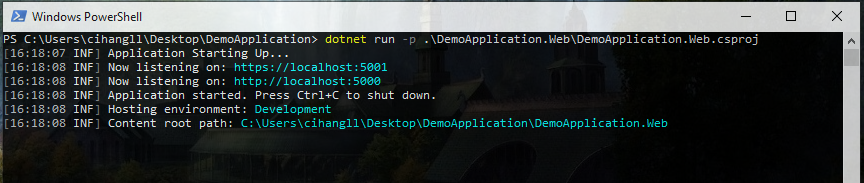

Sonunda! Ekranda log görüyoruz. `Index` sayfasına istek atıp `information`,`warning` ve `error` loglarının gelip gelmediğini test edelim.

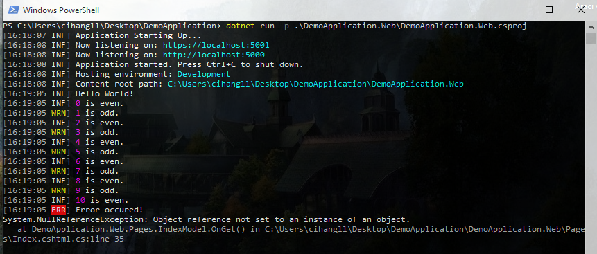

Loglama tam olarak istediğimiz gibi yapılıyor.

#### Serilog AspNetCore Request Loglama

Demo projesi bir web uygulaması olduğundan dolayı web sayfasına gelen isteklerin de serilog tarafından loglanmasını sağlayalım. Bunun için `Startup.cs` sınıfında Http request pipeline ını yapılandırmamız gerekli.

```csharp
//...
public void Configure(IApplicationBuilder app, IWebHostEnvironment env) {
  //...
  app.UseStaticFiles();

  app.UseSerilogRequestLogging();

  app.UseRouting();

  //...
}
```

Uygulamayı çalıştırıp `Index` sayfasına istek atalım.

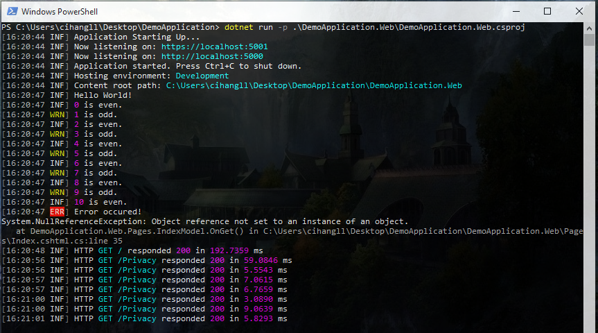

Farkettiyseniz yukarıdaki loglamadan farklı olarak `HTTP GET /` vb. istekleri de logluyoruz.

_Not1: Burada http isteklerinin loglanmasının sebebi `UseSerilogRequestLogging()` metodu. Fakat `appsetting.json` içerisinde default loglama seviyesinin `Information` verildiğini unutmayın. Eğer bu seviye `Information` üzerinde olsaydı loglama gerçekleştirilmeyecekti._

_Not2: NetCore projesi `middleware yapısında` olduğu için `app.UseSerilogRequestLogging();` kullandığınız yer oldukça önemli. Örneğin configure metodunda endpointlerden sonra eklerseniz çalışmaz. Sağlıklı çalışabilmesi için request middleware lerinden önce eklemeniz eklenmesi gerekmekte._

#### Serilog ile Dosyaya Loglama

Herhangi bir sorun yaşamadan sağlıklı bir şekilde loglama yapabiliyoruz. Hazır serilogun etinden sütünden faydalanmaya başlamışken dosyaya loglama işlemini de gerçekleştirelim.

```json
{
  //...
  "Serilog": {
    //...
    "WriteTo": [
      //...
      {
        "Name": "File",
        "Args": {
          "path": "Logs/log.json",
          "formatter": "Serilog.Formatting.Json.JsonFormatter, Serilog"
        }
      }
    ]
  }
  //...
}
```

Loglama yapılacak yeri proje dizini olarak verdik. Otomatik olarak `Logs` adında _klasör_ oluşturup içerisinde `log.json` adında dosya oluşturur. Uygulamayı çalıştırıp test edebilirsiniz.

Bu aşamada loglama yapısını, oluşturulacak dosyanın ismini, boyutunu vb. işlemleri de yapabilirdik. Basit ve anlaşılır olması için bu kısımları geçiyorum.

#### Serilog ile Logları Zenginleştirmek

Serilog ile oluşturduğumuz logları daha zengin hale getirebiliriz.

_Not: Daha fazla bilgi için [tıklayınız.](https://github.com/serilog/serilog/wiki/Enrichment)_

Öncelikle ilgili `enrich` kütüphanelerini projeye dahil etmemiz gerekli.

`Makine adını` loglamak için gerekli enrich kütüphanesini ekleyelim.

```
dotnet add package Serilog.Enrichers.Environment
```

Uygulamanın `process id` sini loglamak için gerekli enrich kütüphanesini ekleyelim.

```
dotnet add package Serilog.Enrichers.Process
```

Yaptığımız o anki işlemin hangi thread üzerinde koştuğunu loglamak için gerekli enrich kütüphanesini ekleyelim.

```
dotnet add package Serilog.Enrichers.Thread
```

Bunlar haricinde çok sayıda `enrich` kütüphanesi bulunuyor. İhtiyacınıza göre gerekli kütüphaneyi ekleyip kullanabilirsiniz.

Eklediğimiz enrich kütüphanelerini uygulamamıza dahil edelim. Bunun için `appsetting.json` içerisinde `Enrich` kısmına şunları yazalım.

```json
{
  //...
  "Serilog": {
    //...
    "Enrich": [
      "FromLogContext",
      "WithMachineName",
      "WithProcessId",
      "WithThreadId"
    ]
    //...
  }
  //...
}
```

Yapılandırmalar bu şekilde. Uygulamayı çalıştırıp `Logs/log.json` dosyasındaki loglamayı kontrol edersek aşağıdaki örneğe benzer bir log görürüz.

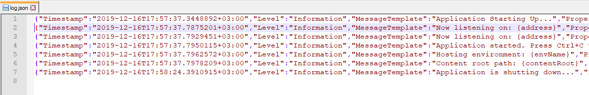

```json
{
  "Timestamp": "2019-12-16T17:57:37.7875201+03:00",
  "Level": "Information",
  "MessageTemplate": "Now listening on: {address}",
  "Properties": {
    "address": "https://localhost:5001",
    "SourceContext": "Microsoft.Hosting.Lifetime",
    "MachineName": "DESKTOP-CKQJPSDE",
    "ProcessId": 13112,
    "ThreadId": 1
  }
}
```

`appsetting.json` dosyasının son hali şu şekilde.

```json
{
  "Serilog": {
    "Using": [],
    "MinimumLevel": {
      "Default": "Information",
      "Override": {
        "System": "Warning",
        "Microsoft": "Warning",
        "Microsoft.Hosting.Lifetime": "Information"
      }
    },
    "Enrich": [
      "FromLogContext",
      "WithMachineName",
      "WithProcessId",
      "WithThreadId"
    ],
    "WriteTo": [
      { "Name": "Console" },
      {
        "Name": "File",
        "Args": {
          "path": "Logs/log.json",
          "formatter": "Serilog.Formatting.Json.JsonFormatter, Serilog"
        }
      }
    ]
  },
  "AllowedHosts": "*"
}
```

`DemoApplication.Web.csproj` projesinin son hali de şu şekilde.

```xml
<Project Sdk="Microsoft.NET.Sdk.Web">

  <PropertyGroup>
    <TargetFramework>netcoreapp3.1</TargetFramework>
  </PropertyGroup>

  <ItemGroup>
    <PackageReference Include="Serilog.AspNetCore" Version="3.2.0" />
    <PackageReference Include="Serilog.Enrichers.Environment" Version="2.1.3" />
    <PackageReference Include="Serilog.Enrichers.Process" Version="2.0.1" />
    <PackageReference Include="Serilog.Enrichers.Thread" Version="3.1.0" />
    <PackageReference Include="Serilog.Settings.Configuration" Version="3.1.0" />
  </ItemGroup>

</Project>
```

### Serilog ile Seq Kullanımı

Bildiğiniz gibi logları txt,json vb. gibi yerlerden okumak,filtrelemek,analiz etmek oldukça zor olabiliyor. Bu gibi nedenlerden dolayı logları rahatlıkla görüntüleyebileceğimiz UI kütüphanelerine ihtiyacımız var. Örn; logstash, kibana, seq. Bu örneğimizde seq kullanacağız.

_Not: Serilog ile seq kullanımı ile ilgili daha fazla bilgi için [tıklayınız.](https://github.com/serilog/serilog-sinks-seq)_

#### Seq Sink Yapılandırması

Serilog kütüphanesini incelerken `sink` kelimesinden söz etmiştik. Sink loglama yapılacak yer olarak anlaşılabilir. `Seq` kütüphanesi de loglama yapılacak yer olduğu için serilog ile uyumlu sink kütüphanesini projeye eklememiz gerekir.

```
dotnet add package Serilog.Sinks.Seq
```

Serilog yapılandırmasını `appsettings.json` içerisinde yaptığımız için seq yapılandırmasını ekleyelim.

```json
//...
"Serilog": {
  //...
  "WriteTo": [
    //...
    { "Name": "Seq", "Args": { "serverUrl": "http://localhost:5341" } }
  ]
}
```

Yapılandırma dosyasında önemli olan kısım `serverUrl`. Burada projedeki logların `push` edileceği _seq serverını_ belirtmemiz gerekiyor. Bu aşamada lokalinizden rahatlıkla erişebildiğiniz herhangi bir server url bilgisini ilişkilendirebilirsiniz.

Json dosyamızın son hali şu şekilde.

```json
{
  "Serilog": {
    "Using": [],
    "MinimumLevel": {
      "Default": "Information",
      "Override": {
        "System": "Warning",
        "Microsoft": "Warning",
        "Microsoft.Hosting.Lifetime": "Information"
      }
    },
    "Enrich": [
      "FromLogContext",
      "WithMachineName",
      "WithProcessId",
      "WithThreadId"
    ],
    "WriteTo": [
      { "Name": "Console" },
      {
        "Name": "File",
        "Args": {
          "path": "Logs/log.json",
          "formatter": "Serilog.Formatting.Json.JsonFormatter, Serilog"
        }
      },
      {
        "Name": "Seq",
        "Args": { "serverUrl": "http://localhost:5341" }
      }
    ]
  },
  "AllowedHosts": "*"
}
```

`DemoApplication.Web.csproj` projesinin son hali de şu şekilde.

```xml
<Project Sdk="Microsoft.NET.Sdk.Web">

  <PropertyGroup>
    <TargetFramework>netcoreapp3.1</TargetFramework>
  </PropertyGroup>

  <ItemGroup>
    <PackageReference Include="Serilog.AspNetCore" Version="3.2.0" />
    <PackageReference Include="Serilog.Enrichers.Environment" Version="2.1.3" />
    <PackageReference Include="Serilog.Enrichers.Process" Version="2.0.1" />
    <PackageReference Include="Serilog.Enrichers.Thread" Version="3.1.0" />
    <PackageReference Include="Serilog.Settings.Configuration" Version="3.1.0" />
    <PackageReference Include="Serilog.Sinks.Seq" Version="4.0.0" />
  </ItemGroup>

</Project>
```

_Not: `WriteTo` kısmındaki diğer sinkler `seq` için zorunlu değildir. Her birinin ayrı bir `sink` olduğunu, birbiriyle ilişkisi olmadığını unutmayın. Loglamanın yapılacağı çıkış noktaları olarak düşünebilirsiniz._

#### Docker Seq Server Kurulumu

Seq server olarak gerçek bir server kullanılacağı gibi geliştirme ortamında test amaçlı seq server kurulumu yapılıp da kullanılabilir. Bunun için demo projesinde seq docker imajı kullanacağız. Tek yapmamız gereken ilgili imajı indirmek ve container oluşturup çalıştırmak.

_Not1: Bu aşamada docker bildiğinizi varsayıyorum. Eğer docker bilginiz yoksa daha detaylı bilgiye [şu adresten](https://docs.docker.com/) ulaşabilirsiniz._

_Not2: Docker kullanmak yerine kendi bilgisayarınıza `seq` kurulumu yapıp işlem adımlarına docker olmadan devam edebilirsiniz. Herhangi bir fark bulunmamakta._

Seq docker ile ilgili bütün bilgileri [şu](https://hub.docker.com/r/datalust/seq/) adreste bulabilirsiniz. Seq serverını ayağa kaldırmamız için tek yapmamız gereken aşağıdaki komutu çalıştırmak.

```
docker run -e ACCEPT_EULA=Y -p 5341:80 datalust/seq:latest
```

Seq 2 adet port kullanır. Bunlar `5341`(data) ve `80`(ui + data) portu. `5341` portu sadece data kabul eder. Api isteklerine izin vermez. `80` portu UI portudur. Hem data kabul eder ve hem de api isteklerine cevap verir. Seq `80` portu ui ve data ihtiyacını birlikte karşıladığı için `80` ve `5341` portlarını ayrı ayrı bağlamak yerine container içerisindeki `80` portunu dış dünyaya herhangi bir port ile vermemiz yeterli olacaktır. Hata olmadıysa seq serverına lokalde `http://localhost:5341` adresinden erişebiliyor olmamız gerek. Test edelim.

_Not: Container içerisindeki iki portu da ayrı expose etmek için docker run komutunu şu şekilde çalıştırabilirsiniz. `docker run -e ACCEPT_EULA=Y -p 5341:5341 -p 80:80 datalust/seq:latest`_

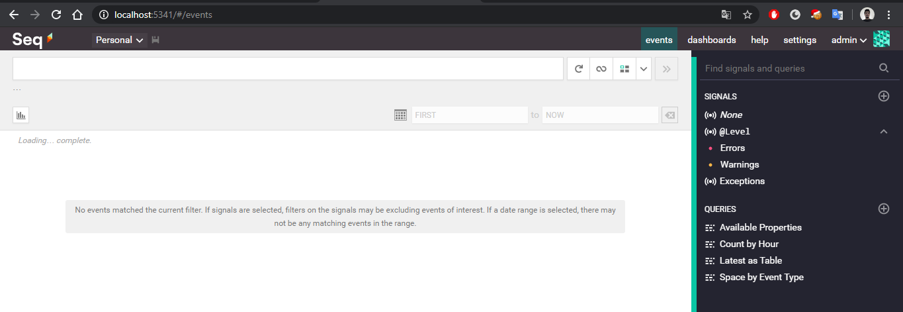

Demo projesini de çalıştırıp seq tarafına logların gönderildiğini test edelim.

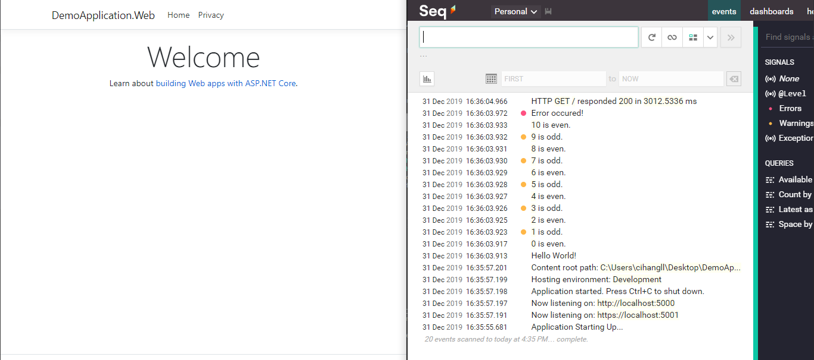

Herhangi bir sorun yok gibi. Loglar seq tarafına da sorunsuz bir şekilde akıyor.

_Not: Eğer lgolar seq tarafında gözükmüyorsa 2 uygulamanında lokalinizde çalıştığından emin olun. Daha sonra `application.json` dosyasındaki serverUrl kısmını kontrol edin. Eğer yine de gözükmüyorsa `docker logs` ile hata olup olmadığına bakın ve inceleyin. Kısacası çözüm üretin :)_

#### Docker Seq Volume Oluşturma

Docker seq containerını sildiğimiz anda bütün logların da beraberinde silineceğini biliyoruz. Çünkü logların tutulduğu kısım da container içerisinde bulunuyor. Bunu önlemek için `volume` oluşturup kendi lokalimizdeki bir kısma logları yazdırabiliriz. Volume sayesinde docker seq containerı bu kısmı kendi parçasıymış gibi görüp verileri bu kısma yazacaktır. Daha sonrasında containerı silsek bile logların bulunduğu data kendi lokalimizde saklanacağı için herhangi bir sorun oluşmayacaktır.

Dokümanda loglamanın saklandığı kısım olarak container içerisindeki `data` klasörü belirtilmiş. Öncelikle bu dosyanın gerçekten de var olduğunu, loglarımızın bu klasörde olduğunu test edelim.

```
docker ps
docker exec -it CONTAINERID sh
cd data
ls -lh
```

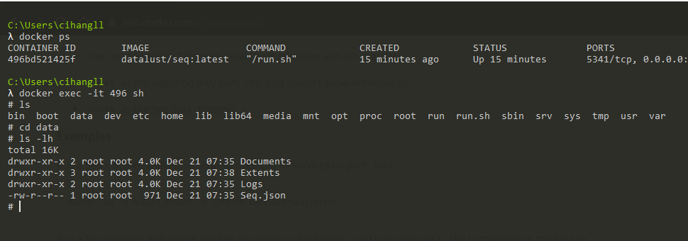

Bu dosyaların neler olduğunu detaylı olarak bilmemize gerek yok. Sadece seq serverının loglarının bu dosyalar ile saklandığını bilmemiz şu anlık yeterli olacaktır.

Container oluşturulma sırasında `docker run` komutu ile birlikte `volume` parametresini de verelim. Bu sayede seq loglarının kendi lokalimizde saklanmasını sağlayacağız.

_Not: Sağlıklı çalışabilmesi adına önceden oluşturdunuz containerı durdurun. Aksi takdirde yeni container oluşturulmaz. 5341 portu kullanımda olacağı için hata alırsınız. Durdurmak için; `docker stop CONTAINERID`, silmek için; `docker rm CONTAINERID`_

`C` diskinde loglamayı yapacağımız klasörü oluşturalım.

```
cd C:\
mkdir Logs\DemoAppSeqData
```

Containeri oluşturup çalıştıralım.

```
docker run -e ACCEPT_EULA=Y -p 5341:80 -v C:\Logs\DemoAppSeqData:/data -d datalust/seq:latest
```

Gerçekten de loglama datasının `C:\Logs\DemoAppSeqData` dizininde olduğunu test edelim.

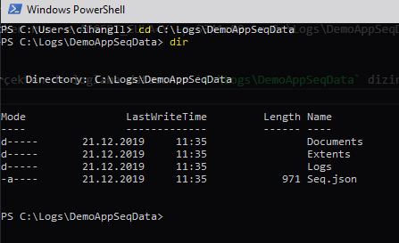

Artık container silinse bile seq datasını container içerisinde tutmadığımız için sorun oluşturmayacaktır.

### Demo Uygulamasını Dockerize Etme

Uygulamayı docker uyumlu hale getirmek için `Dockerfile` dosyası oluşturup gerekli yapılandırmaları yapalım.

_Not: Visual Studio kullanıyorsanız yapanız gereken ilgili projeye sağ tıklayıp `Docker Support...` demek. Sizin için otomatik olarak projeye uygun bir Dockerfile oluşturacaktır._

_Not2: Visual Studio Code kullanıyorsanız ve otomatik yapılandırma dosyasının gelmesini isterseniz `Docker extension` yüklü olması gerekli. Daha sonrasında `Ctrl + shift + p` tuşları ile `Docker` aratırsanız `Docker Add Docker Files to Workspace` seçeneği gelecektir. Bu seçenek üzerinden ilerleyerek Dockerfile oluşturabilirsiniz._

```Dockerfile
FROM mcr.microsoft.com/dotnet/core/aspnet:3.1-buster-slim AS base
WORKDIR /app
EXPOSE 80
EXPOSE 443

FROM mcr.microsoft.com/dotnet/core/sdk:3.1-buster AS build
WORKDIR /src
COPY ["DemoApplication.Web.csproj", ""]
RUN dotnet restore "DemoApplication.Web.csproj"
COPY . .
RUN dotnet build "DemoApplication.Web.csproj" -c Release -o /app/build

FROM build AS publish
RUN dotnet publish "DemoApplication.Web.csproj" -c Release -o /app/publish

FROM base AS final
WORKDIR /app
COPY --from=publish /app/publish .
ENTRYPOINT ["dotnet", "DemoApplication.Web.dll"]
```

Karmaşık gibi görünmesine aldırmayın. Çoğu zaman bu dosyayı otomatik oluşturup bir kaç düzenleme yaptıktan sonra kapatacaksınız. Yine de adım adım neler olduğunu inceleyelim.

- `FROM mcr.microsoft.com/dotnet/core/aspnet:3.1-buster-slim AS base` Demo uygulamamızı çalıştırabilmek için gerekli olan imajı belirttik. Bu imaj ile oluşturulacak olan yeni imagı `base` adı ile tanımladık.
- `WORKDIR /app` ile /app klasörünü öntanımlı hale getirdik. (cd /app gibi)
- `EXPOSE 80` ile içerisinde barındırılacak olan uygulama için default `http` isteklerinin `80` portundan karşılanacağını belirttik.
- `EXPOSE 443` ile içerisinde barındırılacak olan uygulama için default `https` isteklerinin `443` portundan karşılanacağını belirttik.

Bu aşamada `base` adında asp.net core 3.1 ile geliştirilen bir uygulamayı çalıştırabilecek bir imaj elde ettik.

_Not: Doğrudan mcr.microsoft.com/dotnet/core/aspnet:3.1-buster-slim imajını doğrudan kullanabilirdik. Fakat sonraki adımları ilgili imaj için belirtmemiz gerekirdi._

- `FROM mcr.microsoft.com/dotnet/core/sdk:3.1-buster AS build` ile demo uygulamamızı derleyip _çalıştırılabilir_ hale getirebilmek için gerekli olan imajı belirttik. Oluşturulacak yeni imajı `build` adı ile tanımladık.
- `WORKDIR /src` ile /src klasörünü öntanımlı hale getirdik. (cd /src gibi)
- `COPY ["DemoApplication.Web.csproj", ""]` ile proje dosyasını (_.csproj_) `/src` dizinine kopyaladık.
  - Bu aşamada projenin bütün dosyalarını kopyalamıza gerek yok. Gerekli kütüphaneleri indirmek için .csproj dosyası yeterli.
- `RUN dotnet restore "DemoApplication.Web.csproj"` ile projeyi restore ettik. Bu aşamada gerekli kütüphaneler indirilir.
  - Örn; serilog
- `COPY . .` ile dizindeki bütün herşeyi(demo projesini) `/src` dizinine kopyaladık.
- `RUN dotnet build "DemoApplication.Web.csproj" -c Release -o /app/build` ile projeyi `Release` modda `/app/build` dizinine build ettik.

Bu aşamada projemizin build edilmiş halini elde ettik. Artık `build` imajı ile buna erişebiliriz.

- `FROM build AS publish` ile build imajını referans alıp `publish` adında yeni bir imaj oluşturduk.
- `RUN dotnet publish "DemoApplication.Web.csproj" -c Release -o /app/publish` ile projeyi `/app/publish` klasörüne publish ettik.

Bu aşamada `publish` imajının içerisinde `/app/publish` klasöründe projeminizin `çalıştırılabilir` kısmı bulunmakta. Bunu kestrel, IIS gibi web serverlarda rahatlıkla çalıştırabiliriz. Hatırlarsanız `base` adında bir imaj oluşturmuştuk. Bunun içerisine ilgili kısma gönderip projeyi ayağa kaldıralım.

- `FROM base AS final` ile base imajını referans alıp `final` adında yeni bir imaj oluşturduk.
- `WORKDIR /app` ile /app klasörünü öntanımlı hale getirdik. (cd /app gibi)
- `COPY --from=publish /app/publish .` ile `publish` imaj ında bulunan `/app/publish` dizinini `/app` dizinine kopyaladık.
- `ENTRYPOINT ["dotnet", "DemoApplication.Web.dll"]` ile projeyi ayağa kaldırdık.
  - `ENTRYPOINT` container oluşturulurken çalıştırılır. Kısaca containerın halihazırda `çalıştırılabilir` olması sağlar.

_Not: Dockerfile içerisinde oluşturulan imajlar geçicidir. Gerçek imaj değillerdir. Gerçek imaj oluşturmak `Dockerfile` dosyasının build edilmesi ve imaj oluşturulması gerekmektedir._

_Not2: RUN, CMD ve ENTRYPOINT arasındaki farkı anlamak için [şu sayfaya](https://goinbigdata.com/docker-run-vs-cmd-vs-entrypoint/) göz atabilirsiniz._

Dockerfile dosyasını oluşturduğumuza göre uygun bir imaj oluşturup devam edelim. Imaj oluşturmak için `Dockerfile` ın bulunduğu klasörde aşağıdaki komutu çalıştırıyorum.

```
docker build -t cihangll/demo_app .
```

Imaj oluşması için gerekli bütün adımlar bittikten sonra `docker images` ile ilgili imajı görüntüleyebilirsiniz.

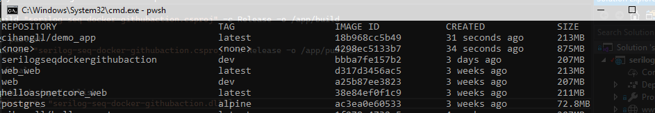

_Not: İlgili imajı docker hub'a gönderecekseniz lütfen isimlendirme kuralına göre gönderim yapın. (KullanıcıAdı/ImajAdı:EtiketAdı) Örn; user0001/demoimage:1_

Şimdi de ilgili imajı kullanarak container oluşturup uygulamızı docker üzerinden çalıştıralım.

```
docker run --name demo_app -p 8090:80 -d cihangll/demo_app
```

`--name` ile container adını özelleştirdik. `-p 8090:80` ile de lokaldeki `8090` portunun container içerisindeki `80` portuna bağlanmasını sağladık. `-d` ile de çalıştırılacak containerın _detach_ modda çalışması gerektiğini söyledik. Bu sayede container içerisi komut satırına bağlanmadı ve arkaplanda çalıştı.

Uygulamaya `http://localhost:8090` adresinden ulaşabiliriz.

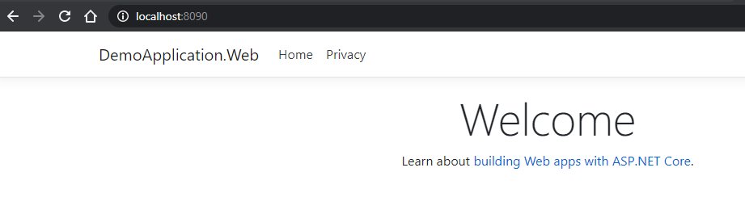

Peki console üzerinde gördüğümüz loglar nerede? Oluşturulan container için `docker logs CONTAINERID` komutu ile bakalım.

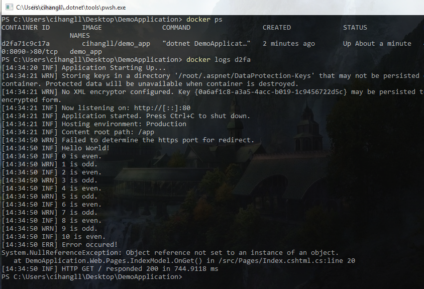

_Not: Txt dosyasına da loglama yapmıştık. Bunu görüntülemek için container içerisinde `/Logs` klasörüne bakabilirsiniz. `docker exec -it CONTAINERID sh` containera shell aracılığıyla bağlanabilirsiniz._

### Docker Compose Kullanımı

Demo uygulaması ve seq için container oluştururken `docker run ...` komutu ile birlikte çalıştırdık. Geliştirme ortamında sürekli `docker run` ile uzun uzun kodlar yazmak yerine daha yönetilebilir hale getirmemiz gerek. Bunun için `docker compose` kullanacağız. Web projemizin bulunduğu yere `docker-compose.yml` adında yapılandırma dosyası ekleyelim.

_Not: Konfigürasyon dosyasının `Unix (LF)` modda olduğuna dikkat edin. Aksi takdirde container oluştururken hata alabilirsiniz._

Yapılandırma dosyasının son hali aşağıdaki şekilde.

```yml
version: "3.7"
services:
  demo_web_app:
    build:
      context: .
      dockerfile: Dockerfile
    depends_on:
      - seq_server
    ports:
      - 8080:80
    environment:
      ASPNETCORE_ENVIRONMENT: "Development"
      SEQ_SERVER_URL: "http://seq_server:80"
    volumes:
      - C:\Logs\DemoAppWeb:/app/Logs
  seq_server:
    image: datalust/seq:latest
    ports:
      - 5341:80
    environment:
      ACCEPT_EULA: Y
    restart: unless-stopped
    volumes:
      - C:\Logs\DemoAppWeb:/data
```

Adım adım ilerleyelim.

```yml
demo_web_app:
  build:
    context: .
    dockerfile: Dockerfile
  depends_on:
    - seq_server
  ports:
    - 8080:80
  environment:
    ASPNETCORE_ENVIRONMENT: "Development"
    SerilogSeqServerUrl: "http://seq_server:80"
  volumes:
    - C:\Logs\DemoAppWeb\SeqData:/app/Logs
```

- `demo_web_app` adında `service` tanımlaması yaptık.
- `build` kısmında ilgili Dockerfile dosyasını ve nelerin dahil olacağını belirttik.
- `depends_on` ile diğer service olan `seq_server` a bağımlı olduğunu söyledik.
  - `docker-compose` dosyası ilk önce bağımlı olduğu `seq_server` servisini ayağa kaldırır. Daha sonrasında `demo_web_app` servisini ayağa kaldırır.
  - _Not: `depends_on` ile başka servislere bağımlı olduğunu söylemek bağımlı servislerin başarılı çalıştırıldığı takdirde ilgili servisin çalıştırılacağı anlamına gelmez. `depends_on` ile sadece bağımlı servisler başlatılır ve ardından ilgili servis çalıştırılır. Bunu aşmanın çeşitli yolları var. Örneğin [şu adres](https://docs.docker.com/compose/startup-order/) ilk adım için faydalı olabilir._
- `ports` ile port bağlantısını yaptık.
- `environment` ile ilgili servis için ortam değişkenlerini verdik.
- `ASPNETCORE_ENVIRONMENT: "Development"` ile çalıştıracağımız uygulamanın `Development` modda çalıştırılması gerektiğini söyledik.
- `SerilogSeqServerUrl: "http://seq_server:80"` ile çalıştıracağımız uygulama için seq server urlsinin bu olduğunu belirttik.
  - Web uygulaması için `SerilogSeqServerUrl` adı anlamsız. Bunu web uygulaması içerisinde yapılandıracağız.
- `volumes:` ile ilgili volume yapılandırması yapıyoruz.
  - `- C:\Logs\DemoAppWeb:/app/Logs` ile web uygulamasında bulunan `/app/Logs` klasörü altındaki her şeyin `C:\Logs\DemoAppWeb` adresinde depolanmasını sağlarız. Hatırlarsanız uygulama içerisinde dosya loglarını ana klasörde `/Logs` klasörü altına yolluyorduk. `Dockerfile` ile imaj oluştururken uygulamayı `/app` klasörü altına yolladığımız için container içerisinde `/app/Logs` klasörü txt loglarının yapıldığı kısım oldu. Containerler ölebilen yapılar olduğu için logları dışarıda tutmak daha mantıklı.

```yml
seq_server:
  image: datalust/seq:latest
  ports:
    - 5341:80
  environment:
    ACCEPT_EULA: Y
  restart: unless-stopped
  volumes:
    - C:\Logs\DemoAppWeb:/data
```

- `seq_server` adında `service` tanımlaması yaptık.
- `image: datalust/seq:latest` ile ilgili imaji belirttik.
  - Lokalde `datalust/seq:latest` adında imaj varsa kullanır. Yoksa otomatik olarak `docker hub` kısmından indirmeye çalışır.
  - _Not: Kendi uygulamamız için de `image: ...` şeklinde tanım yapıp kullanabilirdik. Fakat uygulamanın güncel halini değil de daha önceden `Dockerfile` kullanıp `docker build ...` ile build ettiğimiz halini kullanırdı. Daima güncel halini kullanmak istediğimiz için `build` tanımı yaptık._
- `ports` ile port bağlantısını yaptık.
- `environment` ile ilgili servis için ortam değişkenlerini verdik.
- `ACCEPT_EULA: Y` seq containerına ait bir ortam değişkeni. Bu değer ile kullanıcı lisans sözleşmesini kabul etmiş oluruz.
- `restart: unless-stopped` ile oluşturulacak container'ın restart durumunu belirtledik. Container elle durdurulmadığı sürece yeniden çalıştırılır. Daha fazla bilgi için [şu adresi](https://docs.docker.com/config/containers/start-containers-automatically/) ziyaret edebilirsiniz.
- `volumes:` ile ilgili volume yapılandırmasını yaptık.
- `- C:\Logs\DemoAppWeb\SeqData:/data` ile seq container içerisinde depolanan verilerin `C:\Logs\DemoAppWeb\SeqData` adresinde depolanacağını belirttik.

#### SerilogSeqServerUrl Değerini Ekleme

_SerilogSeqServerUrl_ değerini eklememizin bir kaç sebebi var. Bunları açıklamak gerekirse;

- Serilog yapılandırması için sadece `appsettings.json` dosyasını kullanıyoruz. _appsettings.json_ içerisinde kullandığımız `"Args": { "serverUrl": "..." }` değeri ile de loglama için kullanılacak seq server urlsinin bu olduğunu belirtiyoruz. _appsettings.json_ dosyasını olduğu gibi seriloga vermeden önce _appsettings.json_ içerisindeki değerleri değiştirebiliriz. Fakat bu değere müdahale edip elle değiştirmek uygun bir yöntem değil. Ayrıca konfigürasyon dosyası içerisindeki serilog json değeri iç içe nesneler barındırdığı için `serverUrl` değerine erişmek biraz zor olabilir.
- Docker ile sadece _ortam değişkenlerine_ müdahale edebiliyoruz. Bu yüzden serilog sink server değerini ortam değişkeni olarak da değiştirebilmemiz gerekli.

Bunun için seq sink yapılandırmasını kaldırıp `SerilogSeqServerUrl` adında yeni bir uygulama değeri eklemek daha uygun. Bu sayede bu değere erişmek ve yönetmek daha kolay hale gelmiş olur.

Öncelikle `appsetting.json` içerisinde kullandığımız `Seq` ayarını kaldıralım ve `serverUrl` değerini `SerilogSeqServerUrl` adında yeni uygulama değeri olarak ekleyelim.

```json
{
  "Serilog": {
    //...
    "WriteTo": [
      //...
      //Bu kısım kaldırılacak
      // {
      //   "Name": "Seq",
      //   "Args": { "serverUrl": "http://localhost:5341" }
      // }
    ]
  },
  "SerilogSeqServerUrl": "http://real_seq_server_address"
}
```

appsettings.Development.json

```json
{
  "SerilogSeqServerUrl": "http://localhost:5341"
}
```

Artık bu ayarı verdikten sonra serilog seq tarafına loglama yapmayacaktır. `SerilogSeqServerUrl` değerini uygulama için anlamlı hale getirmemiz gerekli. Burada birden fazla yol izleyebiliriz.

- 1. Sadece `appsettings.json` dosyasındaki `SerilogSeqServerUrl` değeri kullanmak.
- 2. Sadece `SerilogSeqServerUrl` değeri ortam değişkeni olarak geldiği zaman kullanmak.
- 3. `SerilogSeqServerUrl` değeri ortam değişkeni olarak geldiği zaman _appsettings.json_ ve _appsettings.{environment}.json_ yapılandırma dosyalarındaki değeri `ezerek` kullanmak.

3. yol ihtiyacımızı karşılıyor. Bunun için gerekli yapılandırmayı kod tarafında yapalım.

```csharp
//...

const string serilogKey = "SerilogSeqServerUrl";
var seqServerUrl = Environment.GetEnvironmentVariable(serilogKey);
if (string.IsNullOrEmpty(seqServerUrl))
{
  seqServerUrl = configuration.GetSection(serilogKey)?.Value;
}

if (!string.IsNullOrEmpty(seqServerUrl))
{
  loggerConfiguration.WriteTo.Seq(seqServerUrl);
}

Log.Logger = loggerConfiguration.CreateLogger();

//...
```

- Yukarıdaki yapılandırma ile `SerilogSeqServerUrl` değeri ortam değişkeni olarak verilmediği sürece;
  - **Geliştirme Ortamında:** `http://localhost:5341` adresi kullanılır.
  - **Production Ortamında:** `http://real_seq_server_address` adresi kullanılır.
- Yukarıdaki yapılandırma ile `SerilogSeqServerUrl` değeri ortam değişkeni olarak verilirse;
  - Verilen ortam değişkeni kullanılır.
    - Docker için bu değeri `http://seq_server:80"` verdik. Eğer docker container mantığını anlamadıysanız `http://seq_server:80"` kısmı karışık gelebilir. Web uygulaması _SerilogSeqServerUrl_ ile gönderdiğimiz `http://seq_server:80"` adresinin ne olduğunu bilmez. Sadece bu adresin gerçekte var olduğunu düşünür ve seq log isteklerini buraya yollar. Bu aşamada `docker-compose` devreye giriyor. Default olarak `docker-compose` bütün servisleri `default network` oluşturarak birbirine bağlar. `seq_server` adında servis tanımı olduğu için container içerisinde `http://seq_server:80"` isteğini `docker-compose` çözümler ve diğer containera _(`seq_server` adındaki servis)_ isteği gönderir.

_Not: Yukarıdaki yapılandırma sadece demo uygulaması için yapılmış bir örnek. Uygulamanız için gerekli yapılandırmaları farklı şekillerde belirtip yönetebilirsiniz.(Örneğin `appsetting.json` ve `appsettings.Development.json` dosyasını birlikte kullanma, ortam değişkenleri ile diğer değişkenleri ezme vb.) Bu yapılandırmalar uygulamadan uygulamaya farklılık gösterebilir._

#### Docker Compose ile Uygulamayı Çalıştırma

Bütün yapılandırmaları yaptığımıza göre uygulamamızı docker-compose ile çalıştırma aşamasına geçebiliriz. Bunun için ilgili komutu çalıştıralım.

```
docker-compose up --build
```

_Not: İlgili komutun anlamlı olması için `docker-compose.yml` dosyasının bulunduğu dizinde çalıştırılması gerekir._

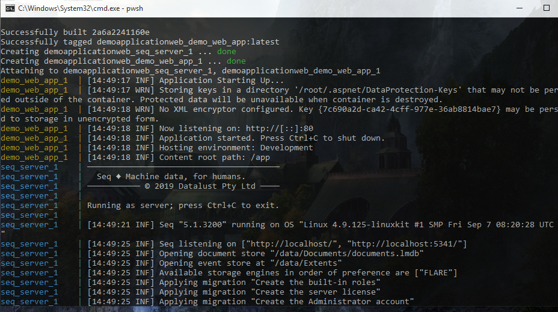

Gördüğünüz gibi seq server ve uygulamamız çalıştı ve içerisindeki loglar ekrana yazdırılıyor. Gerçekten de uygulamanın ve logların sorunsuz bir şekilde çalıştığını kontrol edelim.


Uygulama üzerindeki loglamalar seq tarafına aktarılıyor. Bu aşamada `docker-compose` komutunu `-d` modda çalıştırmadığımız için console üzerinde de loglamaları görebiliriz.

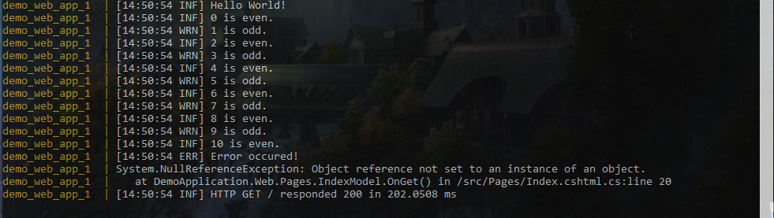

Uygulamaları durdurmak için console üzerinde `ctrl+c` komutunu kullanmamız yeterli. Gerçekten de uygulamalar sonlandırıldı mı kontrol edelim.

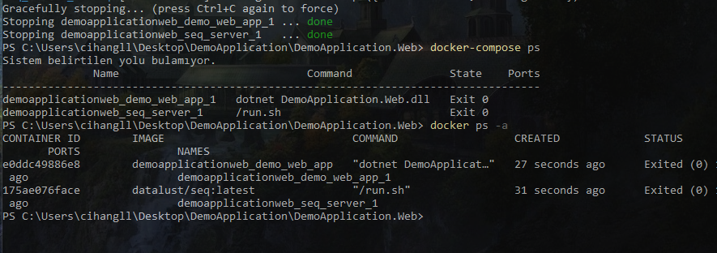

`Exit 0` ile ilgili processler durdurulmuş ve container durdurulmuş durumda. Durdurulmuş olan containerları da kaldıralım.

```
docker-compose down
```


Containerlar da silinmiş oldu. Özetle `docker-compose up` ve `docker-compose down` komutlarını kullanarak ihtiyacımız olan çoğu şeyi aynı anda yapmış olduk.

_Not: detach modda çalıştırmak için `docker-compose up --build -d` komutu kullanılabilir._

_Not2: containerları silerken volumeleri de silmek için `docker-compose down -v` komutu kullanılabilir. Fakat sildiğiniz volume `external` olmaması ve docker-compose ile üretilmiş olması gerekir. Aksi takdirde hata alırsınız. Ayrıca ilgili volumeları silmeden önce biraz düşünmekte fayda var. Eğer önemli şeyler barındırıyorsa `docker-compose.yml` içerisinde barındırmak yerine `external` olarak tanımlayıp az da olsa koruma altına alabilirsiniz.Detaylı bilgi için [tıklayınız.](https://docs.docker.com/compose/compose-file/)_

### Github Action ile Uygulama Imajını Docker Hub'a Göndermek

Nihayet son aşamaya gelebildik :) Uygulamamızı github'a gönderdiğimiz anda çalışan ve `Dockerfile` dosyasını kullanarak imaj oluşturup docker hub'a gönderen bir akış yazalım.

#### Projenin Github'a Gönderilmesi

Öncelikle _github_ üzerinde projemiz için repository oluşturalım. `.gitignore` dosyası olarak `VisualStudio` template'i kullanacağız.

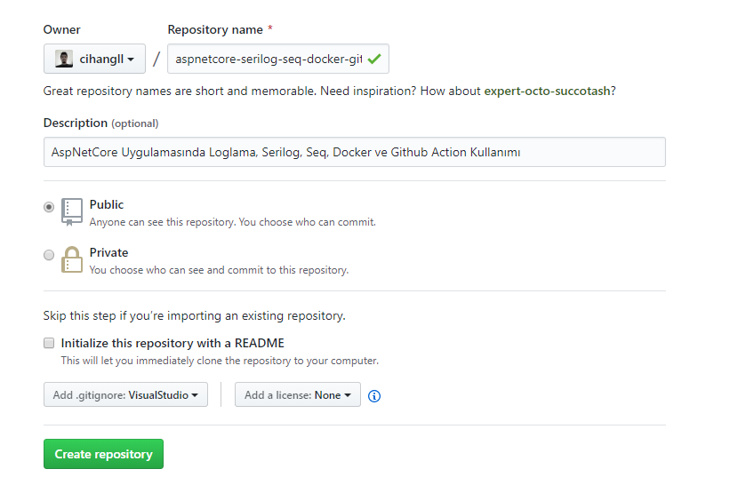

`Create Repository` diyerek repository oluşturduktan sonra github'ın bizin için oluşturmuş olduğu repository adresini kopyalalım.

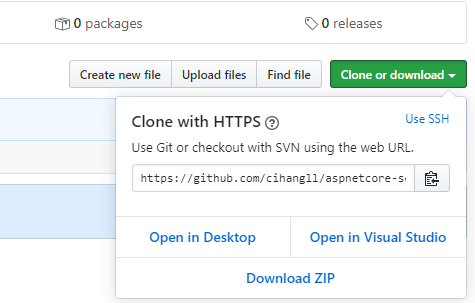

Proje dosyamızın bulunduğu dizinde komut satırını açıp adım adım ilerleyelim. İlk olarak giti projeye dahil edelim.

```
git init
```

Daha sonrasında kopyaladığımız repository adresini `origin` adında remote address olarak ekleyelim.

```
git remote add origin KopyaladığınızRepositoryAdresi
```

Daha sonra github tarafında oluşturduğumuz dosyaları projemize dahil edelim. (`.gitignore` dosyası)

```
git pull origin master
```

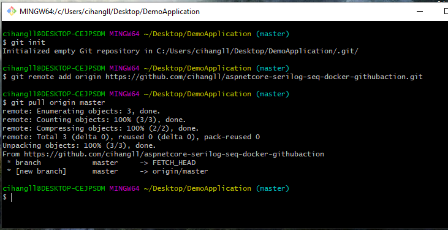

Artık projemizde bulunan dosyaları github'a gönderebiliriz. Bunun için;

```
git add .
git commit -m "first-commit"
git push origin master
```

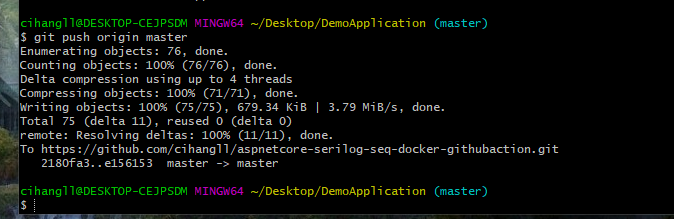

Bu aşamada proje dosyalarının github'a gönderilmiş olması gerekiyor. Kontrol edelim.

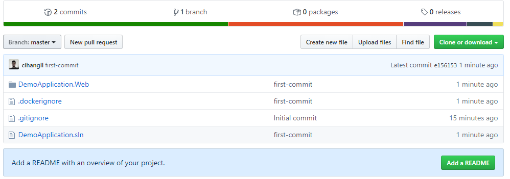

#### Github Action Yapılandırma Dosyası

Projemizin güncel hali github üzerinde olduğundan dolayı işlem adımlarına başlayabiliriz.

Öncelikle Github üzerinde `Actions` kısmına gelip sağ tarafta bulunan `Set up a workflow yourself` kısmına tıklayalım. Hazır _template_ kullanmak yerine biz oluşturacağız.

İlk olarak şu şekilde bir ekran ile karşılaşırız.

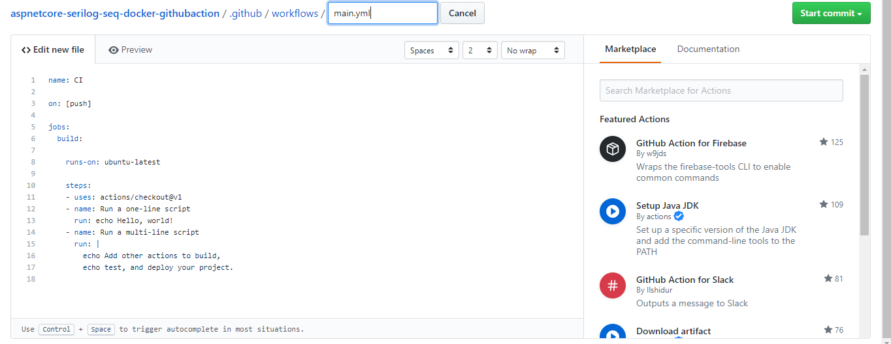

Akış yapılandırma dosya adı `main.yml` verilmiş. Bu ismi daha uygun olması için `publish-to-docker-hub.yml` olarak değiştirelim. Daha sonra ilgili yml dosyası içerisindekileri aşağıdaki ile değiştirelim.

```yml
name: Demo Project Publish Docker Hub
on:
  # Trigger the workflow on push request, but only for the master branch
  push:
    branches:
      - master
jobs:
  build-and-push:
    runs-on: ubuntu-latest
    steps:
      - uses: actions/checkout@master
      - name: Build and publish to docker hub
        uses: elgohr/Publish-Docker-Github-Action@master
        with:
          # Bu alanı `dockerHubId/projeAdi:versiyon` olacak şekilde güncelleyin.
          name: cihangll/aspnetcore-serilog-seq-docker-githubaction
          username: ${{ secrets.DOCKER_USERNAME }}
          password: ${{ secrets.DOCKER_PASSWORD }}
          workdir: DemoApplication.Web/
```

Yapılandırma dosyasını adım adım inceleyelim.

- `name:` ile ilgili akış ismini belirtiyoruz. Projemiz içerisinde birden fazla akış olacağı için akış adını ayırt edilebilecek şekilde vermemiz gerekiyor. Örneğin bu akış için `Demo Project Publish Docker Hub` tanımı kullandık.
- `on []` ile devamındaki işlem adımlarının hangi zamanlarda tetikleneceğini belirtiyoruz. Bu akış için `master` dalında `push` işlemi yapıldığında tetikleneceğini belirttik. Bu sayede github üzerinden `master` dalında yapacağımız güncelleme ya da ilgili remote server'a yapacağımız `push` işleminde ilgili işlem adımları tetiklenecektir.
- `jobs:` ile çalıştırılacak olan işlerin neler olduğunu belirtiyoruz. Bu örneğimizce 1 adet iş tanımlı ve adını `build-and-push` olacak şekilde belirttik.
- `runs-on` ile bu işin hangi ortamda çalıştırılacağını belirtiyoruz. `ubuntu-latest` diyerek ubuntu ortamında çalıştırılması gerektiğini belirttik.
- `steps` ile bu iş üzerindeki işlem adımlarını _dizi halinde_(- ile) belirtiyoruz.
- `uses` ile hangi kütüphanenin kullanacağını belirtiyoruz. Bu örneğimizde `actions/checkout@master` kütüphanesinin kullanılacağını belirttik.

Bu aşamaya kadar yazdığımız alanlar sıklıkla github action yapılandırma dosyalarında kullanılıyor. Bizim için önemli olan kısma geçelim.

- `name` ile çalıştırılacak olan işlem adının ne olacağını belirtiyoruz. Bu örneğimizde `Build and publish to docker hub` olarak belirttik.
  - Bu alanı kullanmamıza gerek yok. Fakat github üzerinde çalıştırılacak akışın işlem adımlarını kontrol ederken nelerin olduğunu görmek adına yardımcı olabilir.
- `uses: elgohr/Publish-Docker-Github-Action@master` ile `Dockerfile` dosyasını kullanarak build edip docker hub'a _publish_ işlemi gerçekleştiren kütüphanenin kullanılacağını belirttik.
  - Bu kütüphane ile ilgili daha fazla bilgi için [tıklayınız.](https://github.com/marketplace/actions/publish-docker)
- `name: cihangll/aspnetcore-serilog-seq-docker-githubaction` ile docker hub'a gönderilecek imajın ismini belirtiyoruz. Bu alanı `dockerHubId/projeAdi:versiyon` olacak şekilde güncelleyin.
- `username:` ile docker hub kullanıcı adını belirtiyoruz.
- `password:` ile docker hub kullanıcı şifresini belirtiyoruz.
- `workdir: DemoApplication.Web/` ile `build` işleminin gerçekleştirileceği klasörü belirtiyoruz.
  - Hatırlarsanız demo projesinde `Dockerfile` dosyasını `DemoApplication.Web/` klasörü içerisinde oluşturmuş ve kullanmıştık. Bu yüzden çalışma ortamı olarak `/DemoApplication.Web/` klasörünü belirttik.

Yapılandırma dosyamız hazır. Bu haliyle `commit` edip kaydedelim.

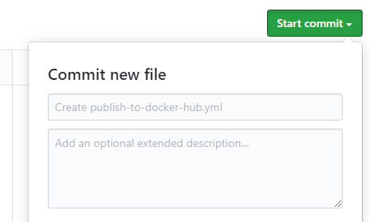

`master` dalı üzerinde `güncelleme` yaptığımız için github action otomatik olarak tetiklenecektir. Proje üzerinde `Action` tabına gelip oluşturmuş olduğumuz `Demo Project Publish Docker Hub` adındaki iş akışına tıklarsak şu ana kadar çalıştırılmış olan akışları görürüz.

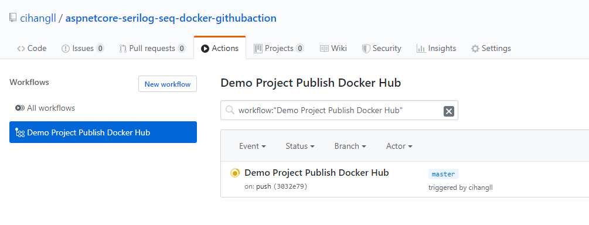

İlgili akış daha yeni tetiklendiği için de henüz tamamlanmamış durumda. Biraz daha beklersek ilgili akış tamamlanacaktır.

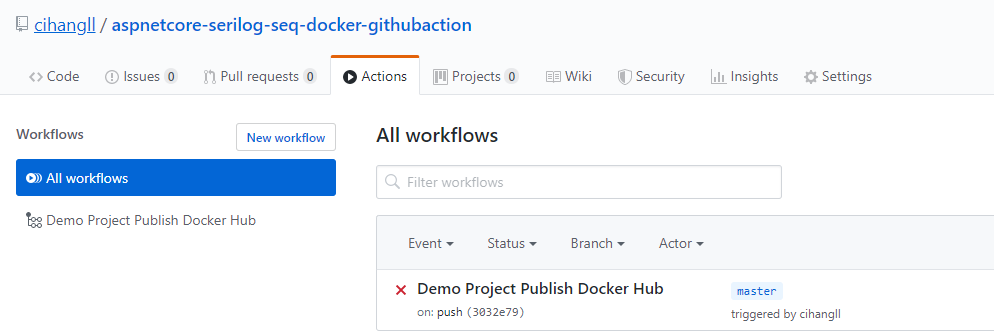

Akış hatalı bir şekilde tamamlandı. Akışa tıklayıp ilgili hatayı detaylı olarak gözlemleyelim.

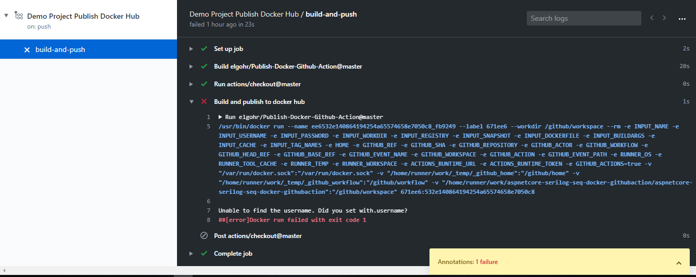

Hatırlarsanız docker hub'a publish etme işlem adımını `Build and publish to docker hub` olarak tanımlamıştık. Bu aşamada `Unable to find the username. Did you set with.username?` şeklinde bir hata aldık. Bu hatanın sebebi `secret key` olarak kullanıcı adını ve şifresini github üzerinde tanımlamamış olmamız. Peki neden doğrudan kullanıcı adı ve şifresini yapılandırma dosyası içerisine değil de `secret key` olarak tanımladık? Kullanıcı adı ve şifre gibi özel anahtarları yapılandırma dosyası içerisinde saklamak doğru bir yöntem değil. Herhangi bir yolla bu yapılandırma dosyasına erişim sağlandığı takdirde yazmış olduğumuz kullanıcı adı ve şifre herhangi birisinin eline geçebilir. Bu sebebten dolayı da bu ve buna benzer `özel alanları` yapılandırma dosyası yerine `secret key - value` ikisili olarak github üzerinde tutmamız daha uygun olur.

Docker hub kullanıcı adı ve şifresini github içerisinde ekleyelim. Bunun için projede `Settings > Secrets` kısmına gelmeliyiz.
Daha sonra `Add a new secret` diyerek `DOCKER_USERNAME` ve `DOCKER_PASSWORD` için gereken bilgileri girelim.

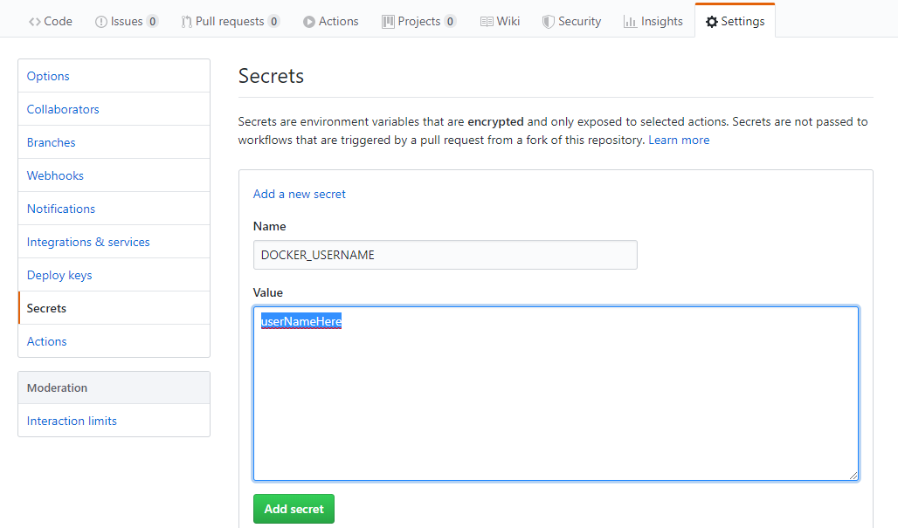

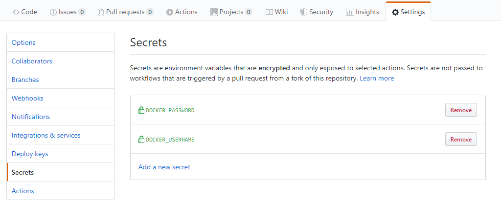

Akışı yeniden çalıştırdığımızda eğer kullanıcı adı ve şifre bilgisi doğruysa ve ilgili kurallara uyulmuş ise Docker hub'a imaj göndermiş olacağız. Akışı yeniden çalıştırmak için akışa gelip `Re-run checks` dememiz yeterli.

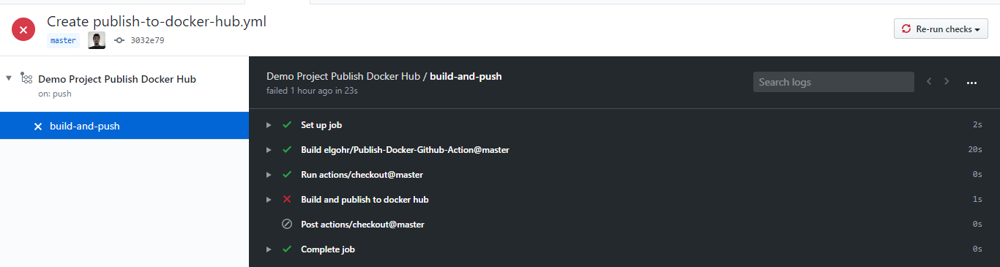

Akışı çalıştırdığımızda aşağıdakine benzer görüntü elde ederiz.

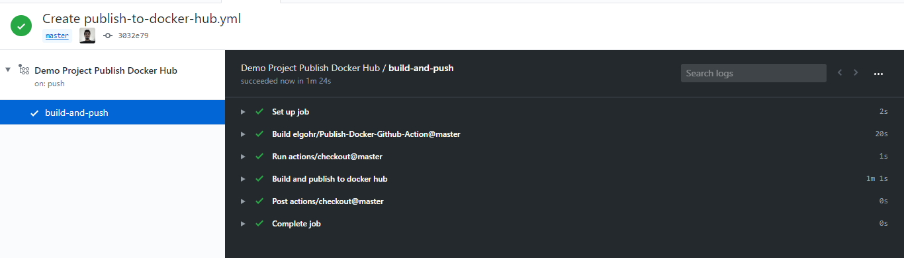

Gerçekten de docker hub içerisine ilgili imajın gönderildiğini test edelim.

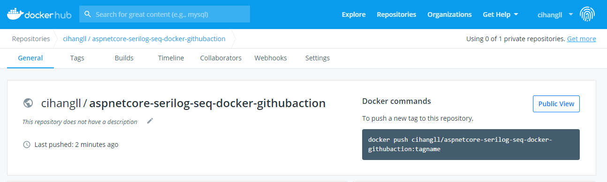

Demo projesi otomatik olarak docker hub'a gönderilmiş. Son olarak github üzerinde oluşturmuş olduğumuz github action yapılandırma dosyasını lokaldeki projemize de ekleyelim. Bu sayede projemiz hem github üzerinde hem de lokalde güncel olacaktır.

```
git pull origin master
```

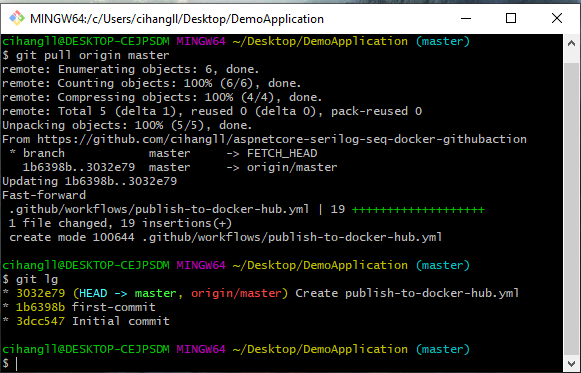

---

Bu kadar uzun olacağını düşünmemiştim. Umarım başkaları için faydalı bir içerik olur. Projenin kaynak dosyalarına [şu adresten](https://github.com/cihangll/aspnetcore-serilog-seq-docker-githubaction) erişebilirsiniz. Herkese mutlu kodlamalar :)

---

### Kullanılan Kaynaklar

- [C# Logging with Serilog and Seq - Structured Logging Made Easy](https://www.youtube.com/watch?v=_iryZxv8Rxw)
- İçerik içerisinde paylaşılan bütün linkler
