### Referans ve Değer Tipleri

#### İçindekiler

1. [Referans ve değer tipi arasındaki temel farkı anlamak](#referans-ve-değer-tipi-arasındaki-temel-farkı-anlamak)
   - [Değer tipindeki bir değişken nasıl bir davranış sergiler?](#değer-tipindeki-bir-değişken-nasıl-bir-davranış-sergiler?)
   - [Referans tipindeki bir değişken nasıl bir davranış sergiler?](#referans-tipindeki-bir-değişken-nasıl-bir-davranış-sergiler?)
2. [Referans ve değer tiplerinin stack ve heap içerisinde saklanması](#referans-ve-değer-tiplerinin-stack-ve-heap-içerisinde-saklanması)
   - [Örnek 1](#örnek-1)
   - [Örnek 2](#örnek-2)
   - [Örnek 3](#örnek-3)
   - [Örnek 4](#örnek-4)
   - [Örnek 5](#örnek-5)
   - [Örnek 6](#örnek-6)
   - [Örnek 7](#örnek-7)
   - [Örnek 8](#örnek-8)
   - [Örnek 9](#örnek-9)
   - [Örnek 10](#örnek-10)
   - [Örnek 11](#örnek-11)
   - [Örnek 12](#örnek-12)
   - [Örnek 13](#örnek-13)
   - [Örnek 14](#örnek-14)
   - [Örnek 15](#örnek-15)
   - [Örnek 16](#örnek-16)
   - [Örnek 17](#örnek-17)
   - [Örnek 18](#örnek-18)
3. [string referans tipi mi değer tipi mi?](#string-referans-tipi-mi-değer-tipi-mi?)
   - [Neden referans tipi gibi değil de değer tipi gibi davranır?](#Neden-referans-tipi-gibi-değil-de-değer-tipi-gibi-davranır?)
4. [Stack heap e göre neden daha hızlı?](#stack-heap-e-göre-neden-daha-hızlı?)
5. [Kullanılan Kaynaklar](#kullanılan-kaynaklar)
6. [Yanıtlanması gereken sorular](#yanıtlanması-gereken-sorular)

### Referans ve değer tipi arasındaki temel farkı anlamak

Konuya başlamadan önce referans ve değer tipi arasında oluşan temel farkı kod üzerinde görelim. Daha sonra neden bu şekilde davrandıklarını örnekler ile detaylandıracağız.

#### Değer tipindeki bir değişken nasıl bir davranış sergiler?

```csharp
int value = 5;
int value2 = value;
value = 4;
Console.WriteLine(value);
Console.WriteLine(value2);
```

_value_ ve _value2_ adında int tipinde 2 değişkenimiz olsun. _value2_ yi oluştururken _value_ değerini _value2_ ye atadık. _value_ değişkeninin değerini _4_ yaptık. Ekran çıktıları ne olur?

```
4
5
```

Cevabın bu şekilde olması çok normal. Değer tiplerinde ilgili değerin kendisi kopyalanır. Atama yapılan değişken ile atanan değişken arasında bir ilişki bulunmaz. Bu yüzden de yapılan değişiklikler sadece ilgili değişken üzerinde uygulanır.

```csharp
//Use
int value = 5;
ChangeValue(value);
Console.WriteLine(value);

//Method
public void ChangeValue(int val)
{
    val++;
}
```

_value_ adında bir değişken tanımladık ve _ChangeValue()_ içerisine bu değeri gönderdik. Method içerisinde ilgili değeri arttırdık. _value_ değeri nedir?

```
5
```

Neden _value_ değişkeninin değeri 6 olmadı? _ChangeValue()_ metoduna ilgili değeri gönderdiğimiz anda metot üzerinde parametre olarak bulunan `int val` üzerine kopyalandı. Bu süreden sonra _ChangeValue()_ metodu üzerinde yapılan bütün değişiklikler _val_ değerini değiştirecektir. Method dışarısında bulunan _value_ değişkeni bu değişikliklerden etkilenmeyeceği için değeri 5 kaldı.

Kısaca değer tipi ile çalışırken ilgili değer kopyalanır. Bu yüzden de kopyalanan değişken üzerinde yapılan değişikliklerden sadece kendisi etkilenir.

#### Referans tipindeki bir değişken nasıl bir davranış sergiler?

```csharp
public class User
{
    public string Name { get; set; }
    public DateTime CreatedDate { get; set; }
}
```

```csharp
User user = new User();
user.Name = "Cihan";
user.CreatedDate = DateTime.Today;

User user2 = user;
user.Name = "Changed";

Console.WriteLine(user2.Name);
```

```
"Changed"
```

_user_ adında değişken oluşturup ilgili alanları setledik. _user2_ adında yeni bir değişken oluşturup _user_ ataması yaptık. _user_ içerisindeki _name_ üzerinde değişiklik yapıp _user2_ nin _name_ değerini ekrana yazdırdık. Değer tipinde olduğu gibi çalışıp ekrana `Cihan` yazmadı. Bunun yerine `Changed` yazdırdı. Peki neden? Referans tiplerinde atama yaparken değer kopyalanmaz. Bunun yerine ilgili değişkenin heap üzerinde tutulan adresi kopyalanır ve atanan değişkene verilir. Yani _user_ ve _user2_ değişkenleri aynı nesneyi referans alırlar. Bu yüzden de birisinde yapılan değişiklik diğerinde de görülür.

```csharp
//Use
User user = new User();
user.Name = "Cihan";
user.CreatedDate = DateTime.Today;
TestClass.ChangeValue(user);
Console.WriteLine(user.Name);

//Method
public static void ChangeValue(User user)
{
    user.Name = "Changed";
}
```

```
"Changed"
```

Aynı şekilde method içerisine gönderilen _User_ nesnesin de referansı kopyalandı. Method içerisinde yapılan değişikliklerden etkilenir.

`Not: Referans ve değer tiplerinde method içerisinde gönderilen parametrelere in,out ve ref anahtar kelimeleri eklenip yapısal olarak değişiklik yapılabilir. Yukarıdaki örneklerde sadece çalışma mantığına değindik. İhtiyaca göre in,out ve ref kullanılarak yapısal değişikliklere gidilebilir.`

### Referans ve değer tiplerinin stack ve heap içerisinde saklanması

Neden tanımladığımız nesnelerin bazıları stack içerisinde tutulurken bazıları heap içerisinde tutulur? Bu sorunun birden fazla cevabı olabilir. Konu ile ilgili olduğu için bir sebebini açıklamaya çalışalım.

Örneğin `int a = 5;` değişkenini ele alalım. Değerinin 5 olduğunu rahatlıkla söyleyebiliriz. Bir int değişkeninin C# içerisinde _min_ ve _max_ değerlerinin belli olduğunu ve tanımladığımız _a_ değerinin de alabileceği _min_ ve _max_ bir değeri olduğunu biliyoruz. Kısacası int türünde bir değişken tanımladığımız anda bunun ne kadar yer kapladığı önceden bellidir. Buna benzer yapıda olan veri türleri genellikle değer tipi olur ve stack içerisinde saklanır. Fakat kullandığımız yapıya, JIT nin çalışma mekanizmasına göre bu değişkenlik gösterebilir. Yani değer tipleri de heap içerisinde tutulabilir.

```csharp
public class Person
{
    public string Name { get; set; }
    public OtherClass OtherClass { get; set; }
}
public class OtherClass
{
    //...
}
```

`Person person = new Person();` şeklinde bir nesnemizin olduğunu ve bunun üzerinde işlem gerçekleştireceğimizi varsayalım. Hafızada ne kadar yer kapladığından söz edebilir miyiz? _OtherClass_ tipinde bir alanımız var. Hafızada ne kadar yer kaplayacağını bilmiyoruz. _string_ tipinde bir alanımız daha var. Bunun da hafızada ne kadar yer kaplayacağını bilmiyoruz. Tanımladığımız nesnenin yapısına göre Person tipinde bir nesne oluşturduktan sonra ya da oluştururken _Name_, _OtherClass_ kısımlarını da oluşturabiliriz. Belki bu sayede hafızada tam olarak ne kadar yer kapladığını önceden bilebiliriz. Peki Person tipinde başka bir nesne oluşturduğumuzda da hafızada aynı boyutta yer kaplayacağının bir garantisi var mı? Hayır. Yani oluşturulan nesnenin net bir şekilde hafızada kapladığı alanın ne kadar olduğunu önceden kestiremiyoruz. Bu gibi tipler genellikle referans tipi olurlar. Referans tipleri stackte saklanacak basit veri tipleri değillerdir. Önceden ne kadar yer kaplayacağı belli olmadığı için de heap içerisinde adreslerenerek tutulur. İhtiyaç halinde de bu adresten ilgili veriye erişilip kullanılır.

Özetlemek gerekirse değer tipleri genellikle stackte tutulurlar. Referans tipleri ise heap içerisinde tutulurlar.

Bazı değer tipleri : int, short, long, double, DateTime, struct
Bazı referans tipleri : class, özel tanımlanan sınıflar

Değer ve referans tiplerini daha iyi anlamak için nasıl bir yapıda çalıştıklarını örnekler üzerinden anlamaya çalışalım.

```csharp
public class Person
{
    public string Name { get; set; }
    public int Age { get; set; }
    public Person(string name, int age)
    {
        Name = name;
        Age = age;
    }
}
```

#### Örnek 1

```csharp
Person p;
```

Yukarıdaki gibi bir değişken tanımladığımızda memory için bir anlam ifade etmez. Değeri yoktur.


Kullanmaya çalıştığımızda aşağıdaki gibi bir uyarı ile karşılaşırız.

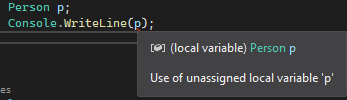

#### Örnek 2

```csharp
Person p;
p = null;

// ya da

Person p = null;

```

Yukarıdaki gibi bir değişken tanımladığımızda stack üzerinde şu şekilde bir görüntü hayal edebiliriz.


Peki `p.Name` ile ilgili isme erişmeye çalışırsak ne olur? Tahmin edebileceğiniz gibi o meşhur hatayı alırız :)

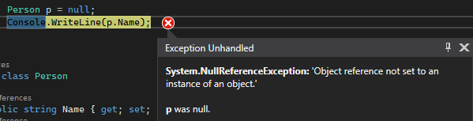

Bu hatayı almamızın nedeni çok basit aslında. Referans tipli bir değişken tanımlayıp içerisindeki başka bir alana erişim sağlamaya çalıştık. Böyle bir değişken heap üzerinde oluşturulmadı bile.

#### Örnek 3

```csharp
new Person();
new Person("Cihan", 25);
```

2 adet yeni nesne oluşturduğumuzda aşağıdaki gibi bir görüntü oluşur.

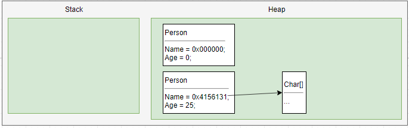

Lokal bir değişkene atama yapmadığımız için sadece bu nesneleri oluşturduk ve heap içerisinde sakladık. Bağlı oldukları herhangi bir değişken olmadığı için bu nesneler anlamsızdır. GC tarafından otomatik olarak silinip ilgili alan temizlenir.

Not: String değişkeni de referans tipindedir. Fakat örnekleri anlamamız açısından `p.Name = "deneme";`şeklinde göstermek daha uygun. Bundan sonraki örnekler içerisinde bu şekilde tanım yapacağız.

#### Örnek 4

```csharp
Person p;
new Person();
```

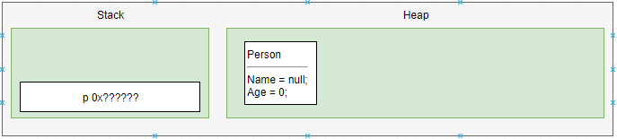

#### Örnek 5

```csharp
Person p = new Person();
```

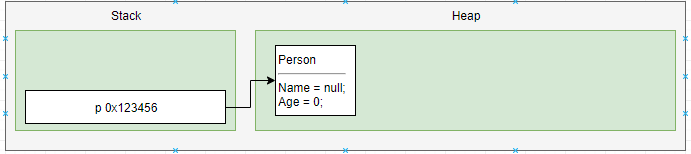

Oluşturduğumuz nesneyi lokal değişkene atadığımızda artık anlam kazanmaya başladı. Lokal değişken doğrudan değer tutmak yerine Person nesnesinin heap içerisindeki adresini tutuyor. Artık p ile ilgili nesneye erişim sağlamaya çalıştığımızda stack üzerindeki p adresine göre heap içerisinde ilgili nesne bulunup getiriliyor. Bu sayede p ye erişim sağlıyoruz.

#### Örnek 6

```csharp
Person p = new Person();
p.Name = "Cihan";
p.Age = 25;
```

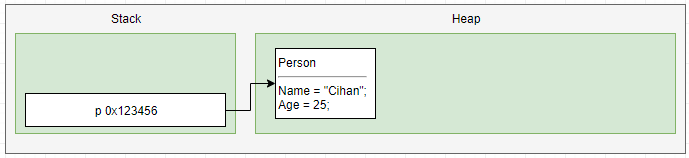

Nesneyi oluşturduk ve ilgili nesnenin alanlarını setledik. Örneğin burada `p.Age` değer tipinde bir değişken olmasına rağmen heap içerisinde tutuluyor.

#### Örnek 7

```csharp
Person p = new Person("Cihan", 25);
p = null;
```

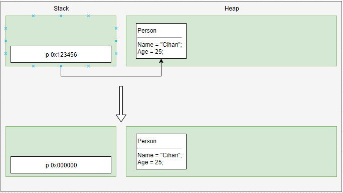

Nesneyi oluşturduktan sonra yeniden null yaparsak yukarıdaki gibi bir görüntü oluşur. Artık oluşturduğumuz Person nesnesinin bir bağı olmadığı için GC tarafından silinecektir.

#### Örnek 8

```csharp
Person p = new Person("Cihan", 25);
p = new Person();
```


#### Örnek 9

```csharp
Person p1 = new Person("Cihan", 25);
Person p2 = new Person("Test", 40);
```

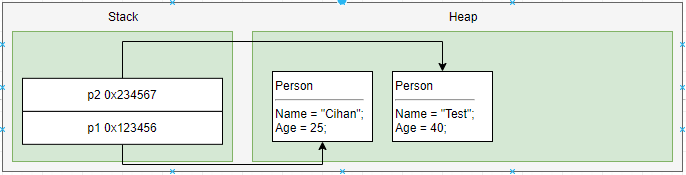

#### Örnek 10

```csharp
Person p1 = new Person("Cihan", 25);
Person p2 = new Person("Test", 40);
p2 = p1;
```

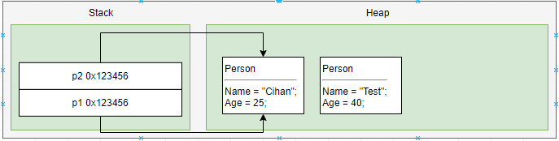

#### Örnek 11

```csharp
int age = 40;
```


Int değer tipi olduğu için değeri doğrudan stack üzerinde tutuldu. Heap kullanımına gerek kalmadı.

#### Örnek 12

```csharp
int age = 40;
int otherAge = age;
```

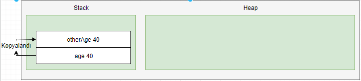

Değer tipini atama yaptığımızda değeri kopyalanır. Referans tipinde olduğu gibi referansı kopyalanmaz.

#### Örnek 13

```csharp
int age = 40;
int otherAge = age;
age = 35;
```


Değer tipini atama yaptığımızda değeri kopyalandığı için iki değişken arasında herhangi bir ilişki yok. Bu yüzden de değerini değiştirdiğimizde atama yaptığımız değişkenin değerini etkilemedi.

#### Örnek 14

```csharp
int age = 40;
Person p = new Person("Cihan", 25);
p.Age = age;
```

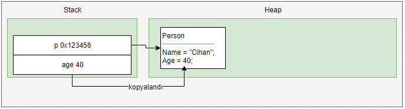

#### Örnek 15

```csharp
int age = 40;
Person p = new Person("Cihan", 25);
p.Age = age;
age = 45;
```

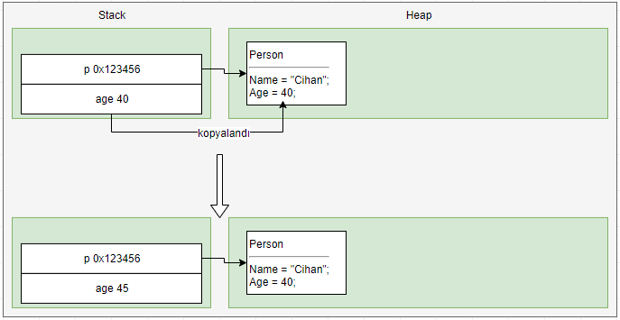

#### Örnek 16

Değer tipini parametre olarak verdiğimizde içeride yaptığımız bütün değişikliklerden dışarıdaki değişkenin eklenmediğini biliyoruz. Çünkü değer tiplerinde ilgili değer kopyalanarak işlem görür. Parametre olarak verilen değişken ile parametre içerisinde kullanılan değişken arasında herhangi bir bağ bulunmaz. Peki paremetre olarak referans tipini gönderirsek ne olur?

```csharp
//Use
Person p = new Person("Cihan", 25);
CelebrateBirthDay(p);

//Method
void CelebrateBirthDay(Person person) {
     person.Age = person.Age + 1;
}
```

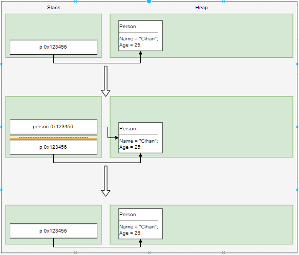

Oluşturduğumuz p yi metot içerisine parametre olarak verdiğimiz anda stack üzerinde bir kısım ayrılır. `person` adında değişkene p nin referans değeri kopyalanır. Metot sonunda ise stack üzerinde ayrılan bu kısım tamamen kaldırılır.

#### Örnek 17

```csharp
//Use
Person p = CreatePerson();

//Method
Person CreatePerson() {
     Person person = new Person("Cihan", 25);
     return person;
}
```


`CreatePerson()`çağrıldığında stack üzerinde bir kısım ayrılır. İçerisinde oluşturulan nesne heap üzerinde adresleme yapılır. `CreatePerson()` metodu ile geri dönen nesnenin referansı lokal değişkene aktarılır ve stack üzerinde ayrılan kısım kaldırılır.

#### Örnek 18

```csharp
public class Person
{
    public string Name { get; set; }
    public int Age { get; set; }
    public Person OtherPerson { get; set; }

    public Person(string name, int age)
    {
        Name = name;
        Age = age;
    }
}
```

Örneğimizde kullandığımız Person sınıfını biraz daha değiştirip şu şekilde bir örnek yapalım.

```csharp
Person p1 = new Person("Cihan", 25);
Person p2 = new Person("Test", 40);
p2.OtherPerson = p1;
```

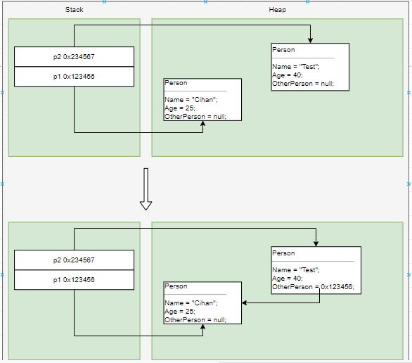

Referans tipinde bir değişkene diğer referans tipini verdiğimizde sadece referansı kopyalandı.

### string referans tipi mi değer tipi mi?

Değer tipi ve referans tipi ayrımını yapabildiğimize göre biraz beyin fırtınası yapalım. `string` referans tipi mi değer tipi mi? String sınıfını incelediğimizde class olduğunu görüyoruz. Yani referans tipidir.

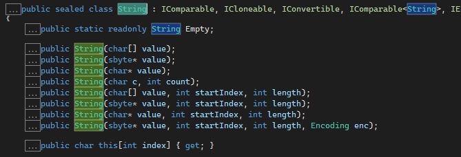

Örnek yapıp stringin referans tipte olduğunu doğrulayalım.

```csharp
string value1 = "Value 1";
string value2 = value1;
value2 = "Value1 Changed.";
Console.WriteLine(value1);
```

Referans tipi olduğuna göre ekran çıktısı ne olur? Hmm. _value1_ değerini _value2_ ye aktardık. _value2_ değerini değiştirdiğimize göre _value1_ in etkilenmesi gerekli. Yani cevap `Value1 Changed.` olmalı. Peki console çıktısı gerçekten de `Value1 Changed.` mi? Hayır değer hala `Value 1`. Bu nasıl oldu? Referans tipinde dediğimiz bir şey değer tipinde olduğu gibi davrandı. string referans tipidir ve değer tipi gibi davranır.

string;

- Referans tipindedir.
- Değer tipi gibi davranır.
- Immutable yani değiştirilemezdir.
- Her değişiklik yapıldığında yeni bir string nesnesi newlenir.

#### Neden referans tipi gibi değil de değer tipi gibi davranır?

Kullanıcı tipi ve string haricindeki tiplerin default bir boyutu vardır. String için hafızada ayrılacak yer belli değildir._(Memory allocation)_ Bir string içerisinde 1 karakter de tutabiliriz. Binlerce karakter de tutabiliriz. Stringin stack(_static memory_) içerisinde tutulması bu yüzden uygun değildir. Heap(_dynamic memory_) kısmında barındırılmaları daha uygundur.

Referans tiplerinin kopyalandığı zaman değerleri yerine referanslarının kopyalandığını biliyoruz. Peki string referans tipi gibi davransaydı neler olurdu? String en sık kullanılan veri tipinden biridir. Değerinin kopyalanması yerine referansının kopyalanması sonucu orjinal string verimiz bu değişikliklerden etkilenebilirdi. Stringi kullanırken kullandığımız metot, extension vb. farklı bir thread tarafından yönetiliyor olabilir. Referans tipinin geçişler sırasında uçması gibi sorunlar da bulunduğu için stringin değer tipinde olduğu gibi değerinin kopyalanması daha uygun görülmüş. Detaylı bilgi için [şu](https://stackoverflow.com/a/7079933/8069766) adresteki bilgileri okuyabilirsiniz.

Yani `string myValue = myValue + "-" + myValue + " - hello";` şeklinde bir kullanım gerçekleştirirken stringin değerinin kopyalanıp eklenen değerler ile birlikte yeni bir stringin oluşturulup lokal değere atandığını bilin :)

### Stack heap e göre neden daha hızlı?

Stack içerisinde daha basit veriler saklanır ve doğrudan stack üzerinde tutulan veriye erişim sağlanabilir. Yığın olduğu için de kullanılan ve işi biten nesneler sistemden silinir. Garbage collector ın stack üzerinde dolaşıp işi biten nesneleri temizlemesine gerek yoktur. Zaten işi biten nesneler LIFO (last in first out) ile kullanıldıktan sonra temizlenirler. Fakat heap alanı stack gibi değildir ve çalışma mekanizması daha farklıdır. Daha karmaşık nesneleri içerisinde adresleyerek tutar. Stackte olduğu gibi işi biten nesneler otomatik olarak sistemden atılmadığı için GC ın heap içerisinde dolaşıp işi biten, kullanılmayan nesneleri saptaması ve temizlemesi gerekir. Bu gibi nedenlerden dolayı da stack heap e göre daha hızlı çalışır.

### Kullanılan kaynaklar

- [Stack and Heap](https://www.youtube.com/watch?v=clOUdVDDzIM)
- [Reference Types ve Value Types arasındaki farklar nelerdir?](https://youtu.be/07Tqdn_h4bU)
- [Is String a Value Type or a Reference Type in C# ?](https://www.csharpstar.com/string-value-type-reference-type-csharp/)

### Yanıtlanması gereken sorular

- Referans tipleri heap içerisinde tutulur. Bunun yerine stack üzerinde tutulabilir mi? Tutulabilirse örnek ile birlikte paylaşılırsa içeriği buna göre güncelleyelim.
