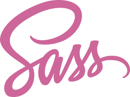
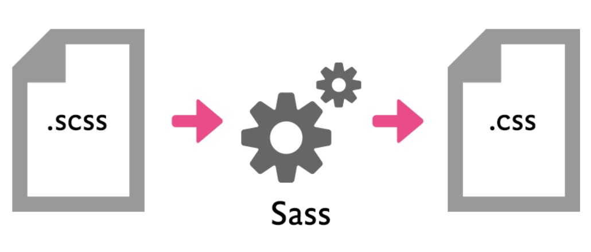

## İçindekiler

1. ##### [Bir CSS Ön-İşlemcisi: SASS & SCSS](#bir-css-%C3%B6n-i%CC%87%C5%9Flemcisi-sass-scss)
2. ##### [Sass'ın Tarihçesi ve SCSS](#sass-%C4%B1n-tarih%C3%A7esi-ve-scss)
3. ##### [Neden Sass&Scss Kullanmalıyım? Nasıl Kullanılır?](#neden-sassscss-kullanmal%C4%B1y%C4%B1m-nas%C4%B1l-kullan%C4%B1l%C4%B1r)
4. ##### [Kurulum ve Derleme Aşaması](#kurulum-ve-derleme-a%C5%9Famas%C4%B1)

    * [npm](#npm)
    * [gulp](#gulp)

5. ##### [Sass İncelikleri]()

    *   [Değişken Tanımlama](#1-de%C4%9Fi%C5%9Fken-tan%C4%B1mlama)
    *   [İç-içe Yapılar Oluşturma](#2-i%CC%87%C3%A7-i%C3%A7e-yap%C4%B1lar-olu%C5%9Fturma)
    *   [İçeri Aktarım - import](#3-i%CC%87%C3%A7eri-aktar%C4%B1m-import)
    *   [Mixins](#4mixins)
    *   [Kalıtım](#5kal%C4%B1t%C4%B1m)
    *   [Operatörler](#6operat%C3%B6rler)
    *   [Koşul Durumları(If- Else)](#7ko%C5%9Ful-durumlar%C4%B1if-else)
    *   ["&" İşareti](#8-i%CC%87%C5%9Fareti)

---


### Bir CSS Ön-İşlemcisi: SASS & SCSS

Sass(**S**yntactically **A**wesome **S**tyle **S**heet), en popüler Css ön-işlemcilerinden biridir. Kendi resmi sitesindeki tanımına göre olgun, istikrarlı ve güçlü seviyede bir Css uzantı dilidir. 

Uzantı dili cümlesinin nedeni CSS dili ile aynı olup sadece Css' i daha esnek, daha verimli ve daha düzenli yazmamıza olanak tanımasından dolayıdır. Diğer popüler olan CSS ön-işlemcileri ise; LESS, Stylus ve PostCSS' dir. Bu ön-işlemciler kısaca Css' i bir programa dili gibi kullanmamıza olanak tanır. 

#### Sass' ın Tarihçesi ve Scss

Sass, 2006 yılında Css' i Ruby diline benzer bir yapıyla geliştirme fikri ile ortaya çıkmış bir Ruby Gem' dir aslında. Şuan ise bir [GitHub](https://github.com/sass/sass) deposunda açık kaynak bir şekilde geliştirilmeye devam ediliyor. 

Ruby diline benzer bir yapıda planlandığı için, yazım dili(syntax) normal Css'in dışına çıkmıştır doğal olarak. Kullanım oranı arttıkça ve Front-end geliştiricilerin normal Css' den gelen el alışkanlığı göz önünde bulundurularak, sözdizimi değişime uğramış ve SCSS haline bürünmüştür.

```
    Sass geliştiricileri varsayılan sözdiziminin Scss olduğunu
    fakat, Sass sözdizimine de destek vermeye devam edeceklerini söylüyorlar.
```

Kısaca, Sass ve Scss' in sözdizimi(syntax) haricinde birbirlerinden farkı yoktur.

Konunun başındayken, yazım dili hakkında küçük bir örnek göstermek gerekirse;


##### SASS
```sass
    .container 
        width: 200px
        height: 200px

        .row 
            background-color: #fff
```

##### SCSS
```scss
    .container {
        width: 200px;
        height: 200px;

        .row{
            background-color: #fff;
        }
    }

```

#### Neden Sass&Scss Kullanmalıyım? Nasıl Kullanılır?

Css' i hantal bir yapıdan çıkartıp daha dinamik bir yapıya döndürür. Bize içerisinde değişken tanımlama, iç içe yazım kolaylığı(yukarıdaki örnek kod gibi), karar yapıları(if, else) ve döngüler gibi birçok imkan sunar.



Global veya Local bir kurulum gerçekleştirdikten sonra projeye oluşturulan ".sass" veya ".scss" dosyalarını derleyerek normal bir Css dosyası oluşturur. Ve o Css dosyasını projeye dahil ederek kullanmış oluruz.


#### Kurulum ve Derleme Aşaması

##### npm

```
    npm install -g sass
```

Kurulumu gerçekleştirdikten sonra(npm ve node.js' in güncel versiyon olduğundan emin olun), bir ".scss" uzantılı dosya yaratıp komut satırına aşağıdaki kod ile derleyip, kullanıma hazır hale getirmiş oluyoruz. 

```
    sass style.scss:style.css 
```

":" dan önceki kısım oluşturduğum dosya ismim(style.scss), 
":" dan sonraki kısım ise derleme sonunda oluşturmasını istediğim kullanılmaya uygun parça

Dizin belirtebilirsiniz.
```
    sass style.scss:app/content/style.css
```

Yukarıdaki bölüm birkez derler bırakır. Her değişiklik yapmak istediğinizde tekrar tekrar yazmamak için; 

```
    sass --watch style.scss:style.css
```

##### gulp

Gulp, Front-end iş akışlarını otomatikleştirmeye yarayan; kabaca tekrar eden işlemleri görev olarak tanımlayıp ardından çalıştırmak için kullanılır.

Gulp hakkında daha fazla bilgi almak için;

* [Medium](https://medium.com/@keremciu/ben-galp-gulp-1-15340198e866)
* [GitHub](https://github.com/omergulcicek/gulp)

Sass kullanımına gelecek olursak da öncelikle bir package.json dosyası oluşturuyoruz.

```
    npm init
```

Daha sonrasında da sırayla

```
    npm install gulp

    ve 

    npm install gulp-sass --save-dev
```

komutlarıyla package.json dosyamızın içerisine bağımlılıklarımızı, modüllerimizi yüklemiş oluyoruz.

Ardından bir gulpfile.js dosyası oluşturup içerisine,

```scss
    var gulp = require('gulp'); 
    var sass = require('gulp-sass');

    gulp.task('css', function(){
        return gulp.src('./src/*.scss)
            .pipe(sass())
            .pipe(gulp.dest('./dest'))
    });
```

yukarıdaki kodları yazıyoruz. Burada kısaca, "src" isimli dosyamızın içerisindeki tüm "scss" uzantılı dosyaları derleyip bir css dosya çıktısı vermesini istiyoruz. Gulp' ı çalıştırmak için ise, terminale "gulp" yazmak yeterli oluyor. 

Ardından tabi ki oluşturulan Css dosyamızı projeye dahil edip(normal HTML içerisine nasıl dahil ediyorsak), yolumuza devam ediyoruz.

#### Sass İncelikleri 

##### 1. Değişken Tanımlama

Css' de değişken oluşturup kullanılmasına olanak sağlar, en kullanışlı özelliklerden biridir. Başına "$" işareti koymamız yeterli oluyor. (php' ciler gülümsüyo)

```scss
    $myColor: #424242;
    $myFontSize: 18px; 
```

##### 2. İç içe Yapılar Oluşturma

Css yazmayı hızlandıran, kod kalabalığını azaltan ve bence asıl önemi büyük projelerde ortaya çıkan favori özelliğimdir.

```scss
    div{
        width: 40px;
        height: 40px;
        background-color: purple;

        span{
            width: 20px;        
            .logo{
                color: #fff;
            }
        }
    }
```

##### 3. İçeri Aktarım - import

3 adet Sass dosyamız olduğunu düşünelim. Derledikten sonra bize 3 adet Css dosyası vermesi pek işimize yaramaz sanırım. O yüzden bu ".scss" uzantılı dosyaların birini ana dosya seçip diğerlerini bunun içerisine import etmek baya faydalı olur.

###### _degiskenler.scss
```scss
    $myColor: purple;
    $myFontFamily: 'Helvetica, sans-serif'; 

```

###### _reset.scss
```scss
    *{
        margin: 0px;,
        padding: 0px;
        box-sizing: border-box;
    }
```

###### main.scss
```scss
    @import 'degiskenler';
    @import 'reset';

    h1{
        font-size: $myFontFamily;
        color: $myColor;
    }
```

##### 4.Mixins
Tam bir türkçe karşığı zannımca yok ama kullanılma amacı kısaca, sürekli yazdığımız Css kodlarını tek bir yerde(fonksiyon gibi) toplayıp daha sonrasında çağırma işlemi yaparak ögeleri, elemanları stillendirmeye yarar.

Mesela;

```scss
@mixin myLayout(){
    display: flex;
    justify-content: center;
    align-items: center;
}

.kapsayici{
    @include myLayout();
}
```

veya

```scss
    @mixin myWidth($width){
        max-width: $width;
    }

    div{
        @include myWidth(600px);
    }
```

##### 5.Kalıtım
Bu özellik ile kodlarımıza miras alma yöntemi(extend) uygulayabiliriz.

```scss
    .myLink{
        padding: 5px;
        text-decoration: none;
    }

    .btn{
        @extend .myLink;
    }

```

##### 6.Operatörler
Basit matematik işlemlerini Css' de yapmamıza olanak sağlayan bir özelliktir. Sass tarafında yapılan matematiksel işlem, Css tarafında sonuçlandırılmış olarak görüntülenecektir.

##### Sass
```scss
    .kutu{
        width: 1/3 * 100%;
        height: 30px * 2.5;
    }
```
##### Css Çıktısı
```css
    .kutu{
        width: 33.33333%;
        height: 75px;
    }
```

##### 7.Koşul Durumları(If-Else)

Direkt örnek üzerinden göstermek gerekirse; 

```scss
    $value = 12;

    div{
        @if $value < 4 {
            background-color: red;
        }
        @else if $value == 4 {
            background-color: blue;
        }
        @else {
            background-color: green;
        }
    }
```

##### 8."&" İşareti

Bunu canlı derste örnek proje üzerinden daha net bir şekilde açıklayacağım ama yine de kısa bir tanım yapmam gerekirse; 4. örnekteki gibi yine iç içe işlemler yaparken, "&" bu işaret, "Class" lardaki "this" anahtar sözcüğü gibi davranır.

Basit bir örnek kod üzerinden göstermek gerekirse; 

##### Scss
```scss
    a{
        color: red;
        font-size: 10px;

        &:hover{
            color: blue;
        }
    }
```

 Normal Css koduyla bir "hover" işlemi yapsak? 

##### Css
```
    a{
        color: red;
        font-size: 10px;
    }

    a:hover{
        color: blue;
    }
```

Şimdilik bahsedeceklerim bu kadar. Umarım arasındaki farkları ve Sass' ın sağladığı kolaylıkları net bir şekilde aktarabilmişimdir. Şunu söyleyebilirim ki Sass kullanmaya başladıktan sonra normal Css yazmak asla istemiyorsunuz ve büyük ölçekli projelerin şuan için vazgeçilmezi durumunda.

---

##### Kaynaklar

* https://sass-lang.com/guide
* https://drupart.com.tr/blog/sass-nedir-nasil-kullanilir
* https://webmaster.kitchen/sass-nedir-neden-kullanmaliyim/
* https://omergulcicek.github.io/gulp/eklentiler/sass

###### Bu rehber yukarıdaki kaynaklardan ve onların örneklerinden faydalanılarak yazılmıştır.


