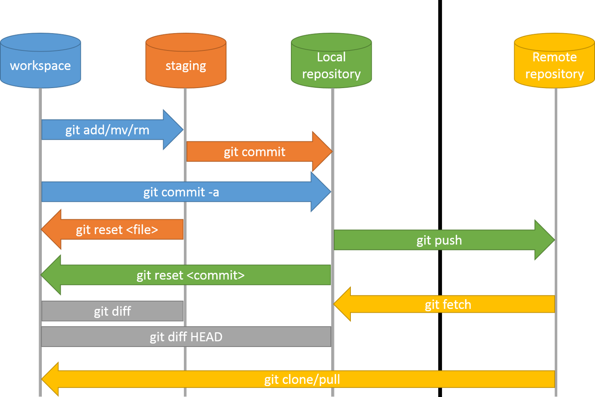

# Git Mantığı
Git işleyiş (akış) mantığını kavrama rehberi.

**İçerik Listesi**
- [Git Nedir?](#git-nedir)
    - [Neleri Kolaylaştırır?](#neleri-kolaylaştırır)
    - [Nerelerde Kullanılır?](#nerelerde-kullanılır)
    - [Nasıl Çalışır?](#nasıl-çalışır)
- [Github Nedir?](#github-nedir)
    - [Neleri Kolaylaştırır?](#neleri-kolaylaştırır-1)
    - [Nerelerde Kullanılır?](#nerelerde-kullanılır-1)
    - [Nasıl Çalışır?](#nasıl-çalışır-1)
- [GitHub Desktop Nedir?](#github-desktop-nedir)
    - [Neleri Kolaylaştırır?](#neleri-kolaylaştırır-2)
    - [Nerelerde Kullanılır?](#nerelerde-kullanılır-2)
    - [Nasıl Çalışır?](#nasıl-çalışır-2)
- [IDE Üzerinde Git Kullanımı](#ide-üzerinde-git-kullanımı)
    - [PhpStorm](#phpstorm)

## Git Nedir? 

Git, versiyon konrtol sistemidir. Kullanımı ücretsiz ve açık kaynak bir uygulamadır. Bir çok kullanıcı ve firma tarafından tercih edilir. Meraklısı için [resmi sayfası](https://git-scm.com/about).

### Neleri Kolaylaştırır?
- Proje klasörü üzerinde yapılan değişiklikleri adım adım kaydetmeyi sağlar.
- Yapılan değişiklikler arasında hızlıca geçiş yapmayı sağlar.
- Bireylerin birbirinden bağımsız ortamlarda geliştirme yapabilmesi esnekliğine sahiptir.
- Bağımsız geliştirme yapısı ile aynı anda geliştirme yapmaya olanak verir ve böylelikle gelişim sürecinde tasarruf sağlar.
<!-- FIXME daha da basitleştirilebilir -->

### Nerelerde Kullanılır?
Genel olarak yazılım yapıları geliştirmede kullanılsa da kullanım alanı oldukça geniştir.

Dijital klasör içinde üretilebilen her şeyin gelişim sürecini takip etme esnekliğine sahiptir. Kitap yazılabilir, resim yapılabilir, şarkı bile üretilebilir.

Kısaca birlikte bir ürün geliştirmenin en pratik ve sağlıklı yoludur.

### Nasıl Çalışır?

Git, tanımlaması yapılan klasör içeriside "**.git**" adında bir klasör oluşturur.

Bu klasör içerisinde Git kendi dosyalarını barındırır. 

Tanımlaması yapılmış olan klasör **workspace** (*ˈwərkˌspās*) veya **working directory** (*ˈwərkiNG diˈrektərē*) adı verilen **çalışma alanıdır** ve bu alan içerisinde geliştirme yapılır.

Git, klasör içerisindeki değişimleri takip eder.

Belirlenen değişiklikler arasından projeye işlenmek istenen değişiklikler seçilir ve Git üzerinde **staging area** (*ˈstājiNG ˈe(ə)rēə*) adı verilen **aşamalar alanına** aktarılır.

Çalışmadaki aşamalar **commit** *(kəˈmit)* adı verilen **işlem kaydı** ile kayıt altına alınır.

Proje dosyaları ve işlem kayıtları **repository** (*riˈpäzəˌtôrē*) adı verilen **depo**larda barındırılır.

İşlem kaydı yapılan aşamalar **local repository** (*ˈlōkəl riˈpäzəˌtôrē*) adı verilen **yerel depo** içine aktarılır.

İşlem kayıtları bütünü işlem akışını oluşturur. Bu akış gelişim sürecini görmeyi sağlar. Gelişimin zaman çizgisi **branch** (*branCH*) adı verilen **dal**larla gösterilir. 

Üzerinde çalıştığımız dal **master** (*ˈmastər*) adı verilen **ana dal**dır.

Tercihe göre ek dallar çıkartılabilir, her gelişimin kendi iş akışında ilerleyebilir, bu dallar daha sonra birleştirilebilir.

Projeler, Git sunucusu üzerinde **remote repository** (*riˈmōt riˈpäzəˌtôrē*) adı verilen **uzak depo**larda da barınabilir.

Uzak deponun varsayılan ana dalı **origin** (*ˈôrəjən*) adı verilen **uzak ana dal**dır. Depo içeriğine göre dallar değişebilir.

Yerel depo ile uzak depo arasında eşitleme yapılabilir.

Eşitleme ile başkasına ait depo üzerinde de geliştirme yapılabilir.

Geliştirme yapılacak uzak deponun seçilen dalından **fork** (*fôrk*) adı verilen **çatal çıkar**ma yöntemi ile çıkarılan dal yerel depoya kopyalanır.

Bu dal üzerinde yapılan güncellemeler **pull request** (*po͝ol riˈkwest*) adı verilen **çekme isteği** yöntemi ile uzak deponun sahibine geri gönderilir.

Uzak depo sahibi çekme isteklerini denetleyebilir, düzenleyebilir, ana dal ile birleştirebilir.

Bu döngü sürdüğü sürece gelişim devam eder.

<!-- TODO işlem akışını ifade eden görsel içerik oluşturulacak, tanımlanacak, tanımlandı - 20190427185600-muaz -->

## GitHub Nedir?
GitHub şirketi bünyesinde açık kaynak ile geliştirilen bir Git arayüzüdür. 

Temelde kendi yerel depomuz üzerinde yaptığımız işlemler yaptığımız gibi kendi sunucuları üzerinde Git işlemleri yapan bir web uygulamasıdır.

### Neleri Kolaylaştırır?

- Git komutları kullanmadan web arayüzü ile bir çok işlemi butonlar ile yapabilme imkanı verir.
- Web arayüzü üzerinden kayıtlı kullanıcıların uzak depoları kullanabilmesini sağlar. 
- Geliştirme sürecini takip etmeyi kolaylaştırır.
- Geliştirme sürecinde kullanıcılar arası iletişimi kolaylaştıran çözümlere sahiptir.
- Ekip ve proje yönetim hizmetleri vardır.

### Nerelerde Kullanılır?
- Git tabanlı proje geliştirmede kolay arayüzü tercih sebebidir.
- Proje takibi ve yönetiminde kullanışlı araçları vardır.
- Ekip yönetim çözümleri ile firmalar tarafından bile tercih edilebilmektedir.
- İş takibindeki netliği ile geliştiriciler tarafından işini tanıtmak adına portfolyo olarak da kullanılabilir.

### Nasıl Çalışır?
`çok yakında...`

## GitHub Desktop Nedir?
GitHub platformunda Electron JS altyapısı üzerinde geliştirilen açık kaynak kodlu depo yönetim uygulamasıdır.

### Neleri Kolaylaştırır?
Konsol üzerinde kullanılan Git işlemlerini pratik biçimde arayüz üzerinden kullanmayı sağlar.

Dosya üzerindeki değişiklikleri görüntülemeyi sağlar.

Konsola olan bağımlılığı azaltır.

### Nerelerde Kullanılır
Genel komutları pratik biçimde yerine getirmesi sebebiyle tercih sebebidir.

GitHub depolarını listeleme ve kontrol etme, değişiklikleri kıyaslama gibi fonksiyonları arayüz üzerinen üzerinden kullnamayı sağlar.

### Nasıl Çalışır?

[GitHub Desktop](https://desktop.github.com/) adresinden uygun kurulum dosyası indirilir, kurulur.

Kurulumu tamamlanan program açıldığında *File/Options* satırına tıklanınca açılan penceden *Accounts* sekmesinde tercihe göre oturum açılır.
*GitHub Desktop hesaba kayıtlı depoları otomatik olarak indirmez.*

Eğer cihazda Git yüklü değilse kullanmadan önce *Git* sekmesinden ayarlamaları yapmak gerekir. 

Bu alana girilecek e-posta bilgisi GitHub hesabının kayıtlı olduğu web arayüzü üzerinden sırasıyla sağ üst köşedeki profil resmine tıklanınca açılan menüden *Settings*, sol menüdeki *Emails* satırlarına tıklanarak ulaşılan sayfadan kayıtlı e-posta bilgisidir.

*appearance* sekmesi üzerinden arayüzde kullanılmak istenen arayüz görünümü seçimi yapılabilir.

*advanced* sekmesinden varsayılan kod editörü, konsol, vb ayarlamalar yapılabilir.

Hesaba tanımlı depolara ulaşmak için *File/Clone repository* satırına tıklanmalı. açılan pencerede *GitHub* sekmesi altında hesaba tanımlı uzak depolar lislenmektedir. yerel depoya kopyalanmak istenen depo seçilir. Hemen altında *Local path* başlığı altındaki kısımdan depo için kullanılacak dosya yolu seçilir. *Clone* tuşuna tıklanarak depo kopyalanmaya başlar.

Hesaba tanımlı olmayan, bağlantısına sahip olunan başka bir uzak depoyu kopyalamak için *Url* sekmesine girilmeli. Sahip olunan uzak depo bağlantısı ilk kutucuğa girilir. İkinci kutucuğa kopyalanacak depo için kullanılacak dosya yolu seçilir. *Clone* tuşuna tıklanarak depo kopyalanmaya başlar.

Yeni bir depo oluşturmak için *File/New repository* satırı tıklanır. GitHub üzerinde depo oluştururken istenen bilgileri talep eden bir pencere açılır. Farklı olarak yerel deponun dosya yolunu girmek gerekir. Tanımlar girildikten sonra *Create repository* butonuna tıklanarak depo oluşturulur.

Yerel cihazda bulunan bir depoyu tanımlamak için *File/Add local repository* satırı tıklanır. Açılan pencerede yerel deponun dosya yolu seçilir. *Add repository* butonuna tıklanarak ekleme işlemi tamamlanır. 

GitHub Desktop programına bir depo tanımladıktan sonra arayüzün üst kısmında seçili deponun durum bilgisini veren ve depo üzerinde pratik kontrol etmeye yarayan yarayan bir satır belirir.

Bu satırın ilk bölümünde *current repository* başlığı altında seçili depo ismi görünür. Buraya tıklanarak programa tanımlı yerel depoların listesini görmek mümkündür. Listeden tercih edilen depoya tıklanarak ilgili depoya geçiş yapılabilir.

Satırın ikinci bölününde *current branch* başlığı altında seçili depo üzerinde seçili dal bilgisi görünür. Buraya tıklanarak dallar arasında hızlı geçiş yapmak, yeni dal oluşturmak gibi dalları yönetmek mümkündür.

Satırın üçüncü bölümünde ilgili dalın durumuna göre değişkenlik gösteren aksiyon butonu bulunur. Bu buton mevcut deponun uzak depo ile ilgili ilişkilerine göre gerekli aksiyonlara göre şekillenir.

Mevcut depo seçiminin(*Current repository*) yapıldığı birinci bölümün altında bulunan sütunda iki sekme bulunur.

Bu sekmelerden ilki *Changes* başlığıyla ilgili depo dosyaları üzerinde yapılan değişiklikleri listeler.

Bu liste öğelerine tıklandığında ekranın sağ kısmında dosya üzerinde yapılan değişikliklerin ön izlemesi belirir.

Değişiklikleri kayıt edilmek istenen dosyalar seçilerek hemen altındaki kutucuğa işlem bilgileri eklenerek en alttaki *Commit to master* tuşuna tıklanarak işlem kaydı oluşturulabilir. Bu işlem yapıldığı sırada üst satırdaki aksiyon butonu yerel depodaki değişiklikleri uzak depoya eşitlemek için gereken komuta dönüşecektir.

Ayrıca *Changes* sekmesinde listelenmiş değişikliği henüz kayıt edilmemiş dosyalara sağ tıklayarak *Ignore file* satırına tıklanarak ilgili dosyayı *.gitignore* dosyasına eklemek gibi bir çok komut kullanılabilir.

İkinci sekme *History* sekmesidir. Bu sekmede ilgili deponun işlem kaydı geçmişi yer almaktadır. İşlem adımları tıklandığı sırada sağ kısımda değişiklik gören dosyalar listelenir. Dosyalara tıklanarak ilgili değişikliğin ön izlemesi sağ kısımda görüntülenebilir.

İşlem kaydına sağ tıklayarak *Revert* gibi geri yükleme vs komutlar kullanılabilir.

## IDE Üzerinde Git Kullanımı
Bazı IDE ve editörler eklentileri ile Git fonksiyonlarının kullanımını sağlamaktadır. 

***UYARI:*** _IDE ler üzerinde Git bağlantısı eklentiler ile sağlanmaktadır ve bu eklentilerin gelişimleri sürdüğünden burada gösterilen yönergeler değişiklik gösterebilir._

### PhpStorm 
PhpStorm bunlardan biridir. 

Tanımlı yerel depo PhpStorm üzerinden açıldığında IDE bunu tanır ve tekrar tanımlamaya gerek kalmaz.

IDE dosyaları ile proje dosyalarının birbirine karışmasına engel olmak için *.gitignore* dosyası ile git dışlaması tanımlanabilir. 
Dışlamaları pratik biçimde tanımlamak için [gitignore.io](https://gitignore.io) gibi siteler üzerinde editörlere özel hazır tanımlara ulaşılabilir.

PhpStorm üzerinde değişiklik yapılan dosyanın işlem kaydını gerçekleştirmek için *VCS/Commit* yolundan veya *Ctrl+K* kısayolundan işlem kaydı oluşturma ekranı açılabilir.
İşlem kaydına dahil edilmek istenen dosyalar seçilir ve *Commit Message* bölümüne kayıt notu eklenerek sağ alt köşedeki *Commit* tuşuna tıklanarak işlem kaydı oluşturulabilir.
İşlem kayıtları oluşturulduktan sonra kayıtları uzak sunucuya yüklemek için *VCS/Git/Push* yolundan veya *Ctrl+Shift+K* kısayolundan *Push Commit* penceresi açılarak seçilen dala işlem kayıtları gönderilebilir.

#### dış kaynaklar
- [Github kullanarak kolayca nasıl başkalarının kodlarına katkılar yapılır ve sosyalleşilir - Tarık Güney](https://www.youtube.com/watch?v=_AAax7iQ6VE)
- [Sıfırdan Git Dersleri - GitHub Kullanımı - Kadir Kasım](https://www.youtube.com/watch?v=uncrCoLiq-g&list=PLHN6JcK509bOrevTCFrSMeAfBtuib4Gpg)
- [git - basit rehber - tr](http://rogerdudler.github.io/git-guide/index.tr.html)
- <a href="https://tr.0wikipedia.org/wiki/Git_(yaz%C4%B1l%C4%B1m)">Git (Yazılım) - vikipedi</a><a href="https://www.google.com/search?q=wikipedia+erişim+engeli"> - (neden '0.wikipedia.org'a yönlendiriliyorum?)</a>
- [GitHub Desktop Documentation](https://help.github.com/en/desktop)
- [gitignore.io](https://gitignore.io)
<!-- 'nasıl çalışır' başlığında tüme varım ile olaylaştırarak okuyucuya mesajı vermeye çalıştım -->
<!-- git kavramlarının ardına okunuşlarını google translate den aldığım okunuşlarınıda ekledim -->
<!-- kavramların türkçeleştirmesi konusunda pek hakim değilim. düz mantık olay tabanlı (kullanımdaki işlevine göre) gittim. -->
<!-- kavramlar ve türkçe karşılıklarını okuyucuya imgelemede kolaylık sağlaması için kalın yazdım -->
<!-- yazıyı bir bütün halinde yazmak yerine olay adımlarına bölerek satır aralığı ekledim -->
<!-- anlatımda anlamların daha ön planda olması için kalıp ifadeler kullandım -->
<!-- böylece, bilmeyen birinin bilgiye boğulmadan ve daha ferah kavrayabilmesini sağlamaya çalıştım -->
<!-- çekme isteği ve çatal çıkarma konusunda pek detay veremedim bende yeni öğrendim birazdan bu geliştirme işlemiyle ile deneyeceğim. umarım başarılı olurum -->
<!-- muhtemelen bunu hazırlarken bir çok kuralı ihlal ettim fakat denemekten korkmuyorum öğrenmek istiyorum. önerilerinize açığım. -->
<!-- TODO tu bi kontinyud - 20190415-164700-muaz -->
