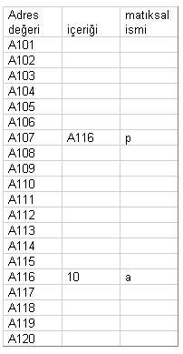

Bir bilgisayar dilinin bir alt programa argüman aktarmasının **iki** yolu vardır.

İlk yol **değerle** çağırmadır. (*call by value*)\
İkinci yol ise **referans ile** çağırmadır. (*call by reference*)

Yazının devamının daha net anlaşılması adına, genel bir fikir sahibi olmamız gereken iki kavram bulunuyor. 

* Memory Allocation
* Heap
* Stack

### Memory Allocation

Allocation kelimesi dağıtım anlamına gelmektedir. Memory ise hafıza demektir. Basit bir çeviri ile hafıza dağıtımı anlamına gelen bu kelime bilgisayar biliminin önemli bir konusu olan **Memory Management** ile alakalı farklı yaklaşımları içinde barındırır.


Yüksek seviyeli diller (Java, C# gibi) bu işlemi programcının yapmasını engelleyerek daha güvenli kodların yazılması hedeflemiştir.

Fakat **C** gibi düşük seviyeli diller programcının tüm kavramlara ve dikkat edilmesi gereken noktalara hakim olduğunu varsayıp, *pointer* adını verdiğimiz yapıları kullanmasına müsaade eder.

#### Pointer nedir?

Pointer(Gösterici) basitçe bir değişkenin bir hafıza alanını göstermesi demektir.

```c
int *p;
int value = 10;
p = &a;
```

 

*Ilgili tablo Sadi Evren Şeker hocamızın sitesinden alınmıştır*

**value** adlı integer değişkeninin sakladığı değer 10'dur. Bellekteki adreslemesi A116 adlı noktaya denk gelmektedir.

Programın çalışması sırasında bir başka değişkenin işaret ettiği adres bölgesi A116 olduğu sürece **value** değişkeni içindeki 10' değerine erişebiliriz. Pointer özetle budur.


### Heap

Java dilinde herhangi bir sınıftan bir nesne oluşturmak için *new* operatörü yada 
```java
Class.forName().newInstance()
clone()
readObject()
```
metodları kullanılmaktadır. New operatörü yahut yukarıdaki metotlardan biri ile yeni bir *nesne* oluşturulduğunda, oluşan bu yeni nesne JVM (**Java Virtual Machine**) tarafından bilgisayarın hafızasında *belirli* bir noktaya konuşlandırılır(yerleştirilir).

Konuşlandırılmış olan bu nesnelerin işaret ettikleri bir **referansları** bulunmaktadır.

Bu referansların işaret ettikleri noktada **object** yada diğer adıyla ilgili class'ın bir **instance** ' ı bulunmaktadır.

Referans kavramını pointer gibi düşünebilirsiniz.


### Stack

Hızlı bir şekilde açıklamak gerekirse ; Ağzına kadar dolu bir otobüs düşünün. Otobüs içindeki herhangi bir yolcunun durakta inebilmesi için, kapının ağzında bulunan **son yolcunun** aşağı inmesi gerekmektedir.

Runtime (Çalışma zamanı) sırasında pek çok class ve obje sürekli belleğe girer ve çıkar. Aynı otobüsün farklı durakları ziyaret edip, yolcu indirip, yolcu bindirmesi gibi. 

Değişkenler stack'e girer, işlem tamamlandıktan sonrada stack'ten silinirler.
Dolayısı ile stack üzerinde yapılan herhangi bir işlem kalıcı olamamaktadır. Yazımızda bu yaklaşımı açıklamaya çalışıyor.

### Call By Value

Bu yaklaşım ile argümanın değerini, alt programın tanımlı parametresi(formal parameter) içine kopyalar. Dolayısı ile de alt programın parametresinde yapılan değişiklikler argüman üzerinde etkili olamaz. 

```java

class Value {

    void meth(int a,int b) {
        a *= 2;
        b /= 2;
    }

    static void main(String ... args) {
        
        Value value = new Value();
        int a = 15, b = 20;
        System.out.println("A is : " + a + " B is : " + b);
        value.meth(a,b);
        System.out.println("A is : " + a + " B is : " + b);
        // degerler ayni kalacaktir.

    }
}

```
### Call By Reference

Bu yaklaşım ile parametreye argüman referansı aktarılır. Referans kavramını yukarıda açıklamıştık. Bu durumda parametrede yapılan değişiklikler, alt programı çağırmak için kullanılan argümanı etkiler.

```java

class Reference {

    int a,b;
    Reference(int a,int b) {
        this.a = a;
        this.b = b;
    }

    void meth(Reference reference) {
        reference.a *= 2;
        reference.b /= 2;
    }

    static void main(String ... args) {
        
        int a = 15, b = 20;

        Reference ref = new Reference();
        ref.meth(ref);
        System.out.println(" A is : " + ref.a + " B is : " + ref.b);
        /*
        Output : 
            A is 30
            B is 10
            olarak cikacaktir.
        */

    }


}


```

## Özet

Bir nesne referansı bir **metoda** aktarıldığında, referansın kendisi *değerle çağrılma* yoluyla aktarılır. Ancak aktarılan değer bir nesneye gönderme yaptığından bu değerin bir kopyası, aynı argümanın göndermede bulunduğu nesneye göndermede bulunur.