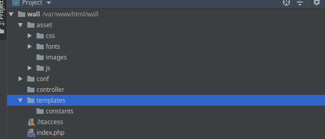

# Birçok şey öğrendim ama web sitesi oluşturamıyorum kafam çok karışık!

Bu ifade şuanda olduğun durumu özetliyorsa muhtemel sıkıntın belirli bir dosya düzenine sahip olmaman veya bir yazılımı oluşturacak dosya düzenini kafanda kurgulayamamandan kaynaklanıyor olabilir. Zamanında benimde yaşadığım bu durumu çevremdeki bir kaç arkadaşımda da gözlemlemiştim. Genel olarak tek sayfalı yapılar oluşturabiliyor ama mesele birden fazla sayfanın birbirleriyle olan ilişkisine gelince insanın kafası karışabiliyor böyle bi durumda birşeyleri yavaş yavaş öğrenmene rağmen programlama olayı eziyet haline gelebilir.

Şimdi göstereceğim dosya yapısı oldukça basit. Küçük ve orta ölçekli projeler için biçilmiş kaftan biraz revize edilerek büyük ölçekli projelerde de kullanılabilir güzel bir yapı. Seveceksiniz...

### Bu dosya sistemi nelerden oluşuyor?
  1. Asset Klasörü / Alt klasörler ise aşağıdaki gibi
  
    - CSS Klasörü / Tüm CSS dosyalarını barındırdığımız klasör 
    - JS Klasörü /  Tüm JS dosyalarını barındırdığımız klasör
    - Font Klasörü / Tüm fontları barındırdığımız klasör 
    - Image Klasörü / Tüm imageleri barındırdığımız klasör
    
  2. Conf Klasörü / Configlerimiz, db ayarlarımız buraya
  
    - conf_main.php 
    
  3. Controller Klasörü  / Tüm control dosyalarımızı burada barındıracağız.
  
  4. Templates Klasörü / Kullanıcının önüne sereceğimiz taraf çoğu frameworkte view olarak geçer. Alt klasörler aşağıdaki gibi
      
    - Constants Klasörü / İçeriği aşşağıdaki gibi
      - header.php
      - footer.php
    
  5. index.php / Ana dizinde olmalı herşeyin döndüğü sayfa olacak.
  
  6. .htaccess / Yönlendirmelerimizi sağlayacak 
  
  ### Şimdi nasıl görünüyor bir bakalım.
 
 Benim wall adında bir projem vardı onun üzünden göstereyim
 
Genel  Görünüm:
 
 

 Alt dosyalar ve klasörlerle beraber:

  
 
 
 ## Bu sistem nasıl çalışır?
 
  Aslında herşey ana dizindeki index dosyamızda kullanıcıya döndürülüyor. Bu indexte işlemler şu şekilde:
 ```php
 <?php
require 'conf/conf_main.php'; // Veritabanı bağlantılarımızın ve proje dahilinde kullanılabilecek fonksiyonları barındıran dosyamızı çektik bu sayede her yerde tekrar tekrar bağlantı kurmamıza gerek yok

if(isset($_GET['__path'])){ // Path kontrolü proje yolundan sonra yol belirlenmiş mi kontrol eder. Örn: http://localhost/wall bu yoldan sonra /kayit, /giris gibi bir yol girildi mi kontrolünü sağlar.  

	$current = array_filter(explode('/',$_GET['__path'])); // Proje anadizininden itibaren path'i slash(/)lardan bölerek $current'a atar ÖRN:localhost/wall/kayitol yolunda $current[0] kayitol olarak döner
	if(file_exists("templates/".$current[0].".php")){ // Templates dosyamda http://projeyolu/kayıtol($current[0]) adında bir dosya var mı diye kontrol eder 
		require "templates/".$current[0].".php"; // Üstteki şart gerçekleştiyse dosyayı $current[0]'a atanmış dosya adını bulup içeri çeker
	}else{
		require "templates/index.php"; // öyle bir dosya adı yoksa templates içindeki indexi çağırır. Dilerseniz 404 sayfası oluşturabilirsiniz.
	}
}else{
	require "templates/index.php"; // Proje yolundan sonra herhangi bir dosya adı yazılıp çağırılmadıysa direkt olarak indexe gider http://localhost/wall yazınca indexin gelmesini sağar kısaca
}
```

Ve tabi ki .htaccess olmazsa olmaz. Bu gördüğünüz kodda '__path'in ne olduğunu tanımlıyoruz aslında. index.php'ye bağlı get ile gönderilen değerler olarak görüyor __path'

```.htaccess
  RewriteEngine On
  RewriteRule ^([0-9a-zA-Z-_/]+)$ index.php?__path=$1 [QSA]

```

  ## Adım adım bir kayıt ol sayfası oluşturalım.
  Dosya yapımız hazır, herşey olması gerektiği yerde ve yazmaya hazırız.
  
  ### conf klasöründeki conf_main.php'yi hazırlayalım. 
  ```php
  // Veritabanı bağlantımı yaptım.
    try {
    $db = new PDO("mysql:host=localhost; dbname=wall; charset=utf8", "root", "123456");
}catch (PDOException $e){

    print $e->getMessage();
}


$URL = "http://localhost/wall/"; // Base URL'imi belirlemek için oluşturduğum bir değişken. header.php içinde kullanacağım.


// Gerektiğinde projenin her yerinde kullanabileyim diye fonksiyonlarımıda buraya yazabilirim.
function kisaltici($icerik,$karakter) {
    $icerik = stripslashes(strip_tags($icerik));
    $icerik = mb_substr($icerik,0,$karakter,'UTF-8');

    return $icerik."...";
}

  ```
  
 ### Constants klasörümün header.php kısmı
 ```php
  <!DOCTYPE html>
<html>
<head>
 <base href="$URL"/> // Dosyalarımızın düzgün bir şekilde okunması için base url'i belirliyoruz.  
<title>Dosya Yapısı Öğreniyoruz</title>
<link href="asset/css/bootstrap.min.css" rel="stylesheet"> // Css'imi projeye dahil ettim.
</head>
<body>

 ```
  ### Constants klasörümün footer.php kısmı
 ```php
 
 <script src="asset/js/bootstrap.min.js"></script> // Js'mi projeye dahil ettim. Js dosyalarınızı münkün olduğunca footer'a koyun sayfa hızını artıracaktır.

</body>
</html>
 
 ```
  ### Templates klasörüne bir kayıtol.php oluşturalım, içeriği şu şekilde:
  
  ```php
<?php require 'controller/kayitol.php'; ?> // Birazdan controller dosyasında oluşturacağım kayitol.php dosyamı sayfaya dahil ettim
<?php require 'constants/header.php'; ?> // Header'ımı sayfaya dahil ettim


 /* HTML ve GEREKTİĞİNDE PHP KOMUTLARI ÖRN: BU SAYFADA VERİTABANINDAN GELEN VERİLERİ LİSTELEMEK İSTİYORSUNUZ
    CONTROLLER DOSYASINDA VERİLERİ ÇEKTİKTEN SONRA BURADA FOREACH İLE DÖNDÜREBİLİRİSİNİZ */


<?php require 'constants/footer.php'; ?> // Footer'ımı sayfaya dahil ettim.


 
 ```
  
  ## Contoller içindeki kayıtol.php dosyam:
   ```php
   if(isset($_POST['kayitol'])){
    
      // Post işlemi gerçekleştiyse artık verileri alabilir ve veritabanına bu dosya içinde yazdırabilirsiniz. 
   }
 
 ```
 ## Kayıtol'u yaparken yaptıklarımızı özetlemek gerekirse
   - Öncelikle dosya yapısının her yerinde aktif olması için config dosyama veritabanı bağlantımı yazdım.
   - Header ve footer.php dosyalarımı tek bir defa yazarak gerektiği durumda oluşturduğum sayfalara require ile içeri çektim. 
   - Ardından kullanıcılara formu göstermek için templates içine kayitol.php adında bir dosya oluşturdum ve html vs. şeyleri oraya yazdım
   - Ardından controller klasörümün içine kayıtol.php oluşturarak php ile alakalı kontrollerimi ve veritabanı işlemlerimi yaptım tabii bu dosyamı require ile templates/kayıtol.php'nin içine çektim.
 
 Bu şekilde  karmaşıklığı ortadan kaldırdım, bazı noktalarda kodumu tek sefer yazdım ve artık yeni sayfa oluşturmak istediğimde controller ve templates klasörlerime ilgili sayfanın dosyalarını oluşturmam yeterli olacak.
 
 https://projeyolu/kayıtol dediğimde artık karşıma hazırladığım kayıtol sayfası çıkacak 
 
 ### Edit: PHP üzerine anlattım ama tüm diller üzerinden benzer yapılar oluşturulabilir. Lütfen referans olarak okuyun.

## Okuyup anlama algoritması:

1. Eğer okuyup anladıysan mükemmel! Otur ve bolca kod yaz!
2. Eğer anlamadıysan lütfen tekrar gözden geçir.
3. Tekrar gözden geçirdiğinde anladın mı? Süper 1. Adımı uygula.
4. Tekrar gözden geçirmene rağmen anlamadın mı? Lütfen kahveni iç kafanı dinle ve tekrar oku.
5. Eğer anladıysan 1. Adımı uygula Anlamadıysan 6. adımı uygula.
6. Üçüncü tekrardan sonra hala anlamadıysan problem benden kaynaklanıyordur, lütfen benimle iletişime geç.
   
Faydalı olması ümidiyle...
 
    
